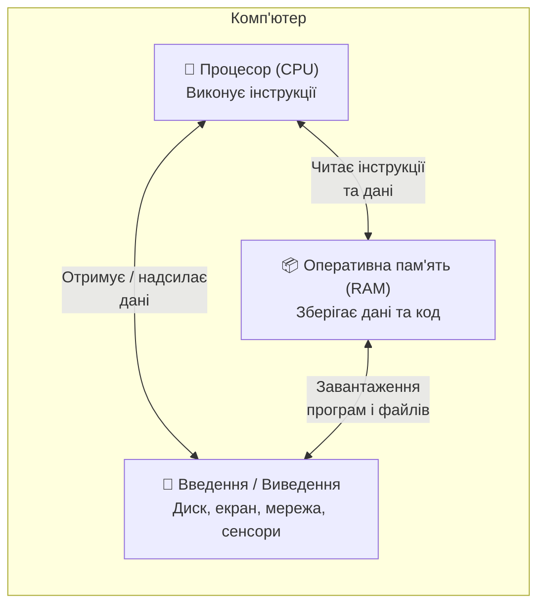
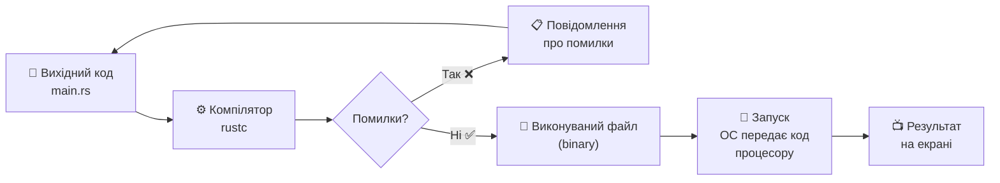
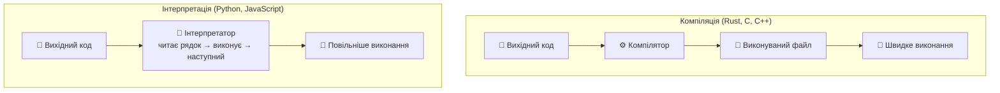
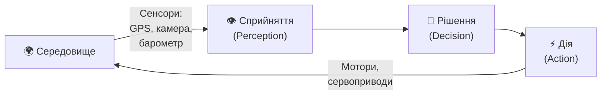

# Розділ 1. Що таке програмування і навіщо Rust

## Анотація

Цей розділ закладає фундамент, без якого все подальше вивчення буде хистким. Перш ніж писати першу програму, потрібно зрозуміти, що відбувається всередині комп'ютера, коли програма працює: звідки беруться інструкції, де зберігаються дані, як процесор перетворює текст, написаний людиною, на дії машини. Розділ пояснює різницю між компіляцією та інтерпретацією, показує, де Rust стоїть серед інших мов програмування, і знайомить з поняттям автономного агента — об'єктом, який проходитиме через увесь курс, поступово набуваючи нових здатностей. Окремо розглядається, що таке AI-асистент з технічної точки зору, і як цей курс поєднує вивчення програмування з навичками ефективної роботи з AI-інструментами. Жодного рядка коду ми поки не напишемо — натомість розберемося, що саме ми будемо робити протягом наступних п'ятдесяти розділів і чому.

---

## Цілі навчання

Після опрацювання цього розділу студент зможе:

1. Пояснити своїми словами, як комп'ютер виконує програму: що роблять процесор, оперативна пам'ять та накопичувач.
2. Описати шлях від вихідного коду до працюючої програми і пояснити роль компілятора у цьому процесі.
3. Назвати принципові відмінності компіляції від інтерпретації та пояснити, до якої моделі належить Rust.
4. Назвати три реальних продукти, що написані мовою Rust, та пояснити, чому для них обрали саме цю мову.
5. Описати концепцію автономного агента та пояснити, як наскрізний проєкт БПЛА пов'язаний з вивченням Rust.
6. Пояснити, чим AI-асистент є корисним для програміста і де проходить межа між допомогою AI та власним розумінням.

---

## Ключові терміни

**Program (програма)** — послідовність інструкцій, які комп'ютер виконує для досягнення певного результату.

**Source code (вихідний код)** — текст програми, написаний людиною мовою програмування.

**Compiler (компілятор)** — програма, що перетворює вихідний код на machine code до запуску програми.

**Interpreter (інтерпретатор)** — програма, що читає та виконує вихідний код порядково, без попередньої компіляції.

**Machine code (машинний код)** — набір інструкцій у двійковому форматі, які процесор виконує безпосередньо.

**CPU (Central Processing Unit, центральний процесор)** — мікросхема, що виконує інструкції програми.

**RAM (Random Access Memory, оперативна пам'ять)** — швидка пам'ять для тимчасового зберігання даних під час роботи програми.

**Binary / Executable (виконуваний файл)** — файл з machine code, готовий до запуску операційною системою.

**Agent (агент)** — програма або система, що автономно сприймає оточення, приймає рішення та діє.

**UAV (Unmanned Aerial Vehicle, БПЛА)** — безпілотний літальний апарат, керований програмно.

---

## Мотиваційний кейс

У жовтні 2023 року сервіс Cloudflare, через який проходить близько 20% усього світового інтернет-трафіку, повідомив, що переписав критичну частину своєї інфраструктури з C на Rust. Причина: у старому C-коді періодично виникали помилки роботи з пам'яттю, які призводили до збоїв обслуговування мільйонів сайтів. Нова версія на Rust працювала без жодного збою, пов'язаного з пам'яттю, з моменту запуску. Інженери Cloudflare зазначили, що компілятор Rust відловив десятки потенційних помилок ще до того, як код вперше запустився. Ці помилки в C-версії знаходили лише після того, як вони проявлялись у продакшені — іноді через місяці після написання коду.

Ця історія ілюструє головну тему першого розділу: програмування — це не просто написання тексту, який "якось працює". Це створення точних інструкцій для машини, де кожна деталь має значення. І мова, якою ви пишете ці інструкції, визначає, наскільки легко припуститися помилки — і наскільки швидко ви її знайдете.

---

## 1.1. Що відбувається всередині комп'ютера

Щоб зрозуміти програмування, потрібно спершу зрозуміти машину, для якої ви пишете програми. Не на рівні електронних схем та транзисторів — це курс фізики напівпровідників, не програмування. А на рівні, достатньому для відповіді на питання: "Коли я натискаю кнопку «Запустити», що відбувається?"

Кожен комп'ютер, від найпростішого мікроконтролера в пральній машині до серверів Google, побудований за одною і тією самою базовою схемою. Є три головних компоненти: процесор, пам'ять та пристрої введення-виведення.



**Процесор** (CPU) — це "мозок" комп'ютера, хоча аналогія дуже приблизна. Процесор не думає і не розуміє. Він вміє робити рівно одне: брати наступну інструкцію з пам'яті та виконувати її. Інструкції гранично прості: додати два числа, порівняти число з нулем, скопіювати значення з одного місця в пам'яті в інше, перейти до іншої інструкції, якщо умова виконана. Сучасний процесор виконує мільярди таких інструкцій за секунду, але кожна окрема інструкція — це елементарна операція.

**Оперативна пам'ять** (RAM) — це робочий стіл процесора. Все, з чим процесор працює прямо зараз — і код програми, і дані, які вона обробляє — знаходиться в оперативній пам'яті. RAM працює швидко, але має дві особливості: її обсяг обмежений (типово 8–32 гігабайти на сучасному комп'ютері), і вона **втрачає весь вміст** при вимкненні живлення. Тому для довготривалого зберігання існують накопичувачі — жорсткі диски та SSD.

**Пристрої введення-виведення** — це все, через що комп'ютер спілкується із зовнішнім світом: клавіатура, екран, мережева карта, диск, USB-порти. Для нашого наскрізного проєкту з БПЛА це будуть ще й сенсори (GPS, барометр, камера) та виконавчі механізми (мотори, сервоприводи).

Коли ви запускаєте програму, відбувається таке: операційна система зчитує файл програми з диска, завантажує його в оперативну пам'ять, і каже процесору: "Почни виконувати інструкції, починаючи з ось цієї адреси в пам'яті." Процесор бере першу інструкцію, виконує її, бере наступну, виконує, і так далі — поки не зустріне інструкцію "зупинись" або поки операційна система не зупинить програму примусово.

Тут виникає природне питання: якщо процесор розуміє лише примітивні інструкції на кшталт "додай два числа", то як написати програму, яка, скажімо, відображає вікно браузера з десятками вкладок, відео та анімаціями? Відповідь — шар за шаром абстракцій. Складні дії розкладаються на простіші, ті — на ще простіші, і так аж до рівня окремих інструкцій процесора. Саме це і робить компілятор.

---

## 1.2. Від тексту до машини: як працює компілятор

Програміст не пише інструкції для процесора безпосередньо. Це можливо — такий спосіб називається програмуванням на асемблері — але для серйозних програм він надто повільний та схильний до помилок. Замість цього програміст пише source code (вихідний код) мовою програмування — текст, зрозумілий людині, який описує *що* програма має робити. А потім спеціальна програма-перекладач перетворює цей текст на machine code — інструкції, зрозумілі процесору.

Для Rust цей перекладач називається compiler (компілятор), і його ім'я — `rustc`. Але безпосередньо з `rustc` ви працюватимете рідко. Натомість ви будете використовувати `cargo` — систему збірки та менеджер пакетів Rust, яка викликає `rustc` сама і при цьому бере на себе багато рутинної роботи. Про `cargo` ми поговоримо детально в наступному розділі.

Ось як виглядає шлях від тексту, який ви пишете, до програми, що працює на комп'ютері:



Розберемо кожен крок.

**Крок 1: Вихідний код.** Ви пишете текстовий файл з розширенням `.rs` (скорочення від Rust). Цей файл містить інструкції мовою Rust — зрозумілі людині, але ще не зрозумілі процесору. Наприклад, рядок `println!("Привіт, світе!");` означає "надрукуй на екрані текст «Привіт, світе!»". Процесор поняття не має, що таке `println!` — це абстракція мови Rust.

**Крок 2: Компіляція.** Коли ви запускаєте компілятор (через команду `cargo build`), він читає ваш файл `.rs` і починає його аналізувати. Компілятор Rust виконує кілька етапів перевірки. Спочатку він перевіряє синтаксис: чи написаний код за правилами мови? Це як перевірка граматики у природній мові. Потім перевіряє типи: чи не намагаєтесь ви додати число до рядка тексту? Далі — перевірка ownership (про це ви дізнаєтесь у Частині II), перевірка часу життя змінних та інші аналізи. І тільки якщо всі перевірки пройдено успішно, компілятор генерує machine code.

**Крок 3: Результат компіляції.** Тут можливі два варіанти. Якщо компілятор знайшов проблему — він видає повідомлення про помилку і відмовляється генерувати виконуваний файл. Програма не буде створена, поки ви не виправите помилку. Якщо проблем не знайдено — компілятор створює виконуваний файл (binary, executable). На Windows це файл з розширенням `.exe`, на Linux та macOS — файл без розширення.

**Крок 4: Запуск.** Коли ви запускаєте виконуваний файл (через `cargo run` або подвійним кліком), операційна система завантажує machine code у RAM та передає керування процесору. Процесор починає виконувати інструкції одну за одною, і ви бачите результат на екрані.

Зверніть увагу на один принциповий момент: компіляція відбувається **один раз**, а запускати програму можна **багато разів**. Компілятор потрібен лише розробнику. Користувач, який отримує готову програму, ніколи не бачить ваш вихідний код і не потребує компілятора. Він отримує виконуваний файл — набір інструкцій для процесора, готовий до запуску.

Це, до речі, одна з причин швидкості Rust-програм. Уся робота з аналізу, перевірки та оптимізації виконується під час компіляції. Коли програма запускається — вона вже є чистим machine code, без жодного "посередника".

---

## 1.3. Компілятор чи інтерпретатор?

Не всі мови програмування використовують компілятор. Існує альтернативний підхід — інтерпретація.

Інтерпретатор (interpreter) не перетворює ваш код у machine code заздалегідь. Замість цього він читає вихідний код рядок за рядком і виконує кожен рядок одразу. Це як різниця між перекладачем книги (компілятор) та синхронним перекладачем на конференції (інтерпретатор). Перекладач книги працює повільно — може витратити місяці на переклад — але результатом є готова книга, яку можна читати швидко. Синхронний перекладач починає працювати одразу, але переклад відбувається в реальному часі, з неминучими затримками.



Python — найвідоміший приклад інтерпретованої мови. Коли ви запускаєте Python-скрипт, інтерпретатор CPython читає ваш файл `.py` і виконує інструкції одну за одною. Ніякого окремого етапу компіляції немає — ви пишете код і одразу запускаєте.

У чому переваги інтерпретації? Швидший цикл розробки. Ви змінили рядок — запустили — побачили результат. Немає етапу компіляції, який для великих проєктів на Rust може тривати хвилини.

У чому переваги компіляції? Їх кілька, і для серйозних програм вони переважають.

По-перше, швидкість виконання. Скомпільована програма працює безпосередньо на процесорі, без посередника. Rust-програма може бути в 10–100 разів швидшою за аналогічну Python-програму. Для БПЛА, що обробляє дані сенсорів у реальному часі, ця різниця між "встигли відреагувати" і "впали".

По-друге, перевірка до запуску. Компілятор аналізує *всю* програму перед тим, як створити виконуваний файл. Він бачить помилки типів, помилки логіки, помилки роботи з пам'яттю — до того, як програма хоча б раз запуститься. Інтерпретатор побачить помилку лише коли дійде до конкретного рядка під час виконання. Якщо помилка в рідко використовуваній гілці коду — вона може ховатися місяцями.

По-третє, самодостатність результату. Скомпільований виконуваний файл можна передати іншій людині, і він запрацює без встановлення додаткових програм (у більшості випадків). Python-скрипт вимагає, щоб на комп'ютері користувача був встановлений Python потрібної версії з потрібними бібліотеками.

Rust — компільована мова. Це означає, що кожна програма, яку ви напишете в цьому курсі, пройде через повний цикл: вихідний код → компілятор → виконуваний файл → запуск. І компілятор Rust — один з найвимогливіших у світі. Він відмовиться компілювати ваш код, якщо знайде навіть потенційну проблему. Перші тижні це може дратувати. Але з часом ви зрозумієте: кожна помилка, знайдена компілятором, — це помилка, яку не знайшов ваш користувач.

Зверніть увагу, що межа між компіляцією та інтерпретацією не завжди чітка. Java, наприклад, компілює код у проміжний формат (bytecode), який потім виконує віртуальна машина JVM. JavaScript у сучасних браузерах спершу інтерпретується, а потім "гарячі" частини коду компілюються на льоту (JIT-компіляція). Але для нашого курсу важливо розуміти базову різницю: Rust компілює все заздалегідь, Python інтерпретує в реальному часі, і це впливає на швидкість, безпеку та процес розробки.

---

## 1.4. Де живе Rust: реальні проєкти

Теорія про компілятори та процесори має сенс лише тоді, коли за нею стоять реальні програми, якими користуються реальні люди. Rust — не академічна мова, створена для дослідницьких статей. Це інженерний інструмент, яким щодня працюють десятки тисяч розробників у компаніях будь-якого масштабу.

**Linux kernel.** Ядро операційної системи Linux працює на більшості серверів у світі, на Android-пристроях, на суперкомп'ютерах, на маршрутизаторах. З 2022 року Linux kernel приймає код на Rust поруч із C — мовою, якою ядро писалося понад 30 років. Це рішення Лінус Торвальдс прийняв не через моду, а через конкретну статистику: більшість уразливостей безпеки в ядрі пов'язані з помилками пам'яті, які Rust запобігає на етапі компіляції.

**Discord.** Сервіс для голосового та текстового спілкування з сотнями мільйонів користувачів переписав одну з найнавантаженіших служб — Read States — з Go на Rust. Результат: використання пам'яті впало з 1 ГБ до 120 МБ на один екземпляр, а латентність (час відгуку) зменшилася в рази. Причиною проблем Go був збирач сміття (garbage collector), який періодично зупиняв роботу програми для очищення пам'яті. У Rust збирача сміття немає — пам'ять звільняється автоматично, але без пауз, завдяки системі ownership.

**Cloudflare.** Компанія, через яку проходить близько п'ятої частини світового інтернет-трафіку, використовує Rust для обробки HTTP-запитів, DNS, проксі-серверів та системи захисту від DDoS-атак. Їхній проєкт Pingora, написаний на Rust, обслуговує трильйон запитів на день.

**Amazon Web Services.** AWS використовує Rust для Firecracker — легкої віртуальної машини, що лежить в основі сервісів AWS Lambda та Fargate. Firecracker запускає нову віртуальну машину за 125 мілісекунд — і безпека цього процесу критична, бо на одному фізичному сервері працюють тисячі ізольованих середовищ різних клієнтів.

**Mozilla Firefox.** Rust був створений у Mozilla, і перші реальні компоненти з'явилися саме у Firefox: CSS-рушій Stylo, рушій рендерингу WebRender, мережевий стек, парсер URL. Кожен з цих компонентів замінив старий C++ код, і кожен працює швидше та безпечніше.

Зверніть увагу на спільну рису цих проєктів: це не іграшкові додатки. Це системи, де помилка коштує грошей, репутації або безпеки мільйонів користувачів. Компанії обирають Rust не тому, що він "модний", а тому, що ціна помилки для них занадто висока, щоб покладатися на мову без суворих гарантій.

---

## 1.5. Що таке агент: знайомство з наскрізним проєктом

Увесь цей курс побудований навколо одного проєкту, який поступово ускладнюватиметься. Цей проєкт — симуляція автономного рою БПЛА. Але перш ніж говорити про рій, потрібно зрозуміти, що таке один агент.

Agent (агент) у програмуванні — це сутність, яка: сприймає своє оточення через сенсори, приймає рішення на основі сприйнятого, та діє на оточення через виконавчі механізми.



Ця модель "сприйняття → рішення → дія" (perception-decision-action loop) — фундаментальна для будь-якого агента. Термостат у вашій квартирі — це агент: він сприймає температуру (сенсор), вирішує чи потрібно включити опалення (рішення), і вмикає або вимикає котел (дія). Автопілот Tesla — теж агент, тільки значно складніший.

БПЛА як агент сприймає оточення через GPS (координати), барометр (висота), камеру (візуальна інформація), акселерометр (орієнтація в просторі). На основі цих даних бортовий комп'ютер приймає рішення: куди летіти, чи потрібно уникати перешкоди, чи час повертатися на базу. І ці рішення перетворюються на дії — зміну швидкості обертання моторів, що змінює напрямок і швидкість польоту.

Протягом курсу ваш агент пройде через кілька стадій розвитку. На початку — у Частині 0 та Частині I — агент буде простим алгоритмом: набір змінних (координати, заряд батареї, напрямок) та функцій (розрахувати відстань, вибрати напрямок, зменшити заряд). Жодної справжньої автономності — просто послідовність кроків.

У Частині II агент стане структурою даних із машиною станів. Він матиме чітко визначені стани (патрулювання, повернення, зарядка, аварія) та правила переходу між ними. Тут ви зрозумієте, навіщо Rust має enum, struct, та pattern matching.

У Частині III агент навчиться обробляти помилки та працювати з непередбачуваним середовищем: сенсор не відповів, координати поза межами карти, батарея розрядилася швидше, ніж очікувалось.

У Частинах IV–V з'являться інші агенти. Вони працюватимуть паралельно, обмінюватимуться повідомленнями, координуватимуть дії. Тут ви зрозумієте, навіщо Rust має ownership, threads, channels, async/await.

До кінця курсу у вас буде система, де десятки агентів-БПЛА утворюють рій — swarm — що виконує спільні місії: пошук об'єкта, патрулювання зони, координоване картографування.

Але все це — потім. Зараз достатньо запам'ятати: агент = сприйняття + рішення + дія, і ваш БПЛА-агент буде рости разом з вашими знаннями Rust.

---

## 1.6. AI-асистент як інструмент програміста

У цьому курсі, окрім програмування на Rust, ви навчитесь ефективно працювати з AI-асистентами. Це окрема навичка — і вона не зводиться до "набрати питання в чаті".

Технічно AI-асистент (Claude, ChatGPT, GitHub Copilot) — це програма на основі великої мовної моделі (Large Language Model, LLM). Мовна модель навчена на величезному обсязі тексту: книгах, статтях, документації, коді з відкритих репозиторіїв. Вона вміє генерувати текст (і код), який *статистично схожий* на текст, що вона бачила під час навчання. Це не "розуміння" у людському сенсі, не "мислення" і не "свідомість". Це дуже потужний механізм статистичного прогнозування: "яке наступне слово (або рядок коду) найімовірніше має бути після попередніх?"

Чому це працює? Тому що в коді є патерни. Якщо тисячі програмістів писали функцію сортування, модель "бачила" тисячі варіантів і може згенерувати ще один, синтаксично правильний і часто працюючий. Якщо тисячі питань на Stack Overflow починались з "cannot borrow as mutable because it is also borrowed as immutable", модель "знає", що типова відповідь включає пояснення правил позичання та рекомендацію переструктурувати код.

Чому це ненадійно? З тієї ж причини. Модель не розуміє, що робить код. Вона не виконує його в голові, не відстежує стан змінних, не міркує про інваріанти. Вона генерує "схоже на правильне". У більшості випадків "схоже на правильне" виявляється правильним — бо патерни в програмуванні повторюються. Але коли задача хоч трохи відрізняється від типової — модель може видати впевнену, граматично бездоганну, добре структуровану відповідь, яка при цьому є неправильною.

Ми вже бачили це у Вступі: AI згенерував функцію розрахунку циклів зарядки, яка компілювалась, запускалась і давала результат — але неправильний. Модель не "зрозуміла", що відсікання дробової частини є неприйнятним для задачі, де потрібне округлення вгору. Вона просто згенерувала найпоширеніший патерн конвертації float → int.

Тому в цьому курсі ви вивчатимете prompt engineering (мистецтво формулювання запитів до AI) з позиції програміста, який *вже розуміє* матеріал і використовує AI для прискорення роботи, а не для заміни власних знань.

Конкретно: кожен розділ цього підручника містить PE-секцію. Там ви знайдете не промпти вигляду "поясни мені тему X" — бо тему X повністю пояснює сам підручник. Натомість ви знайдете промпти для реальних робочих задач: "ось мій код і ось помилка компілятора — покажи два варіанти виправлення", або "ось моя специфікація — згенеруй каркас коду", або "ось готовий модуль — зроби code review". Такі задачі AI виконує добре — за умови, що ви здатні оцінити результат.

---

## Практика

У цьому розділі немає коду — ми ще не встановили середовище розробки. Але є вправа, яка допоможе закріпити розуміння.

Візьміть будь-яку програму, якою ви користуєтесь щодня — месенджер, текстовий редактор, гру, браузер. Спробуйте описати її роботу в термінах цього розділу. Хтось колись написав вихідний код цієї програми мовою програмування. Потім код був скомпільований у виконуваний файл. Коли ви натискаєте на іконку — операційна система завантажує машинний код у оперативну пам'ять і каже процесору почати виконання.

Спробуйте відповісти на такі питання: коли ви набираєте текст у месенджері — що відбувається на рівні процесора та пам'яті? Де зберігається текст повідомлення до того, як ви натиснули "Надіслати"? Де він зберігається після? Як текст потрапляє з вашого телефону на телефон співрозмовника?

Ви не зможете відповісти на всі ці питання зараз — і це нормально. Мета вправи — почати думати про програми не як про "чорні скриньки", а як про конкретні інструкції, що виконуються конкретним обладнанням.

Для нашого наскрізного проєкту з БПЛА — подумайте: які дані потрібно зберігати в оперативній пам'яті бортового комп'ютера дрона під час польоту? Поточні координати, висота, швидкість, заряд батареї, карта маршруту, дані з камери — що ще? І чому цих даних там може бути більше, ніж вміщує пам'ять бортового комп'ютера, який значно слабший за ваш ноутбук?

---

## Prompt Engineering: перший крок

Це перший розділ, і ви ще не написали жодного рядка коду. Тому PE-секція тут буде короткою і зосередженою на одній ідеї: **формулювання питання визначає якість відповіді.**

Розглянемо два способи задати AI одне й те саме питання.

**Перший спосіб** (неефективний):

```
Розкажи про Rust.
```

AI видасть загальний огляд на кілька абзаців: Rust — системна мова, створена в Mozilla, безпечна, швидка тощо. Інформація буде правильною, але марною — бо ви могли прочитати те саме у Вікіпедії за хвилину.

**Другий спосіб** (ефективний):

```
Я студент першого курсу. Мій курс використовує Rust 
для побудови симуляції автономного рою БПЛА. 
Я вже знаю, що Rust — компільована мова і що вона 
використовується у Firefox, Discord, Cloudflare та ядрі Linux.

Знайди три реальних проєкти, де Rust використовується 
для програмування дронів або робототехніки. 
Для кожного проєкту вкажи:
1. Назву та URL репозиторію
2. Що саме робить цей проєкт
3. Чому обрали Rust, а не C++

Формат відповіді: структурований список.
```

Різниця — у чотирьох елементах, які ви використаєте у кожному ефективному промпті протягом всього курсу:

**Контекст** — хто ви, що ви вже знаєте, що вивчаєте. Без контексту AI не знає, чи ви — десятирічна дитина, першокурсник, чи senior-розробник з десятирічним стажем. А відповідь для кожної з цих аудиторій — принципово різна.

**Задача** — що конкретно потрібно зробити. "Розкажи про Rust" — це не задача, це запрошення до розмови. "Знайди три проєкти з певними характеристиками" — це задача з чіткими критеріями.

**Обмеження** — що включити, що виключити, у якому обсязі. Без обмежень AI схильний генерувати максимально загальну відповідь, яка ніби все покриває, але нічого конкретного не дає.

**Формат** — як має виглядати результат: список, таблиця, код з коментарями, порівняння. Чітко заданий формат економить час на переформатуванні відповіді.

Запам'ятайте цю структуру: **контекст → задача → обмеження → формат.** Вона буде основою кожної PE-секції у наступних розділах, де ви застосовуватимете її до конкретних задач програмування.

---

## Лабораторна робота №1

### Мета

Дослідити, як реальні програми відповідають моделі "вихідний код → компілятор → виконуваний файл", та порівняти компільовані та інтерпретовані мови.

### Завдання базового рівня

1. Знайдіть на GitHub один відкритий проєкт на Rust та один на Python.
2. Для кожного проєкту визначте:
   - скільки файлів вихідного коду в проєкті,
   - яке розширення мають ці файли (`.rs`, `.py`),
   - чи є в репозиторії скомпільовані виконувані файли (зазвичай їх немає — чому?),
   - яка команда потрібна для збірки/запуску (прочитайте README).
3. Напишіть коротке порівняння (10–15 речень): чим відрізняється процес від "вихідний код" до "працююча програма" для цих двох проєктів?

### Варіанти для самостійного виконання

**Варіант A.** Знайдіть три проєкти на Rust з різних доменів (мережева інфраструктура, CLI-інструмент, гра) і порівняйте їхні README: які залежності потрібні, як збирається проєкт, як запускається.

**Варіант B.** Знайдіть проєкт, який мігрував з іншої мови на Rust (наприклад, Discord, Cloudflare, або інший). Знайдіть статтю або пост розробників, що пояснює причини міграції. Підготуйте стислий переказ (1 сторінка).

**Варіант C.** Дослідіть проєкт PX4 або ArduPilot (автопілоти для БПЛА). Визначте, якими мовами вони написані, та поясніть, чому. Знайдіть, чи є компоненти на Rust або плани міграції на Rust.

**Варіант D.** Встановіть Rust на свій комп'ютер (за інструкцією з Розділу 2) та запустіть `rustc --version` і `cargo --version`. Зробіть знімок екрана з результатом. Знайдіть, де на диску встановився компілятор, і визначте його розмір.

### Критерії оцінювання

| Критерій | Максимальний бал |
|----------|-----------------|
| Знайдено та описано потрібні проєкти | 30 |
| Коректно визначено процес збірки/запуску | 25 |
| Порівняння компіляції та інтерпретації | 25 |
| Якість аналізу та висновків | 20 |

---

## Troubleshooting

Цей розділ — теоретичний, і в ньому немає коду для компіляції. Проте ось кілька типових проблем, з якими студенти стикаються на цьому етапі:

**"Я не розумію різницю між RAM і диском."**
RAM — це тимчасове робоче місце: швидке, але зникає при вимкненні. Диск (SSD, HDD) — це постійне сховище: повільніше, але зберігає дані і після вимкнення. Аналогія: RAM — це робочий стіл, де ви розкладаєте документи для роботи. Диск — це шафа, де документи зберігаються постійно. Ви берете документ із шафи (диск), кладете на стіл (RAM), працюєте з ним, потім прибираєте назад у шафу (зберігаєте файл).

**"Якщо компілятор просто перекладає, навіщо він такий вимогливий?"**
Тому що "переклад" — це спрощення. Компілятор Rust не просто перекладає ваш код у machine code. Він аналізує його: перевіряє типи, відстежує, хто володіє якими даними, шукає потенційні помилки. Це як перекладач, який не просто перекладає текст, а ще й вичитує його на логічні суперечності та фактичні помилки. Так, це довше. Але результат — надійніший.

**"Навіщо мені знати, як працює процесор? Я ж не буду писати machine code."**
Ні, не будете. Але розуміння того, що відбувається "під капотом", допоможе вам зрозуміти, чому Rust працює саме так. Наприклад, чому є різниця між stack та heap. Чому один тип даних копіюється, а інший — переміщується. Чому паралельне виконання створює проблеми з пам'яттю. Усі ці теми ми розглянемо в наступних розділах, і без базового розуміння архітектури комп'ютера вони будуть здаватися довільними правилами замість логічних наслідків.

**"Мені здається, що Python простіший і кращий. Навіщо Rust?"**
Простіший — так, для старту. Кращий — залежить від задачі. Python чудовий для скриптів, аналізу даних, прототипування. Але коли потрібна швидкість, безпека пам'яті, паралелізм без помилок — Python не підходить. Не випадково ядро Linux, Cloudflare, Discord обирають Rust, а не Python, для своєї інфраструктури. Після Rust ви зможете легко освоїти Python; після Python перехід на Rust буде значно складнішим, бо Python привчає не думати про пам'ять, типи та ownership — а Rust саме цього і вимагає.

**"AI може написати код за мене. Навіщо мені самому вміти?"**
Уявіть таксиста, який не знає міста і покладається тільки на GPS-навігатор. Навігатор може вести через затор, коли є вільна паралельна вулиця. Може завести в тупик через застарілу карту. Може втратити сигнал у тунелі. Досвідчений таксист використовує навігатор як помічника, але знає місто сам — і коли навігатор помиляється, він це бачить. Те саме з AI та програмуванням.

---

## Додатково

### Коротка історія Rust

Rust з'явився не з порожнечі. У 2006 році Грейдон Хоар, інженер Mozilla, почав працювати над мовою, яка мала б швидкість C++ і безпеку "керованих" мов на кшталт Java. Причиною була конкретна проблема: браузер Firefox, написаний на C++, постійно мав баги, пов'язані з роботою з пам'яттю — use-after-free, buffer overflow, data races. Ті самі помилки, що роками переслідують будь-який великий C/C++ проєкт.

Перша стабільна версія Rust (1.0) вийшла у 2015 році. З того часу нова версія виходить кожні шість тижнів — стабільно, передбачувано, з гарантією зворотної сумісності. Код, написаний для Rust 1.0, компілюється і на Rust 1.82 (актуальна версія на момент написання).

У 2021 році було створено Rust Foundation — незалежну організацію, що підтримує розвиток мови. Серед її засновників: AWS, Google, Huawei, Microsoft, Mozilla. Це гарантія, що Rust — не проєкт-одноденка, а мова з довгостроковою підтримкою.

### Де ще використовується Rust

Окрім уже згаданих проєктів: Microsoft переписує частини Windows на Rust. Google використовує Rust в Android та ChromeOS. Meta використовує Rust для серверної інфраструктури. Dropbox переписав на Rust систему синхронізації файлів. 1Password написав клієнтські додатки на Rust. Figma використовує Rust для рушія рендерингу. Список щороку зростає.

---

## Контрольні запитання

### Рівень 1 (знання)

1. Назвіть три головні компоненти комп'ютера та поясніть роль кожного одним реченням.
2. Що таке compiler і чим він відрізняється від interpreter?
3. Яке розширення мають файли вихідного коду Rust?
4. Назвіть три компанії або проєкти, що використовують Rust.

### Рівень 2 (розуміння)

5. Чому скомпільована програма працює швидше за інтерпретовану? Поясніть на рівні процесора.
6. Чому компілятор Rust відмовляється створювати виконуваний файл, якщо знаходить помилку, хоча інтерпретатор Python просто зупиняється на проблемному рядку під час виконання? У чому принципова різниця підходів?
7. Поясніть, чому в репозиторіях на GitHub зазвичай немає скомпільованих виконуваних файлів, а лише вихідний код.

### Рівень 3 (застосування)

8. Опишіть, що відбувається крок за кроком, коли ви двічі клацаєте на іконку програми на робочому столі — від натискання до появи вікна програми на екрані. Використовуйте терміни: операційна система, RAM, CPU, machine code.
9. БПЛА має бортовий комп'ютер з 512 МБ оперативної пам'яті. Камера генерує 30 кадрів на секунду, кожен кадр — 2 МБ. Окрім камери, в пам'яті мають бути: координати маршруту, поточний стан агента, дані інших сенсорів. Поясніть, чому бортовий комп'ютер не може просто зберігати всі кадри в RAM, і запропонуйте стратегію вирішення.

### Рівень 4 (аналіз)

10. Уявіть, що ви обираєте мову програмування для бортового комп'ютера БПЛА. Доступні варіанти: Python, C, Rust. Проаналізуйте кожен варіант за критеріями: швидкість виконання, безпека пам'яті, споживання ресурсів, швидкість розробки. Обґрунтуйте свій вибір.
11. Компанія розробляє хмарний сервіс, що приймає дані від 10 000 БПЛА одночасно. Кожен БПЛА надсилає своє місцезнаходження раз на секунду. Чому для серверної частини такої системи Rust може бути кращим вибором, ніж Python? А чому для прототипу, який тестує лише 10 БПЛА, Python може бути доцільнішим?

---

## Резюме

Програма — це послідовність інструкцій для процесора. Людина пише вихідний код мовою програмування, а компілятор перетворює його на machine code, зрозумілий процесору.

Компілятор Rust аналізує весь код до запуску і відмовляється створювати виконуваний файл, якщо знайде помилку. Це повільніше на етапі розробки, але безпечніше на етапі використання.

Компілятор відрізняється від інтерпретатора тим, що працює до запуску програми (а не під час), аналізує весь код (а не лише поточний рядок), і створює самодостатній виконуваний файл (а не потребує runtime-середовища).

Три компоненти комп'ютера — процесор, оперативна пам'ять та пристрої введення-виведення — працюють разом для виконання програми. Процесор виконує інструкції, RAM зберігає дані та код, I/O забезпечує зв'язок із зовнішнім світом.

Rust використовується у проєктах, де ціна помилки висока: ядро Linux, Discord, Cloudflare, AWS, Firefox. Це не академічна мова — це промисловий інструмент.

Агент — це програма, що сприймає оточення, приймає рішення та діє. БПЛА — приклад агента. Наш наскрізний проєкт побудований навколо цієї концепції.

AI-асистент — корисний інструмент, але не заміна знань. Він генерує статистично правдоподібний код, який *зазвичай* правильний, але потребує перевірки людиною, яка розуміє, що цей код робить.

---

## Що далі

Ви тепер знаєте, що програма — це текст, який компілятор перетворює на інструкції для процесора. Наступний крок — підготувати робоче місце: встановити Rust, налаштувати редактор коду, познайомитись з `cargo`. У Розділі 2 ми зробимо все необхідне, щоб у Розділі 3 написати і запустити першу програму.
