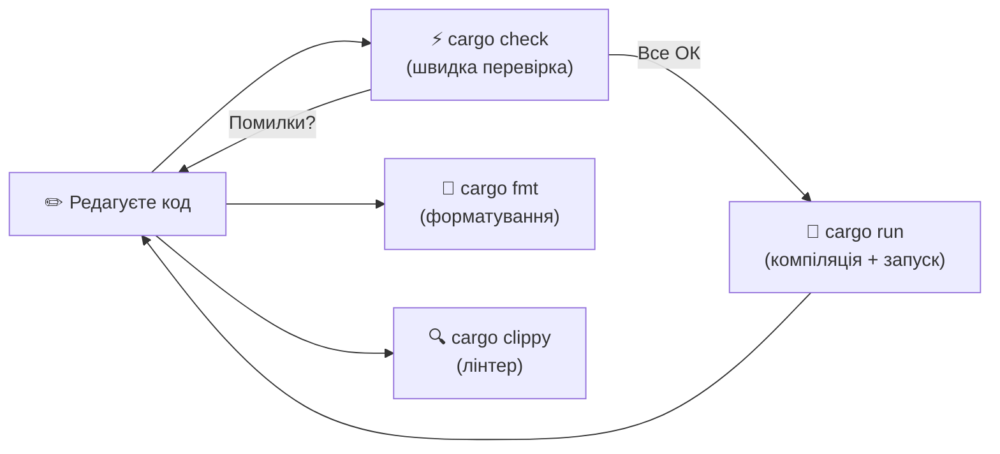

# Розділ 2. Налаштування середовища розробки

## Анотація

Перед тим як написати першу програму, потрібно підготувати робоче місце. Цей розділ проведе вас через встановлення Rust та всіх необхідних інструментів крок за кроком: від завантаження rustup до запуску першої команди `cargo run`. Ви розберетесь, що таке toolchain, навіщо потрібен cargo і чим він відрізняється від компілятора rustc, як влаштований Rust-проєкт зсередини, і що означає кожен рядок у файлі Cargo.toml. Окремо налаштуємо редактор коду VS Code з розширенням rust-analyzer, яке перетворює звичайний текстовий редактор на повноцінне середовище розробки з підсвіткою помилок, автодоповненням та навігацією по коду. Нарешті, ви зареєструєтесь у Claude та проведете перший діалог із AI-асистентом — не для вивчення теорії, а для знайомства з інструментом, який супроводжуватиме вас протягом усього курсу.

---

## Цілі навчання

Після опрацювання цього розділу студент зможе:

1. Самостійно встановити Rust (rustup, cargo, rustc) на Windows, Linux або macOS та перевірити коректність встановлення.
2. Створити новий Rust-проєкт командою `cargo new` та пояснити призначення кожного згенерованого файлу.
3. Пояснити вміст файлу Cargo.toml та його роль у проєкті.
4. Використовувати команди `cargo build`, `cargo run`, `cargo check`, `cargo fmt`, `cargo clippy` та пояснити, коли яку застосовувати.
5. Налаштувати VS Code з розширенням rust-analyzer та використовувати базові можливості IDE.
6. Зареєструватись у Claude та сформулювати перший ефективний запит до AI-асистента.

---

## Ключові терміни

**Toolchain (набір інструментів)** — комплект програм для розробки: компілятор, лінкер, стандартна бібліотека, документація.

**rustup** — програма для встановлення та оновлення Rust toolchain.

**cargo** — система збірки та менеджер пакетів Rust. Центральний інструмент розробника.

**rustc** — компілятор Rust. Зазвичай викликається через cargo, а не безпосередньо.

**Crate (крейт)** — одиниця компіляції в Rust: бібліотека або виконуваний файл.

**Cargo.toml** — маніфест проєкту: назва, версія, залежності. Формат TOML.

**TOML (Tom's Obvious, Minimal Language)** — формат конфігураційних файлів, використовуваний Rust.

**IDE (Integrated Development Environment)** — середовище розробки з підсвіткою коду, автодоповненням, навігацією.

**rust-analyzer** — мовний сервер для Rust, що забезпечує розумну підтримку коду в редакторах.

**clippy** — лінтер Rust, що знаходить типові помилки та неідіоматичний код.

**fmt (rustfmt)** — автоматичний форматувальник коду Rust.

---

## Мотиваційний кейс

Є стара жартівлива приказка серед програмістів: "Працює на моєму комп'ютері" — і до неї додають: "Тоді відвантажимо твій комп'ютер клієнту." Жарт старий, але проблема, яку він описує, — ні. Одна з найчастіших причин, чому код, що працює у одного розробника, не працює у іншого — різниця в середовищі розробки: інша версія компілятора, інша операційна система, відсутня бібліотека, не та версія залежності.

Rust вирішує цю проблему системно. rustup гарантує, що всі розробники в команді можуть використовувати однакову версію toolchain. Cargo.toml фіксує залежності проєкту з точністю до версії. Cargo.lock (про який ми поговоримо пізніше) фіксує точні версії всіх транзитивних залежностей. Результат: якщо проєкт компілюється на одному комп'ютері — він скомпілюється на будь-якому іншому з тим самим toolchain.

Тому правильне налаштування середовища — це не нудна формальність, а перший крок до відтворюваної, надійної розробки.

---

## 2.1. Встановлення Rust: rustup

Rust встановлюється не як окрема програма, а як керований набір інструментів (toolchain) через менеджер rustup. Чому не просто "скачати компілятор"? Тому що Rust — це більше, ніж компілятор. Це компілятор rustc, система збірки cargo, менеджер документації rustdoc, стандартна бібліотека, і ще кілька утиліт. Усе це має бути узгодженої версії, і rustup бере цю координацію на себе.

Крім того, Rust виходить у нових версіях кожні шість тижнів. rustup дозволяє оновлюватися однією командою, переключатися між версіями, і навіть мати кілька версій одночасно (хоча для нашого курсу це не знадобиться).

### Встановлення на Windows

Відкрийте браузер і перейдіть за адресою [https://rustup.rs](https://rustup.rs).

> 📸 **СКРИНШОТ 2-01:** Головна сторінка rustup.rs у браузері. Видно кнопку завантаження для Windows (rustup-init.exe) та команду для Unix-систем.

Сайт визначить вашу операційну систему автоматично і запропонує завантажити `rustup-init.exe`. Завантажте та запустіть цей файл.

Перед встановленням Rust на Windows вам може знадобитися Microsoft C++ Build Tools. Це набір інструментів від Microsoft, необхідний для компіляції (Rust використовує лінкер від Microsoft на Windows). Якщо вони ще не встановлені, rustup-init запропонує їх встановити.

> 📸 **СКРИНШОТ 2-02:** Вікно rustup-init.exe при першому запуску. Видно три варіанти: (1) Proceed with standard installation, (2) Customize installation, (3) Cancel. Обраний варіант 1.

Оберіть варіант 1 — стандартне встановлення. Процес займе кілька хвилин: rustup завантажить та встановить останню стабільну версію Rust.

> 📸 **СКРИНШОТ 2-03:** Вікно rustup-init.exe після успішного завершення встановлення. Видно повідомлення "Rust is installed now. Great!" та підказку про перезапуск терміналу.

Після завершення закрийте та відкрийте заново термінал (Command Prompt або PowerShell — будемо використовувати PowerShell). Це потрібно, щоб нові змінні середовища (environment variables) набули чинності.

Перевірте встановлення трьома командами:

```
rustc --version
```

```
cargo --version
```

```
rustup --version
```

> 📸 **СКРИНШОТ 2-04:** Вікно PowerShell з виконаними командами `rustc --version`, `cargo --version`, `rustup --version`. Видно версії кожного компонента (наприклад, rustc 1.82.0, cargo 1.82.0, rustup 1.27.1).

Якщо всі три команди повернули номери версій без помилок — Rust встановлено коректно. Якщо щось пішло не так — дивіться секцію Troubleshooting наприкінці розділу.

### Встановлення на Linux та macOS

На Linux і macOS встановлення ще простіше. Відкрийте термінал і виконайте команду:

```bash
curl --proto '=https' --tlsv1.2 -sSf https://sh.rustup.rs | sh
```

Ця команда завантажує скрипт встановлення з rustup.rs і передає його інтерпретатору sh для виконання.

> 📸 **СКРИНШОТ 2-05:** Термінал Linux або macOS з виконаною командою curl. Видно меню з варіантами: (1) Proceed with standard installation, (2) Customize, (3) Cancel.

Оберіть варіант 1. Після завершення встановлення виконайте:

```bash
source $HOME/.cargo/env
```

Ця команда активує змінні середовища для поточної сесії терміналу. У наступних сесіях вони активуватимуться автоматично.

Перевірте встановлення тими самими трьома командами: `rustc --version`, `cargo --version`, `rustup --version`.

### Що саме встановилося?

rustup розмістив усі файли в директорії `$HOME/.cargo/` (на Linux/macOS) або `%USERPROFILE%\.cargo\` (на Windows). Ось що знаходиться всередині:

- `.cargo/bin/` — виконувані файли: rustc, cargo, rustup, rustfmt, clippy, та інші
- `.cargo/registry/` — кеш завантажених бібліотек (поки порожній)
- `.rustup/toolchains/` — власне toolchain: компілятор та стандартна бібліотека

Вам не потрібно заходити в ці директорії вручну. Але корисно знати, що Rust не розкидає файли по всій системі, а тримає все компактно в одному місці. Якщо колись захочете повністю видалити Rust — достатньо виконати `rustup self uninstall`.

### Оновлення

Rust оновлюється однією командою:

```
rustup update
```

Рекомендую виконувати цю команду приблизно раз на місяць. Нові версії Rust виходять кожні шість тижнів і завжди зворотно сумісні — код, що працював на старій версії, працюватиме і на новій.

---

## 2.2. Cargo: центральний інструмент розробника

У попередньому розділі ми говорили, що компілятор Rust називається rustc. Це правда, але на практиці ви майже ніколи не будете викликати rustc безпосередньо. Замість цього ви працюватимете через cargo.

cargo — це значно більше, ніж обгортка навколо компілятора. Це система збірки (build system), менеджер пакетів (package manager), інструмент для запуску тестів, генератор документації, та багато іншого — все в одній програмі. У Python для цих задач потрібно окремо pip, setuptools, virtualenv, pytest, sphinx. У Rust — один cargo.

Ось аналогія. Уявіть, що ви будуєте будинок. rustc — це цегляр, який вміє класти цеглу. Але хтось має привезти цеглу потрібного розміру, підготувати розчин, скласти план робіт, перевірити якість після завершення. Це cargo. Він організовує процес, а rustc виконує безпосередню роботу компіляції.

### Створення проєкту

Відкрийте термінал і перейдіть у директорію, де хочете зберігати проєкти (наприклад, `C:\Users\ВашеІм'я\projects` на Windows або `~/projects` на Linux/macOS). Якщо директорія не існує — створіть:

```
mkdir projects
cd projects
```

Тепер створіть перший Rust-проєкт:

```
cargo new hello_drone
```

> 📸 **СКРИНШОТ 2-06:** Термінал після виконання `cargo new hello_drone`. Видно повідомлення "Creating binary (application) `hello_drone` package" та "note: see more `Cargo.toml` keys and their definitions at ...".

cargo створив директорію `hello_drone` з усією необхідною структурою. Зайдіть у неї:

```
cd hello_drone
```

### Анатомія проєкту

Подивимось, що cargo створив:

```
hello_drone/
├── Cargo.toml
└── src/
    └── main.rs
```

> 📸 **СКРИНШОТ 2-07:** Вивід команди `tree hello_drone` (або `dir /s` на Windows, або `ls -R` на Linux/macOS), що показує структуру файлів створеного проєкту.

Файлів усього два, але кожен має чітку роль.

**Cargo.toml** — маніфест проєкту. Це "паспорт" вашої програми: як вона називається, якої версії, від чого залежить. Відкрийте його — ось що всередині:

```toml
[package]
name = "hello_drone"
version = "0.1.0"
edition = "2021"

[dependencies]
```

Формат цього файлу називається TOML — Tom's Obvious, Minimal Language. Це простий текстовий формат для конфігурацій, створений спеціально для читабельності.

Розберемо кожен рядок.

`[package]` — це заголовок секції. Усе, що йде після нього до наступного заголовка, описує сам пакет (так у Rust називається одиниця проєкту).

`name = "hello_drone"` — ім'я проєкту. Саме під цим іменем буде створено виконуваний файл. Якщо ви запустите `cargo build`, результат буде називатися `hello_drone` (або `hello_drone.exe` на Windows).

`version = "0.1.0"` — версія вашого проєкту за стандартом Semantic Versioning (SemVer). Перша цифра (0) — мажорна версія, друга (1) — мінорна, третя (0) — патч. Для навчального проєкту це не критично, але у реальній розробці версіонування — серйозна тема.

`edition = "2021"` — "видання" мови Rust. Rust зберігає зворотну сумісність, але деякі зміни синтаксису вводяться через механізм видань. 2021 — останнє стабільне видання на момент написання. Це не версія компілятора (яка може бути 1.82.0), а набір мовних правил, які компілятор застосовує до вашого коду.

`[dependencies]` — секція залежностей. Поки вона порожня — наш проєкт не залежить від зовнішніх бібліотек. У майбутніх розділах, коли ми підключатимемо serde для серіалізації або tokio для асинхронності, залежності з'являться саме тут.

**src/main.rs** — власне програма. Це файл з вихідним кодом, який cargo скомпілює. Відкрийте його:

```rust
fn main() {
    println!("Hello, world!");
}
```

cargo автоматично згенерував мінімальну працюючу програму. Детально ми розберемо кожен елемент цього коду у Розділі 3, а зараз головне — це повноцінна програма, готова до компіляції та запуску.

### Перший запуск

Виконайте команду:

```
cargo run
```

> 📸 **СКРИНШОТ 2-08:** Термінал після виконання `cargo run`. Видно два етапи: "Compiling hello_drone v0.1.0 (...)" та "Running `target/debug/hello_drone`", і нижче — вивід "Hello, world!".

Відбулося дві речі. Перша: cargo викликав компілятор rustc, який перетворив ваш main.rs на виконуваний файл. Друга: cargo одразу запустив цей файл, і ви побачили результат — "Hello, world!" на екрані.

Зверніть увагу на рядок `Compiling hello_drone v0.1.0`. Це cargo повідомляє, що він компілює ваш проєкт. Якщо ви виконаєте `cargo run` ще раз, не змінюючи код, ви побачите лише `Running ...` без `Compiling ...` — cargo достатньо розумний, щоб не перекомпільовувати те, що не змінилось.

Скомпільований файл знаходиться у директорії `target/debug/`. Ви можете запустити його безпосередньо:

```
# Linux/macOS:
./target/debug/hello_drone

# Windows:
.\target\debug\hello_drone.exe
```

Але у повсякденній роботі зручніше використовувати `cargo run` — він і скомпілює (якщо потрібно), і запустить.

---

## 2.3. Команди cargo, які ви використовуватимете щодня

cargo має десятки команд, але для повсякденної роботи достатньо шести. Розберемо кожну.



**`cargo build`** — компілює проєкт, але не запускає. Створює виконуваний файл у `target/debug/`. Використовуєте, коли хочете перевірити, чи компілюється проєкт, але не потрібно його запускати.

```
cargo build
```

> 📸 **СКРИНШОТ 2-09:** Термінал після `cargo build`. Видно "Compiling hello_drone v0.1.0 (...)" та "Finished `dev` profile [unoptimized + debuginfo] target(s) in X.XXs".

Зверніть увагу на `[unoptimized + debuginfo]`. Це означає, що cargo скомпілював програму в режимі розробки (debug mode): без оптимізацій (щоб компіляція була швидшою) і з інформацією для відладки. Для фінального продукту ви б використали `cargo build --release` — це створює оптимізований файл у `target/release/`, який працює значно швидше, але компілюється довше.

**`cargo run`** — компілює (якщо потрібно) та одразу запускає. Це команда, яку ви використовуватимете найчастіше.

```
cargo run
```

**`cargo check`** — перевіряє код на помилки, але не створює виконуваний файл. Це швидше за `cargo build`, тому що пропускає етап генерації machine code. Використовуйте `cargo check` під час активного написання коду — щоб швидко перевірити, чи немає помилок, без повної компіляції.

```
cargo check
```

> 📸 **СКРИНШОТ 2-10:** Термінал після `cargo check`. Видно "Checking hello_drone v0.1.0 (...)" та "Finished `dev` profile target(s) in X.XXs". Зверніть увагу: "Checking", а не "Compiling".

**`cargo fmt`** — автоматично форматує ваш код за стандартним стилем Rust. Не потрібно дискутувати, де ставити фігурні дужки чи скільки пробілів використовувати для відступів — `cargo fmt` робить це за вас. Увесь код у спільноті Rust форматується однаково, що різко спрощує читання чужого коду.

```
cargo fmt
```

Ця команда не видає нічого, якщо все добре — вона мовчки виправляє форматування у ваших файлах. Рекомендую запускати її перед кожним збереженням або налаштувати автоматичне форматування в редакторі (ми зробимо це далі).

**`cargo clippy`** — це лінтер (linter): програма, що аналізує ваш код і знаходить потенційні проблеми, які формально не є помилками компіляції, але можуть призвести до багів або є неідіоматичними. Наприклад, clippy підкаже, якщо ви написали `if x == true` замість `if x`, або якщо є невикористані змінні, або якщо є більш ефективний спосіб написати певну конструкцію.

```
cargo clippy
```

> 📸 **СКРИНШОТ 2-11:** Термінал після `cargo clippy` на чистому проєкті. Видно "Checking hello_drone ..." та "Finished" без попереджень (поки код простий — clippy нічого не знаходить).

Якщо clippy не встановлений — виконайте `rustup component add clippy`.

**`cargo test`** — запускає тести. Ми повернемось до цієї команди у Розділі 19, коли вивчатимемо тестування. Поки просто знайте, що вона існує.

Ось коротка таблиця для запам'ятовування:

| Команда | Що робить | Коли використовувати |
|---------|----------|---------------------|
| `cargo check` | Перевіряє код, не компілює повністю | Під час написання коду — швидка перевірка |
| `cargo build` | Компілює, не запускає | Коли потрібен лише виконуваний файл |
| `cargo run` | Компілює та запускає | Коли хочете побачити результат |
| `cargo fmt` | Форматує код | Перед збереженням / перед комітом |
| `cargo clippy` | Знаходить неідіоматичний код | Після завершення роботи над функцією |
| `cargo test` | Запускає тести | Після змін — перевірити, що нічого не зламалось |

Типовий робочий цикл виглядає так: ви пишете код → зберігаєте → `cargo check` (швидко перевірити) → виправляєте помилки → `cargo run` (запустити та подивитись результат) → `cargo fmt` (привести до стандартного стилю) → `cargo clippy` (перевірити на неідіоматичність).

---

## 2.4. VS Code та rust-analyzer

Писати код можна в будь-якому текстовому редакторі — хоч у Блокноті. Але сучасне середовище розробки (IDE) робить процес у рази продуктивнішим. Для Rust найпопулярніший вибір — Visual Studio Code (VS Code) із розширенням rust-analyzer.

### Встановлення VS Code

Перейдіть на [https://code.visualstudio.com](https://code.visualstudio.com) і завантажте інсталятор для вашої операційної системи.

> 📸 **СКРИНШОТ 2-12:** Головна сторінка code.visualstudio.com з кнопкою завантаження.

Встановіть VS Code зі стандартними параметрами. На Windows рекомендую поставити галочки "Add to PATH" та "Add 'Open with Code' to context menu" — це дозволить відкривати проєкти з терміналу та з провідника файлів.

> 📸 **СКРИНШОТ 2-13:** Інсталятор VS Code на етапі вибору додаткових опцій. Відмічені галочки "Add to PATH" та "Register Code as an editor for supported file types".

### Встановлення rust-analyzer

Запустіть VS Code. Зліва на бічній панелі знайдіть іконку розширень (чотири квадратики, один відокремлений) або натисніть `Ctrl+Shift+X`.

> 📸 **СКРИНШОТ 2-14:** VS Code з відкритою панеллю розширень (Extensions). У пошуковому полі введено "rust-analyzer".

У пошуковому полі введіть `rust-analyzer`. Перший результат — розширення від "The Rust Programming Language". Натисніть "Install".

> 📸 **СКРИНШОТ 2-15:** Сторінка розширення rust-analyzer у VS Code. Видно назву, автора, кількість завантажень та кнопку "Install".

Після встановлення rust-analyzer почне працювати автоматично, коли ви відкриєте Rust-проєкт.

### Відкриття проєкту у VS Code

Є два способи відкрити проєкт. Перший — з терміналу, перебуваючи в директорії проєкту:

```
code .
```

Крапка означає "поточну директорію". Другий спосіб — через меню VS Code: File → Open Folder → оберіть директорію `hello_drone`.

> 📸 **СКРИНШОТ 2-16:** VS Code з відкритим проєктом hello_drone. Зліва видно файлову структуру (Explorer): Cargo.toml та src/main.rs. У центрі відкрито файл main.rs з кодом "Hello, world!". Внизу — статус-бар, де rust-analyzer показує статус.

Зверніть увагу на кілька речей. У лівій панелі (Explorer) видно структуру проєкту. У центрі — відкритий файл main.rs з підсвіткою синтаксису: ключові слова Rust виділені кольором. У нижньому правому куті видно статус rust-analyzer — він аналізує ваш код у фоновому режимі.

### Що дає rust-analyzer

rust-analyzer — це не просто підсвітка синтаксису. Це повноцінний аналізатор коду, який працює у фоні та надає кілька можливостей, що заощадять вам години.

**Підсвітка помилок у реальному часі.** Зробіть навмисну помилку — наприклад, видаліть крапку з комою наприкінці рядка `println!("Hello, world!")`. Через секунду rust-analyzer підкреслить проблемне місце червоною хвилястою лінією, і в панелі "Problems" (Ctrl+Shift+M) з'явиться опис помилки.

> 📸 **СКРИНШОТ 2-17:** VS Code з навмисною помилкою в main.rs (видалена крапка з комою). Видно червоне підкреслення та панель Problems внизу з описом помилки "expected `;`".

**Автодоповнення.** Коли ви починаєте набирати код, rust-analyzer пропонує варіанти завершення. Наприклад, наберіть `println` — і з'явиться підказка з повним синтаксисом макросу.

> 📸 **СКРИНШОТ 2-18:** VS Code з відкритим меню автодоповнення: набрано "print" і видно варіанти: println!, print!, eprint!, eprintln!.

**Вбудований термінал.** VS Code має вбудований термінал: меню Terminal → New Terminal або комбінація клавіш Ctrl+`. Тут ви можете запускати `cargo run`, `cargo check` та інші команди, не перемикаючись між вікнами.

> 📸 **СКРИНШОТ 2-19:** VS Code з відкритим вбудованим терміналом у нижній частині екрана. У терміналі виконано `cargo run`, видно вивід "Hello, world!".

### Рекомендовані налаштування

Відкрийте налаштування VS Code: File → Preferences → Settings (або `Ctrl+,`). Знайдіть і увімкніть такі опції:

**Format On Save.** Шукайте "format on save" і поставте галочку. Тепер при кожному збереженні файлу (`Ctrl+S`) VS Code автоматично запускатиме `rustfmt`.

> 📸 **СКРИНШОТ 2-20:** Сторінка Settings у VS Code. У пошуку введено "format on save", видно галочку напроти "Editor: Format On Save".

**Check On Save.** rust-analyzer за замовчуванням запускає `cargo check` при кожному збереженні. Переконайтесь, що у налаштуваннях rust-analyzer параметр "Check On Save: Command" має значення `clippy` замість стандартного `check`. Тоді при збереженні ви отримаєте не лише перевірку компіляції, а й рекомендації clippy.

> 📸 **СКРИНШОТ 2-21:** Сторінка Settings у VS Code. У пошуку введено "rust-analyzer check on save". Видно параметр "Check On Save: Command" зі значенням "clippy".

Після цих налаштувань ваш робочий процес спрощується до: написали код → зберегли (`Ctrl+S`) → побачили помилки та попередження одразу в редакторі. Термінал знадобиться лише для `cargo run`.

---

## 2.5. Анатомія директорії target/

Після першого `cargo build` або `cargo run` у вашому проєкті з'явиться директорія `target/`. Вона може здатися великою — сотні мегабайт навіть для простого "Hello, world!". Не лякайтесь — це нормально.

```
hello_drone/
├── Cargo.toml
├── Cargo.lock          ← з'явився після першої збірки
├── src/
│   └── main.rs
└── target/
    └── debug/
        ├── hello_drone     ← ваш виконуваний файл
        ├── ...             ← проміжні файли компіляції
        └── deps/           ← скомпільовані залежності
```

`target/debug/` містить результати компіляції в режимі розробки. `target/release/` з'явиться, коли ви виконаєте `cargo build --release`.

Також з'явився файл `Cargo.lock`. Він фіксує точні версії всіх залежностей проєкту. Поки залежностей немає — файл майже порожній. Але в реальних проєктах Cargo.lock гарантує, що кожен розробник у команді працює з однаковими версіями бібліотек.

Директорію `target/` не потрібно додавати до системи контролю версій (Git). Вона може бути відтворена з вихідного коду в будь-який момент командою `cargo build`. Тому у файлі `.gitignore`, який cargo створює за замовчуванням (якщо ви використовуєте git), уже є рядок `/target`.

Якщо `target/` займає занадто багато місця — можете безпечно видалити її цілком. Наступний `cargo build` створить усе заново.

---

## 2.6. Налаштування Claude

Окрім Rust та VS Code, у цьому курсі ми використовуємо AI-асистент Claude. Ви вже читали про нього у Вступі та у Розділі 1 — тепер налаштуємо.

### Реєстрація

Перейдіть на [https://claude.ai](https://claude.ai) і створіть обліковий запис. Вам знадобиться email-адреса. Безкоштовний тариф достатній для навчальних задач цього курсу.

> 📸 **СКРИНШОТ 2-22:** Сторінка входу/реєстрації claude.ai.

### Інтерфейс

Після входу ви побачите чат-інтерфейс: текстове поле для введення повідомлення та область для відповіді.

> 📸 **СКРИНШОТ 2-23:** Головна сторінка Claude після входу. Видно текстове поле для промпту та кнопку надсилання.

Зверніть увагу: кожна нова розмова з Claude починається "з чистого аркуша" — AI не пам'ятає попередні діалоги (у межах безкоштовного тарифу). Тому кожного разу, коли ви починаєте новий діалог, важливо надати контекст: хто ви, що вивчаєте, який код обговорюєте.

### Перший діалог: перевірка середовища

Ми ще не написали жодного власного коду, тому повноцінна PE-практика почнеться у наступних розділах. Але вже зараз можна перевірити, як працює Claude, на задачі, де ви здатні оцінити відповідь.

Спробуйте такий запит:

```
Я студент першого курсу, вивчаю Rust. 
Щойно встановив Rust через rustup і створив проєкт cargo new hello_drone.
Коли запускаю cargo run, бачу "Hello, world!".

Яку команду мені виконати, щоб перевірити встановлену версію:
1. Компілятора Rust
2. Cargo
3. Rustup

Для кожної команди покажи приклад виводу.
```

> 📸 **СКРИНШОТ 2-24:** Вікно Claude з цим запитом та відповіддю. Видно, що Claude дає три команди (rustc --version, cargo --version, rustup --version) з прикладами виводу.

Вся інформація у відповіді Claude вам уже відома з цього розділу. Саме в цьому суть: ви використовуєте AI для підтвердження того, що вже знаєте, а не для заміни знань. У цьому випадку ви можете перевірити кожну відповідь Claude, виконавши команди у своєму терміналі. Якщо щось не збігається — ви знаєте, що AI помилився, і можете виправити.

---

## Практика

Тепер, коли середовище налаштоване, проведемо невелику розвідку проєкту, який cargo створив для нас.

Відкрийте термінал у директорії hello_drone і виконайте:

```
cargo build
```

Потім знайдіть виконуваний файл:

```
# Linux/macOS:
ls -lh target/debug/hello_drone
file target/debug/hello_drone

# Windows PowerShell:
Get-Item target\debug\hello_drone.exe
```

> 📸 **СКРИНШОТ 2-25:** Термінал з виводом цих команд. Видно розмір виконуваного файлу (кілька мегабайт) та його тип (ELF executable на Linux або PE32+ на Windows).

Зверніть увагу на розмір файлу — він значно більший, ніж можна було б очікувати для програми з двох рядків. Це тому, що Rust статично лінкує (вбудовує) частину стандартної бібліотеки у виконуваний файл. Перевага: ваша програма самодостатня і не потребує зовнішніх бібліотек для запуску. Недолік: розмір файлу більший. Для БПЛА з обмеженою пам'яттю це може мати значення — і пізніше ми поговоримо про оптимізацію розміру.

Тепер порівняйте час виконання `cargo check` та `cargo build`:

```
# Очистіть попередню збірку:
cargo clean

# Заміряйте час повної збірки:
cargo build
# Запам'ятайте час із рядка "Finished ... in X.XXs"

# Очистіть знову:
cargo clean

# Заміряйте час перевірки:
cargo check
# Порівняйте час
```

`cargo check` буде швидшим, тому що він не генерує machine code — тільки перевіряє правильність коду. У великих проєктах ця різниця може бути значною: секунди замість хвилин.

---

## Prompt Engineering: знайомство з інструментом

Секція PE в цьому розділі коротка, бо ми ще не маємо власного коду для роботи з AI. Але є одна навичка, яку варто почати відпрацьовувати вже зараз: уміння оцінювати відповідь AI.

Спробуйте дати Claude такий запит:

```
Я щойно встановив Rust. Виконую cargo run і бачу 
повідомлення "Hello, world!". Мені цікаво:

1. У якій директорії знаходиться скомпільований файл?
2. Якщо я зміню текст у println!, чи потрібно заново 
   виконувати cargo build перед cargo run?
3. Чи можу я просто запустити ./main.rs напряму 
   без компіляції?
```

Проаналізуйте відповідь AI, маючи знання з цього розділу.

На питання 1 — Claude має відповісти `target/debug/`. Якщо він каже щось інше — це помилка.

На питання 2 — правильна відповідь: ні, `cargo run` сам перекомпілює, якщо код змінився. Окремий `cargo build` перед `cargo run` не потрібен.

На питання 3 — правильна відповідь: ні, файл .rs — це вихідний код, не виконуваний файл. Rust — компільована мова, і .rs-файл потрібно спершу скомпілювати. Якщо Claude якимось чином скаже "так" — це грубо неправильна відповідь, і ви це знаєте, бо прочитали Розділ 1 та Розділ 2.

Ось суть PE у цьому курсі: ви запитуєте AI — і оцінюєте відповідь на основі власних знань. Зараз ваші знання охоплюють два розділи. До кінця курсу вони охоплюватимуть усю мову Rust, і ви зможете оцінювати значно складніші відповіді AI.

---

## Лабораторна робота №2

### Мета

Встановити Rust та VS Code, переконатися у коректності середовища, познайомитися з командами cargo.

### Завдання базового рівня

1. Встановіть Rust через rustup. Зробіть скриншот результату `rustc --version`, `cargo --version`, `rustup --version`.
2. Створіть проєкт `cargo new lab02_drone`. Запустіть `cargo run`. Зробіть скриншот.
3. Відкрийте файл Cargo.toml та поясніть кожен рядок (письмово, 2–3 речення на рядок).
4. Встановіть VS Code та rust-analyzer. Зробіть навмисну помилку в main.rs (наприклад, видаліть фігурну дужку). Зробіть скриншот, де rust-analyzer підсвічує помилку.
5. Виправте помилку, збережіть файл, виконайте `cargo fmt` та `cargo clippy`. Зробіть скриншот терміналу.

### Варіанти для самостійного виконання

**Варіант A.** Створіть три проєкти: `lab02_hello`, `lab02_drone`, `lab02_test`. У кожному змініть текст у `println!` на щось своє. Скомпілюйте кожен окремо. Знайдіть усі три виконувані файли у відповідних директоріях `target/debug/`. Порівняйте їхні розміри — чому вони майже однакові?

**Варіант B.** Дослідіть різницю між `cargo build` та `cargo build --release`. Скомпілюйте один і той самий проєкт обома способами. Порівняйте: час компіляції, розмір виконуваного файлу, розташування файлу (`target/debug/` vs `target/release/`). Запишіть результати порівняння.

**Варіант C.** Знайдіть і встановіть два додаткових розширення VS Code, корисних для Rust-розробки (наприклад: Error Lens, Even Better TOML, CodeLLDB). Для кожного: запишіть назву, що воно робить, зробіть скриншот, де видно його роботу.

**Варіант D.** Зареєструйтесь у Claude. Задайте AI три питання про Rust (на ваш вибір, пов'язані з матеріалом Розділів 1–2). Для кожної відповіді AI напишіть: правильна / частково правильна / неправильна, і чому (з посиланням на конкретне місце у підручнику).

### Критерії оцінювання

| Критерій | Максимальний бал |
|----------|-----------------|
| Коректне встановлення Rust та VS Code | 25 |
| Створення та запуск проєкту | 20 |
| Пояснення Cargo.toml | 20 |
| Демонстрація rust-analyzer (помилка + виправлення) | 20 |
| Скриншоти та оформлення | 15 |

---

## Troubleshooting

**Помилка: `rustc is not recognized` або `command not found: rustc` після встановлення.**

Причина: термінал не бачить шлях до Rust. На Windows — перезапустіть термінал (або перезавантажте комп'ютер). На Linux/macOS — виконайте `source $HOME/.cargo/env` або додайте цей рядок у файл `~/.bashrc` (або `~/.zshrc` для macOS).

**Помилка: `linker 'cc' not found` на Linux.**

Причина: не встановлені інструменти для збирання. Виконайте:
```bash
# Ubuntu/Debian:
sudo apt install build-essential

# Fedora:
sudo dnf install gcc
```

**Помилка: `linker 'link.exe' not found` на Windows.**

Причина: не встановлені Microsoft C++ Build Tools. Завантажте Visual Studio Build Tools з [https://visualstudio.microsoft.com/visual-cpp-build-tools/](https://visualstudio.microsoft.com/visual-cpp-build-tools/) і встановіть компонент "Desktop development with C++".

> 📸 **СКРИНШОТ 2-26:** Інсталятор Visual Studio Build Tools. Відмічено компонент "Desktop development with C++".

**Помилка: `error: could not compile` з незрозумілим повідомленням.**

Скоріш за все, помилка у вашому коді. Прочитайте повідомлення уважно — компілятор Rust майже завжди каже, що саме не так і де. Якщо не можете зрозуміти — зверніться до Troubleshooting відповідного розділу, де розглядається конкретна тема.

**VS Code не підсвічує помилки та не пропонує автодоповнення.**

Перевірте: чи встановлений rust-analyzer (панель Extensions)? Чи відкрили ви саме *директорію проєкту* (де лежить Cargo.toml), а не окремий файл? rust-analyzer потребує Cargo.toml для роботи. Якщо ви відкрили окремий .rs-файл через File → Open File — аналіз не працюватиме. Відкрийте директорію через File → Open Folder.

**`cargo clippy` видає `error: component 'clippy' is not installed`.**

Виконайте:
```
rustup component add clippy
```

**cargo run працює дуже повільно (перша компіляція).**

Перша компіляція завжди найповільніша — cargo завантажує та компілює залежності та частини стандартної бібліотеки. Наступні компіляції будуть значно швидшими, тому що cargo кешує проміжні результати у директорії `target/`.

---

## Додатково

### Альтернативні редактори

VS Code — не єдиний варіант для Rust-розробки. Ось інші:

**RustRover** від JetBrains — повноцінна IDE, спеціально створена для Rust. Має вбудовану підтримку мови без додаткових плагінів. Безкоштовна для студентів (через JetBrains Education Program). Якщо ви вже знайомі з продуктами JetBrains (IntelliJ IDEA, PyCharm) — RustRover буде звичним.

**Vim/Neovim** з плагінами — вибір досвідчених розробників, які цінують швидкість роботи з клавіатурою. rust-analyzer працює і тут.

**Helix** — сучасний термінальний редактор, написаний на Rust, із вбудованою підтримкою LSP (Language Server Protocol). Якщо хочете відчути "Rust-спільноту зсередини" — спробуйте.

Для цього курсу ми використовуємо VS Code, тому що він безкоштовний, кросплатформний, і більшість скриншотів та інструкцій будуть саме для нього.

### Cargo.toml: що ще може бути

У нашому Cargo.toml поки лише `[package]` та порожній `[dependencies]`. У реальних проєктах там може бути значно більше:

```toml
[package]
name = "drone_swarm"
version = "0.3.1"
edition = "2021"
authors = ["Ваше Ім'я <your@email.com>"]
description = "Simulation of autonomous UAV swarm"
license = "MIT"

[dependencies]
serde = { version = "1.0", features = ["derive"] }
tokio = { version = "1", features = ["full"] }
tracing = "0.1"

[dev-dependencies]
criterion = "0.5"

[[bin]]
name = "swarm_sim"
path = "src/main.rs"
```

Не намагайтесь зрозуміти це зараз — ми повернемось до кожного з цих елементів у відповідних розділах. Мета цього прикладу — показати, що Cargo.toml росте разом з проєктом, і одного дня ваш Cargo.toml буде виглядати саме так.

---

## Контрольні запитання

### Рівень 1 (знання)

1. Що таке rustup і яку роль він виконує?
2. Назвіть шість основних команд cargo, які розглянуто у цьому розділі.
3. Як називається файл маніфесту Rust-проєкту і в якому форматі він написаний?
4. У якій директорії знаходиться скомпільований виконуваний файл після `cargo build`?

### Рівень 2 (розуміння)

5. Чому `cargo check` працює швидше за `cargo build`? Що він пропускає?
6. Поясніть, чому після `cargo new my_project` у директорії немає виконуваного файлу, хоча вже є файл main.rs з кодом.
7. Чому при повторному `cargo run` без зміни коду компіляція не відбувається?
8. Поясніть, навіщо потрібен `cargo fmt`, якщо код і без форматування працює правильно.

### Рівень 3 (застосування)

9. Ви створили проєкт `cargo new sensor_reader`. Опишіть повну послідовність команд, щоб: створити проєкт, відкрити його у VS Code, скомпілювати, запустити, відформатувати код, перевірити лінтером.
10. Ваш колега надіслав вам файл `main.rs` (без Cargo.toml, без директорії проєкту). Які кроки потрібні, щоб перетворити цей файл на повноцінний проєкт cargo і запустити його?

### Рівень 4 (аналіз)

11. Уявіть команду з п'яти розробників, які працюють над одним Rust-проєктом. Поясніть, яку роль відіграють файли Cargo.toml та Cargo.lock у забезпеченні того, щоб код працював однаково на всіх п'яти комп'ютерах.
12. Порівняйте процес встановлення та налаштування середовища для Rust (rustup + cargo + VS Code) та Python (Python installer + pip + VS Code). Які переваги та недоліки кожного підходу? Чому Rust об'єднує компілятор, менеджер пакетів та систему збірки в одному інструменті, а Python — ні?

---

## Резюме

Rust встановлюється через rustup — менеджер, що координує компілятор, cargo та стандартну бібліотеку. Одна команда `rustup update` оновлює все.

cargo — центральний інструмент Rust-розробника: система збірки, менеджер пакетів, тест-раннер — все в одній програмі. Безпосередньо з rustc працювати не потрібно.

Проєкт створюється командою `cargo new ім'я`, яка генерує Cargo.toml (маніфест) та src/main.rs (вихідний код). Ця структура стандартна для всіх Rust-проєктів.

Шість щоденних команд: `cargo check` (швидка перевірка), `cargo build` (компіляція), `cargo run` (компіляція + запуск), `cargo fmt` (форматування), `cargo clippy` (лінтер), `cargo test` (тести).

VS Code із rust-analyzer забезпечує підсвітку помилок у реальному часі, автодоповнення та навігацію по коду. Налаштування "Format On Save" та "Check On Save: clippy" автоматизують рутину.

Директорія `target/` містить результати компіляції. Вона може бути видалена та відтворена будь-коли. Не додавайте її до Git.

---

## Що далі

Середовище готове: Rust встановлено, cargo працює, VS Code налаштовано. Тепер — час писати код. У Розділі 3 ми розберемо кожен елемент програми "Hello, world!" і напишемо першу програму, що виводить статус нашого БПЛА-агента: його позицію, заряд батареї та стан готовності.
