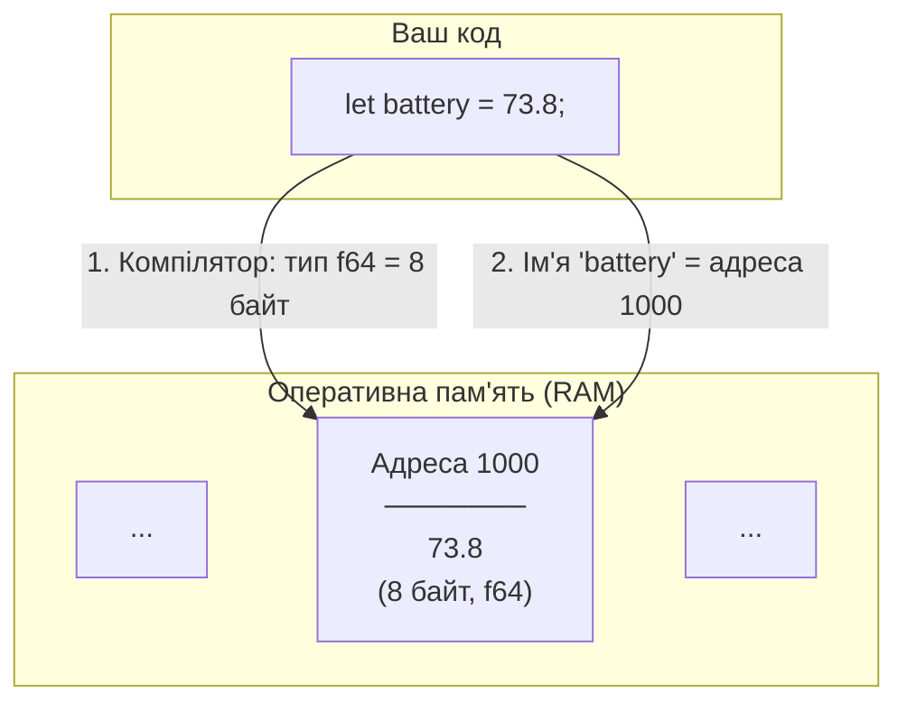
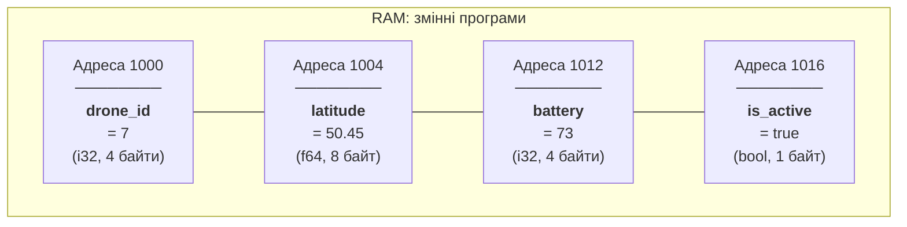
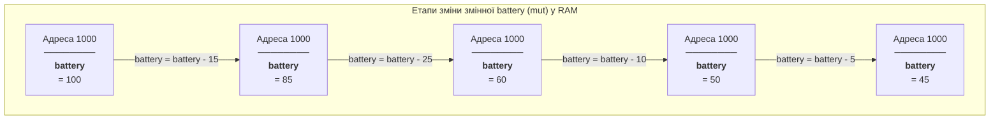
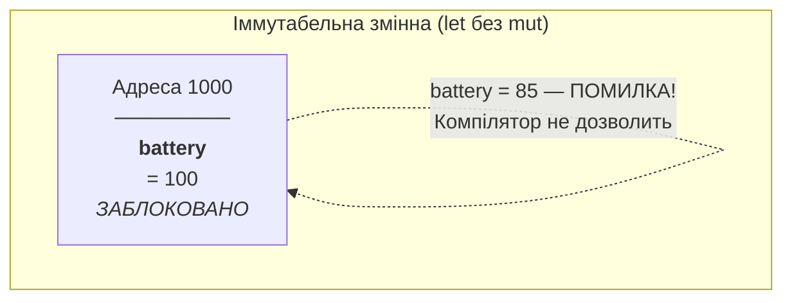
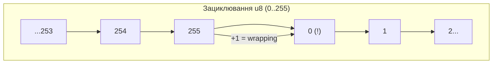
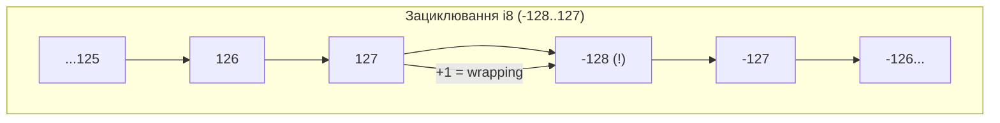

# ЧАСТИНА I: ІМПЕРАТИВНИЙ RUST

*Мета: навчити писати базову логіку, не ускладнюючи моделлю пам'яті*

## Стан агента на початку Частини I

Поки що нашого агента не існує. Є лише програма з Розділу 3, яка виводить захардкоджений статус БПЛА на екран. Усі значення — координати, висота, батарея — зашиті прямо в текст `println!`. Якщо дрон переміститься — програма цього не побачить. Якщо батарея розрядиться — програма продовжить показувати 73.8%.

## Обмеження

Програма не вміє: зберігати дані, які змінюються; приймати рішення ("якщо батарея нижче 30% — повертайся"); повторювати дії ("перевіряй сенсори кожну секунду"); організовувати код у логічні блоки; читати команди від оператора.

## Що буде додано в Частині I

До кінця цієї частини агент стане алгоритмом на текстовій сітці. Він матиме змінні для позиції та енергії (Розділ 5), зможе приймати рішення через умовні оператори (Розділ 6), повторювати дії через цикли (Розділ 7), зберігати масив показань сенсорів (Розділ 8), працювати з текстовими ідентифікаторами та командами (Розділ 9), читати команди оператора (Розділ 10), і все це буде організовано у функції (Розділ 11). Практикум у Розділі 12 об'єднає все разом: інтерактивна текстова симуляція БПЛА на патрулюванні.

Фаза PE: AI для дебагу — ви пишете код самостійно, AI допомагає розібрати помилки компілятора.

---

# Розділ 5. Змінні та базові типи даних

## Анотація

У Розділі 3 всі дані нашого БПЛА були "вморожені" прямо в текст: `let battery = 73.8;` — і це число ніколи не зміниться. Справжній дрон так не працює: його координати оновлюються щосекунди, батарея розряджається, швидкість змінюється. Цей розділ пояснює, як Rust зберігає дані в пам'яті комп'ютера, що таке змінна з точки зору процесора і RAM, і чому Rust за замовчуванням забороняє змінювати значення змінних — рішення, яке на перший погляд абсурдне, але насправді запобігає цілим категоріям помилок. Ви дізнаєтесь про систему типів Rust: чому існує десять різних типів цілих чисел, чим `i32` відрізняється від `u8`, що відбувається при переповненні, і як все це пов'язано з реальними обмеженнями бортового комп'ютера БПЛА, де кожен байт пам'яті на рахунку.

---

## Цілі навчання

Після опрацювання цього розділу студент зможе:

1. Пояснити, що таке змінна з точки зору пам'яті комп'ютера, і намалювати схему зв'язку між ім'ям змінної та коміркою RAM.
2. Пояснити різницю між `let` та `let mut` і обґрунтувати, чому іммутабельність за замовчуванням — це перевага.
3. Обрати правильний числовий тип (`i32`, `u8`, `f64` тощо) для конкретної задачі, враховуючи діапазон та розмір.
4. Пояснити, що таке переповнення цілого числа, продемонструвати wrapping-поведінку, та описати, чим відрізняється поведінка у debug та release режимах.
5. Використовувати shadowing, const, та числові літерали різних форматів.

---

## Ключові терміни

**Variable (змінна)** — іменоване місце в пам'яті для зберігання значення певного типу.

**Immutable (незмінний)** — змінна, значення якої не можна змінити після створення. У Rust — за замовчуванням.

**Mutable (змінний)** — змінна, значення якої можна змінювати. У Rust — потребує явного `mut`.

**Type (тип)** — категорія значення, що визначає його розмір у пам'яті та допустимі операції.

**Type inference (виведення типу)** — здатність компілятора автоматично визначити тип змінної за її значенням.

**Overflow (переповнення)** — ситуація, коли результат операції виходить за межі діапазону типу.

**Shadowing (затінення)** — створення нової змінної з тим самим ім'ям, що "перекриває" попередню.

**Scalar type (скалярний тип)** — тип, що зберігає одне значення: ціле число, дробове число, bool, char.

---

## Мотиваційний кейс

У 1996 році ракета Ariane 5 вибухнула через 37 секунд після старту. Причина: програма навігаційної системи зберігала значення горизонтальної швидкості у 64-бітному дробовому числі, а потім конвертувала його в 16-бітне ціле. Швидкість Ariane 5 виявилася більшою, ніж максимальне значення 16-бітного числа (32 767). Результат — переповнення, помилковий сигнал, автоматичне самознищення. Збитки — 370 мільйонів доларів. Одна змінна неправильного типу.

Для нашого БПЛА ставки менші, але принцип той самий: якщо заряд батареї зберігається в типі, що допускає від'ємні значення, а ваш код не перевіряє це — дрон може "думати", що в нього -3% батареї, і прийняти хибне рішення. Типи даних — це не бюрократія. Це захист.

---

## 5.1. Що таке змінна: від імені до комірки пам'яті

У Розділі 3 ви писали `let battery = 73.8;` і використовували `battery` у `println!`. Але що насправді відбувається всередині комп'ютера, коли Rust виконує цей рядок?

Згадайте з Розділу 1: оперативна пам'ять (RAM) — це робочий стіл процесора, де зберігаються і код програми, і дані. Можна уявити RAM як довгий ряд пронумерованих комірок. Кожна комірка має адресу (номер) і може зберігати один байт (8 біт) інформації. Сучасний комп'ютер має мільярди таких комірок.

Коли ви пишете `let battery = 73.8;`, відбуваються три речі. По-перше, компілятор визначає тип значення — `73.8` це дробове число, отже тип `f64` (64-бітне число з плаваючою крапкою, 8 байт). По-друге, при запуску програми виділяється блок із 8 послідовних байтів у RAM для зберігання цього значення. По-третє, ім'я `battery` стає "етикеткою", через яку ви звертаєтесь до цього блоку пам'яті.



Важливий момент: ім'я `battery` існує тільки у вашому коді та в голові компілятора. У machine code, який виконує процесор, ніяких імен немає — є лише адреси пам'яті. Компілятор перетворює кожне згадування `battery` на конкретну адресу. Тому ім'я змінної — це зручність для людини, а не інструкція для машини.

Подивимось, як виглядає пам'ять, коли у програмі кілька змінних:

```rust
fn main() {
    let drone_id = 7;        // i32: 4 байти
    let latitude = 50.45;    // f64: 8 байт
    let battery = 73;        // i32: 4 байти
    let is_active = true;    // bool: 1 байт
}
```



Кожна змінна займає рівно стільки байтів, скільки вимагає її тип. `i32` — 4 байти, `f64` — 8 байт, `bool` — 1 байт. Змінні розташовуються послідовно в пам'яті (у спрощеній моделі; реальне розташування може відрізнятися через вирівнювання, але принцип той самий).

Зверніть увагу: бортовий комп'ютер типового навчального БПЛА має 256 КБ – 1 МБ оперативної пам'яті. Це мільйон байтів. Здається багато — але одне зображення з камери 640×480 у форматі RGB займає 921 600 байт. Тому вибір правильного типу (а значить — правильного розміру) для кожної змінної в embedded-програмуванні — не академічна вправа, а практична необхідність.

---

## 5.2. let: іммутабельність за замовчуванням

Напишемо просту програму, де змінна отримує значення, і потім ми спробуємо його змінити. Цей код демонструє фундаментальну особливість Rust — іммутабельність за замовчуванням.

```rust
fn main() {
    let battery = 100;
    println!("Батарея: {}%", battery);
    battery = 75; // спроба змінити значення
    println!("Батарея після польоту: {}%", battery);
}
```

Цей код не скомпілюється. Помилка:

```
error[E0384]: cannot assign twice to immutable variable `battery`
 --> src/main.rs:4:5
  |
2 |     let battery = 100;
  |         -------
  |         |
  |         first assignment to `battery`
  |         help: consider making this binding mutable: `mut battery`
  |
4 |     battery = 75;
  |     ^^^^^^^^^^^^ cannot assign twice to immutable variable
```

Компілятор відмовляється. Він каже: змінна `battery` — незмінна (immutable), і ви не можете присвоїти їй нове значення. Більш того, він одразу підказує рішення: "consider making this binding mutable: `mut battery`" — "розгляньте можливість зробити цю прив'язку змінною: `mut battery`".

У більшості мов програмування — Python, C, Java, JavaScript — змінні за замовчуванням змінні. Ви пишете `x = 5`, потім `x = 10`, і ніхто не скаржиться. Rust пішов іншим шляхом: за замовчуванням значення не можна змінювати. Це може здатися дивним або навіть незручним. Але за цим рішенням стоїть конкретна інженерна логіка.

Уявіть велику програму в тисячу рядків. У рядку 50 створена змінна `altitude = 200.0`. У рядку 300 якась функція змінює `altitude` на 0.0 (посадка). У рядку 700 інша функція читає `altitude` і вважає, що дрон все ще у повітрі. Результат: помилка, яку складно знайти, бо зміна відбулася далеко від місця, де вона проявилася.

Якщо змінна незмінна — така помилка неможлива. Значення, присвоєне в рядку 50, гарантовано буде тим самим у рядку 700. Ніхто не може його змінити між цими рядками. Це не обмеження — це гарантія.

На практиці більшість змінних у програмі насправді не потребують зміни. Подумайте про свій код із Розділу 3: `let drone_id = "БПЛА-07"` — ідентифікатор не змінюється. `let latitude = 50.450001` — конкретне значення координати в момент звіту. `let pi = 3.14159` — константа. Зміна потрібна порівняно рідко, і Rust вимагає, щоб ви робили цей вибір свідомо.

---

## 5.3. let mut: явний дозвіл на зміну

Коли зміна значення дійсно потрібна — ви додаєте ключове слово `mut` (скорочення від mutable — змінний). Це явний сигнал: "я знаю, що ця змінна буде змінюватися, і це зроблено навмисно."

Наступна програма моделює розрядку батареї БПЛА. Значення змінної `battery` зменшується з кожним етапом польоту — і тому їй потрібен `mut`.

```rust
fn main() {
    let mut battery = 100; // mut — явний дозвіл на зміну

    println!("Старт місії. Батарея: {}%", battery);

    battery = battery - 15; // зліт та набір висоти
    println!("Після зльоту. Батарея: {}%", battery);

    battery = battery - 25; // патрулювання
    println!("Після патрулювання. Батарея: {}%", battery);

    battery = battery - 10; // повернення
    println!("Після повернення. Батарея: {}%", battery);

    battery = battery - 5; // посадка
    println!("Після посадки. Батарея: {}%", battery);
}
```

Вивід:

```
Старт місії. Батарея: 100%
Після зльоту. Батарея: 85%
Після патрулювання. Батарея: 60%
Після повернення. Батарея: 50%
Після посадки. Батарея: 45%
```

Зверніть увагу: `mut` стоїть у місці оголошення змінної (`let mut battery`), а не біля кожного присвоєння. Це дозвіл, що діє на весь час життя змінної.

Тепер подивимось, що відбувається в пам'яті при кожному присвоєнні:



Адреса в пам'яті не змінюється — це та сама комірка. Змінюється лише значення, записане в цю комірку. Ім'я `battery` завжди вказує на адресу 1000 (умовно). Просто по цій адресі спочатку лежало 100, потім 85, потім 60, і так далі.

Порівняємо з іммутабельною змінною:



Для іммутабельної змінної значення записується один раз і "замикається". Будь-яка спроба записати нове значення — помилка компіляції. Не помилка виконання, не попередження — саме помилка компіляції. Програма не буде створена, поки ви не виправите код.

Ось простий тест для прийняття рішення: якщо змінна отримує значення один раз і далі тільки читається — використовуйте `let`. Якщо значення буде змінюватися (лічильник, акумулятор, стан) — використовуйте `let mut`. Коли є сумніви — починайте з `let`. Компілятор сам підкаже, якщо потрібен `mut`.

---

## 5.4. Цілі числа: десять типів і навіщо стільки

Rust має п'ять розмірів цілих чисел, і кожен існує у двох варіантах: зі знаком (signed, може бути від'ємним) та без знаку (unsigned, тільки невід'ємне). Разом — десять типів.

Спочатку проста програма, що демонструє різні типи:

```rust
fn main() {
    let drone_id: u8 = 7;          // без знаку, 1 байт: 0..255
    let altitude: i32 = -15;       // зі знаком, 4 байти (може бути нижче рівня моря)
    let battery_mv: u16 = 11800;   // без знаку, 2 байти: напруга батареї в мілівольтах
    let mission_seconds: u64 = 3600; // без знаку, 8 байт: час місії

    println!("Дрон #{}: висота {} м, батарея {} мВ, час {} с",
        drone_id, altitude, battery_mv, mission_seconds);
}
```

Вивід:

```
Дрон #7: висота -15 м, батарея 11800 мВ, час 3600 с
```

Чому типів десять, а не один? Тому що кожен тип — це компроміс між діапазоном значень і розміром у пам'яті. Ось повна таблиця:

**Цілі типи зі знаком (signed) — можуть бути від'ємними:**

| Тип | Розмір | Мінімум | Максимум | Приклад використання |
|-----|--------|---------|----------|---------------------|
| `i8` | 1 байт | -128 | 127 | Температура в градусах |
| `i16` | 2 байти | -32 768 | 32 767 | Висота відносно бази (м) |
| `i32` | 4 байти | -2 147 483 648 | 2 147 483 647 | Тип за замовчуванням |
| `i64` | 8 байт | -9.2 × 10^18 | 9.2 × 10^18 | Час у мілісекундах |
| `i128` | 16 байт | -1.7 × 10^38 | 1.7 × 10^38 | Криптографія, рідко |

**Цілі типи без знаку (unsigned) — тільки невід'ємні:**

| Тип | Розмір | Мінімум | Максимум | Приклад використання |
|-----|--------|---------|----------|---------------------|
| `u8` | 1 байт | 0 | 255 | Рівень батареї (%), ID дрона |
| `u16` | 2 байти | 0 | 65 535 | Напруга (мВ), обороти мотора |
| `u32` | 4 байти | 0 | 4 294 967 295 | Порт, кількість пакетів |
| `u64` | 8 байт | 0 | 1.8 × 10^19 | Розмір файлу, timestamp |
| `u128` | 16 байт | 0 | 3.4 × 10^38 | UUID, рідко |

Якщо не вказати тип — Rust за замовчуванням обере `i32` для цілих чисел. Це розумний вибір: 4 байти дають діапазон до двох мільярдів, що достатньо для більшості задач, і на сучасних 32/64-бітних процесорах `i32` обробляється швидко.

Навіщо обирати менший тип? Для нашого десктопного комп'ютера з 16 ГБ RAM різниця між `u8` (1 байт) та `i32` (4 байти) для однієї змінної непомітна. Але якщо у вас масив з мільйона показань сенсора, де кожне — число від 0 до 255, різниця між `u8` (1 МБ) та `i32` (4 МБ) вже відчутна. А на бортовому комп'ютері БПЛА з 512 КБ RAM — критична.

Чому знаковий (`i`) та беззнаковий (`u`)? Тому що бітове представлення від'ємних чисел "з'їдає" половину діапазону. У `u8` (unsigned, 1 байт) усі 256 комбінацій битів використовуються для чисел 0–255. У `i8` (signed, 1 байт) ті самі 256 комбінацій розподіляються між -128..127. Тому якщо ви точно знаєте, що значення ніколи не буде від'ємним (заряд батареї, кількість дронів, швидкість обертання мотора) — `u`-тип дає вдвічі більший максимум за ту саму пам'ять.

---

## 5.5. Переповнення: що відбувається на межі діапазону

Ось найцікавіше і найнебезпечніше. Що відбувається, коли число виходить за межі свого типу?

Уявіть лічильник оборотів мотора типу `u8` (максимум 255). Мотор крутиться, лічильник збільшується: 253, 254, 255... що далі? У математиці далі 256. Але `u8` не вміє зберігати 256 — максимум 255. Це переповнення (overflow).

Наступна програма намагається додати 1 до максимального значення `u8`. Поведінка залежить від режиму компіляції.

```rust
fn main() {
    let max_value: u8 = 255;
    println!("Максимум u8: {}", max_value);

    // Наступний рядок спричинить різну поведінку
    // в debug та release режимах:
    let overflow: u8 = max_value + 1;
    println!("255 + 1 = {}", overflow);
}
```

**У debug-режимі** (`cargo run`, `cargo build`): програма скомпілюється, але при запуску впаде з помилкою:

```
thread 'main' panicked at 'attempt to add with overflow', src/main.rs:6:28
```

Rust у debug-режимі спеціально перевіряє кожну арифметичну операцію на переповнення і зупиняє програму, якщо воно сталося. Це захист: краще програма впаде з чітким повідомленням, ніж продовжить працювати з хибними даними.

**У release-режимі** (`cargo run --release`, `cargo build --release`): програма не впаде, а виконає wrapping — "загортання" значення назад до початку діапазону.

Для `u8` це працює так: 255 + 1 = 0, 255 + 2 = 1, 255 + 3 = 2. Значення "проходить через максимум" і починається з нуля, як одометр автомобіля, що після 999 999 показує 000 000.



Це називається modular arithmetic (модульна арифметика): результат — це залишок від ділення на 256 (кількість можливих значень u8). 256 % 256 = 0, 257 % 256 = 1, 258 % 256 = 2.

Те саме відбувається і в "зворотному" напрямку. Для `u8`: 0 - 1 = 255. Для `i8`: -128 - 1 = 127.



Для типу зі знаком `i8`: при збільшенні 127 + 1 значення "перестрибує" на -128. Це тому що на рівні бітів 127 представлений як `01111111`, а наступне значення `10000000` інтерпретується як -128. Біти ті самі, просто інтерпретація змінюється.

Наступна програма безпечно демонструє wrapping-поведінку за допомогою спеціальних методів Rust:

```rust
fn main() {
    // wrapping_add — явне "загортання" без panic
    let max_u8: u8 = 255;
    let wrapped = max_u8.wrapping_add(1);
    println!("u8: 255 + 1 = {} (wrapping)", wrapped);

    let wrapped2 = max_u8.wrapping_add(10);
    println!("u8: 255 + 10 = {} (wrapping)", wrapped2);

    // Зворотний напрямок
    let min_u8: u8 = 0;
    let wrapped3 = min_u8.wrapping_sub(1);
    println!("u8: 0 - 1 = {} (wrapping)", wrapped3);

    // Те саме для i8
    let max_i8: i8 = 127;
    let wrapped4 = max_i8.wrapping_add(1);
    println!("i8: 127 + 1 = {} (wrapping)", wrapped4);

    let min_i8: i8 = -128;
    let wrapped5 = min_i8.wrapping_sub(1);
    println!("i8: -128 - 1 = {} (wrapping)", wrapped5);
}
```

Вивід:

```
u8: 255 + 1 = 0 (wrapping)
u8: 255 + 10 = 9 (wrapping)
u8: 0 - 1 = 255 (wrapping)
i8: 127 + 1 = -128 (wrapping)
i8: -128 - 1 = 127 (wrapping)
```

Кожен тип у Rust має чотири групи методів для роботи з потенційним переповненням:

- `wrapping_add`, `wrapping_sub`, `wrapping_mul` — "загортання" без перевірки
- `checked_add`, `checked_sub` — повертає `None`, якщо переповнення (ми вивчимо `Option` у Розділі 15)
- `saturating_add`, `saturating_sub` — "насичення": зупиняється на максимумі/мінімумі
- `overflowing_add`, `overflowing_sub` — повертає і результат, і прапорець переповнення

Для наскрізного проєкту БПЛА найкориснішим є saturating — "насичення":

```rust
fn main() {
    // Батарея не може бути нижче 0 і вище 100
    let mut battery: u8 = 10;
    println!("Батарея: {}%", battery);

    // Витратили 15% — але saturating не дасть опуститись нижче 0
    battery = battery.saturating_sub(15);
    println!("Після польоту: {}% (saturating_sub)", battery);

    // Зарядили на 200% — але saturating не дасть перевищити 255
    battery = battery.saturating_add(200);
    println!("Після зарядки: {}% (saturating_add)", battery);
}
```

Вивід:

```
Батарея: 10%
Після польоту: 0% (saturating_sub)
Після зарядки: 200% (saturating_add)
```

`saturating_sub(15)` від 10 дає 0, а не 251 (як wrapping) і не panic (як звичайне віднімання в debug). Значення "насичується" на нижній межі. Аналогічно `saturating_add` "насичується" на верхній межі типу (255 для `u8`).

---

## 5.6. Дробові числа: f32 та f64

Для чисел із дробовою частиною Rust має два типи:

| Тип | Розмір | Точність | Діапазон |
|-----|--------|----------|----------|
| `f32` | 4 байти | ~7 значущих цифр | ±3.4 × 10^38 |
| `f64` | 8 байт | ~15 значущих цифр | ±1.8 × 10^308 |

За замовчуванням Rust обирає `f64`. Це правильний вибір для більшості задач: різниця у швидкості між `f32` та `f64` на сучасних процесорах мінімальна, а різниця у точності — суттєва.

Для GPS-координат БПЛА `f64` необхідний: координата 50.450001234567 потребує 14 значущих цифр, що виходить за межі точності `f32`.

```rust
fn main() {
    let lat_f32: f32 = 50.450001234567;
    let lat_f64: f64 = 50.450001234567;

    println!("f32: {:.12}", lat_f32);
    println!("f64: {:.12}", lat_f64);
}
```

Вивід:

```
f32: 50.450000762939
f64: 50.450001234567
```

Зверніть увагу: `f32` зберіг лише перші 6–7 цифр правильно, а далі — "сміття". `f64` зберіг усі 12 цифр точно. Для навігації БПЛА ця різниця — десятки метрів відхилення від маршруту.

---

## 5.7. bool та char

**`bool`** — логічний тип з двома значеннями: `true` та `false`. Займає 1 байт у пам'яті (хоча для зберігання одного біта достатньо, мінімальна адресована одиниця пам'яті — 1 байт).

```rust
fn main() {
    let is_armed: bool = true;
    let has_gps_signal: bool = true;
    let is_low_battery: bool = false;

    println!("Озброєний: {}", is_armed);
    println!("GPS сигнал: {}", has_gps_signal);
    println!("Низький заряд: {}", is_low_battery);
}
```

У Rust `bool` — це окремий тип, а не число 0 або 1, як у C. Ви не можете написати `let x: bool = 1;` — це помилка компіляції. Це запобігає цілому класу помилок, де програміст випадково використовує число замість логічного значення.

**`char`** — один символ Unicode. Не один байт, а один символ. Це важливо: кирилічна літера "Б" або емодзі — це один `char` у Rust, хоча у пам'яті вони займають більше одного байта. `char` завжди займає 4 байти, бо це розмір, достатній для будь-якого символу Unicode.

```rust
fn main() {
    let status_ok: char = 'O';
    let status_warn: char = 'W';
    let letter: char = 'Б'; // кирилиця — теж один char

    println!("Статус: {}", status_ok);
    println!("Увага: {}", status_warn);
    println!("Літера: {}", letter);
}
```

Зверніть увагу: `char` пишеться в одинарних лапках (`'O'`), а рядок — у подвійних (`"БПЛА"`). Це різні типи.

---

## 5.8. Type inference та явна анотація типу

У всіх попередніх прикладах ми іноді вказували тип (`let x: u8 = 7`), а іноді — ні (`let battery = 73.8`). Rust має type inference — здатність визначити тип за значенням:

```rust
fn main() {
    let a = 42;       // компілятор бачить ціле число → i32
    let b = 3.14;     // компілятор бачить дробове → f64
    let c = true;     // компілятор бачить логічне → bool
    let d = 'A';      // компілятор бачить символ → char

    // Явна анотація типу — коли потрібен інший тип:
    let e: u8 = 42;   // без анотації було б i32
    let f: f32 = 3.14; // без анотації було б f64
}
```

Коли потрібна явна анотація? Коли тип за замовчуванням вас не влаштовує (потрібен `u8` замість `i32`), або коли компілятор не може визначити тип однозначно (ми зустрінемо такі ситуації у наступних розділах).

---

## 5.9. Shadowing: нова змінна під старим ім'ям

Rust дозволяє створити нову змінну з тим самим ім'ям, що й існуюча. Нова "затіняє" (shadow) стару:

```rust
fn main() {
    let altitude = 100;
    println!("Висота: {} (ціле)", altitude);

    let altitude = altitude as f64 + 0.5;
    println!("Висота: {:.1} (дробове)", altitude);

    let altitude = "невідома";
    println!("Висота: {} (рядок)", altitude);
}
```

Вивід:

```
Висота: 100 (ціле)
Висота: 100.5 (дробове)
Висота: невідома (рядок)
```

Shadowing — це не зміна значення (як `mut`). Це створення абсолютно нової змінної, яка просто має те саме ім'я. Стара змінна перестає бути доступною. Зверніть увагу: при shadowing тип може змінитися (з `i32` на `f64` на `&str`). З `mut` тип змінити не можна.

Коли shadowing корисний? Коли ви обробляєте дані послідовно і кожен крок дає результат того самого "сенсу", але іншого типу. Наприклад: прочитали рядок з датчика → конвертували в число → перевірили діапазон. Ім'я `sensor_reading` залишається зрозумілим на кожному етапі.

---

## 5.10. Константи

`const` — константа, відома на етапі компіляції:

```rust
const MAX_ALTITUDE: f64 = 500.0; // метрів
const MIN_BATTERY_PERCENT: u8 = 30; // поріг повернення
const DRONE_COUNT: u32 = 10;

fn main() {
    println!("Макс. висота: {} м", MAX_ALTITUDE);
    println!("Поріг батареї: {}%", MIN_BATTERY_PERCENT);
    println!("Кількість дронів: {}", DRONE_COUNT);
}
```

Відмінності `const` від `let`: тип вказується обов'язково, значення має бути відоме під час компіляції (не може бути результатом виклику функції), ім'я пишеться у SCREAMING_SNAKE_CASE за конвенцією, може бути оголошена поза `main` (глобально).

---

## 5.11. Числові літерали: зручний запис

Rust дозволяє записувати числа у різних форматах:

```rust
fn main() {
    // Роздільник тисяч — підкреслення (ігнорується компілятором)
    let population = 1_000_000;
    let max_altitude = 10_000;
    println!("Населення: {}, макс. висота: {}", population, max_altitude);

    // Різні системи числення
    let hex = 0xFF;        // шістнадцяткова: 255
    let octal = 0o77;      // вісімкова: 63
    let binary = 0b1010;   // двійкова: 10
    println!("hex: {}, oct: {}, bin: {}", hex, octal, binary);

    // Наукова нотація для f64
    let speed_of_light = 3.0e8; // 3.0 × 10^8
    let tiny = 1.5e-6;          // 0.0000015
    println!("Швидкість світла: {} м/с", speed_of_light);
    println!("Мала величина: {}", tiny);

    // Суфікс типу прямо в літералі
    let x = 42u8;     // те саме, що let x: u8 = 42
    let y = 3.14f32;  // те саме, що let y: f32 = 3.14
    println!("x = {}, y = {}", x, y);
}
```

Підкреслення `_` у числах — суто візуальна допомога. Компілятор їх ігнорує. `1_000_000` та `1000000` — одне й те саме число.

---

## 5.12. Практика: повна модель стану БПЛА

Тепер об'єднаємо все вивчене. Напишемо програму, де кожен параметр БПЛА має правильний тип, і агент "живе" — його стан змінюється.

```rust
const MIN_BATTERY: u8 = 30;
const MAX_ALTITUDE: f64 = 400.0;

fn main() {
    // --- Ідентифікація ---
    let drone_id: u8 = 7;         // 0..255 — достатньо для ID
    let mission_name = "Розвідка периметра";

    // --- Навігація (mut — змінюються під час польоту) ---
    let mut latitude: f64 = 50.450001;
    let mut longitude: f64 = 30.523410;
    let mut altitude: f64 = 0.0;

    // --- Системи (mut — змінюються) ---
    let mut battery: u8 = 100;
    let mut speed: f64 = 0.0;
    let is_armed: bool = true;
    let mut heading: u16 = 0; // напрямок 0..359 градусів

    // === Етап 1: Зліт ===
    println!("=== ЗЛІТ ===");
    altitude = 120.0;
    speed = 5.0;
    battery = battery.saturating_sub(10); // безпечне віднімання
    heading = 90; // на схід
    println!("Висота: {:.1} м, швидкість: {:.1} м/с", altitude, speed);
    println!("Батарея: {}%, курс: {}°", battery, heading);

    // === Етап 2: Патрулювання ===
    println!("\n=== ПАТРУЛЮВАННЯ ===");
    latitude = 50.451200;
    longitude = 30.525000;
    speed = 12.0;
    battery = battery.saturating_sub(25);
    heading = 180; // на південь
    println!("Позиція: {:.6}, {:.6}", latitude, longitude);
    println!("Швидкість: {:.1} м/с, курс: {}°", speed, heading);
    println!("Батарея: {}%", battery);

    // === Етап 3: Повернення ===
    println!("\n=== ПОВЕРНЕННЯ ===");
    latitude = 50.450001;
    longitude = 30.523410;
    altitude = 50.0;
    speed = 8.0;
    battery = battery.saturating_sub(15);
    heading = 270; // на захід
    println!("Позиція: {:.6}, {:.6}, висота: {:.1} м", latitude, longitude, altitude);
    println!("Батарея: {}%", battery);

    // === Підсумок ===
    println!("\n=== ПІДСУМОК МІСІЇ ===");
    println!("Дрон #{}, місія: {}", drone_id, mission_name);
    println!("Озброєний: {}", is_armed);
    println!("Залишок батареї: {}%", battery);

    // Перевірка порогу (поки без if — просто вивід)
    println!("Поріг повернення: {}%", MIN_BATTERY);
    println!("Макс. дозволена висота: {} м", MAX_ALTITUDE);
}
```

Вивід:

```
=== ЗЛІТ ===
Висота: 120.0 м, швидкість: 5.0 м/с
Батарея: 90%, курс: 90°

=== ПАТРУЛЮВАННЯ ===
Позиція: 50.451200, 30.525000
Швидкість: 12.0 м/с, курс: 180°
Батарея: 65%

=== ПОВЕРНЕННЯ ===
Позиція: 50.450001, 30.523410, висота: 50.0 м
Батарея: 50%

=== ПІДСУМОК МІСІЇ ===
Дрон #7, місія: Розвідка периметра
Озброєний: true
Залишок батареї: 50%
Поріг повернення: 30%
Макс. дозволена висота: 400 м
```

У цій програмі кожна змінна має свідомо обраний тип: `u8` для батареї (0–100%), `f64` для координат (потрібна точність), `u16` для курсу (0–359°), `bool` для стану озброєння. Змінні, що змінюються, позначені `mut`. Константи винесені на рівень модуля.

---

## Prompt Engineering: дебаг помилок типів

Тепер, коли ви знаєте про типи, варто попрактикувати дебаг з AI. Помилки типів — одні з найчастіших у Rust.

Створіть код з навмисною помилкою типу і дайте AI:

```
Я вивчаю Rust (розділ 5: змінні та типи). Ось мій код:

fn main() {
    let battery: u8 = 100;
    let consumption: u8 = 15;
    let remaining = battery - consumption - consumption - 
                    consumption - consumption - consumption - 
                    consumption - consumption;
    println!("Залишок: {}", remaining);
}

Програма падає з "attempt to subtract with overflow".
Я розумію, що u8 максимум 255, але battery = 100 
і я віднімаю 7*15 = 105, тобто результат -5.

Покажи два способи виправлення:
1. Через saturating_sub
2. Через зміну типу на i16

Поясни плюси та мінуси кожного способу.
```

Зверніть увагу: студент не просить "поясни overflow" (це пояснює підручник), а просить вирішити конкретну проблему зі свого коду двома способами.

---

## Лабораторна робота №5

### Мета

Навчитися обирати правильні типи для даних та працювати з мутабельними змінними.

### Завдання базового рівня

Напишіть програму "Симуляція польоту", де БПЛА проходить 5 етапів (зліт, набір висоти, круїз, зниження, посадка). На кожному етапі змінюються: координати, висота, швидкість, батарея, температура двигуна. Вимоги:

1. Використайте щонайменше 3 різних числових типи (наприклад, `u8`, `f64`, `u16`).
2. Обґрунтуйте вибір кожного типу коментарем.
3. Батарея: використайте `saturating_sub`, щоб уникнути переповнення.
4. Координати: точність 6 знаків.
5. Виведіть стан на кожному етапі.

### Варіанти для самостійного виконання

**Варіант A.** Напишіть програму, що демонструє переповнення для всіх п'яти `u`-типів (`u8`, `u16`, `u32`, `u64`, `u128`). Для кожного: покажіть максимальне значення, покажіть wrapping при додаванні 1, покажіть saturating при додаванні 1.

**Варіант B.** Створіть "конвертер одиниць" для БПЛА: змінні з висотою в метрах, футах, та flight levels (FL, де FL100 = 10 000 футів). Продемонструйте shadowing: одна змінна `altitude` послідовно зберігає значення в різних одиницях.

**Варіант C.** Дослідіть точність `f32` vs `f64`. Виконайте одну й ту саму послідовність арифметичних операцій (додавання, множення, ділення) 100 разів (скопіюйте рядки — циклів ще не знаємо) і покажіть, як накопичується різниця між `f32` та `f64`.

**Варіант D.** Попросіть AI обрати типи для 10 параметрів БПЛА (ви описуєте параметри, AI обирає типи). Критично оцініть кожен вибір: чи правильний діапазон? Чи не занадто великий тип? Чи потрібен знаковий тип? Запишіть аналіз у промпт-журнал.

### Критерії оцінювання

| Критерій | Максимальний бал |
|----------|-----------------|
| Програма компілюється та працює | 15 |
| Правильний вибір типів з обґрунтуванням | 25 |
| Використання mut тільки де потрібно | 20 |
| Безпечна робота з переповненням (saturating) | 20 |
| 5 етапів зі зміною стану | 20 |

---

## Troubleshooting

**`error[E0384]: cannot assign twice to immutable variable`**

Ви намагаєтесь змінити змінну, оголошену без `mut`. Додайте `mut`: `let mut x = 5;`.

**`error[E0308]: mismatched types — expected u8, found i32`**

Ви присвоюєте значення не того типу. Або змініть тип змінної, або конвертуйте значення: `let x: u8 = 42;` або `let x = 42u8;`.

**`error: literal out of range for u8`**

Ви намагаєтесь присвоїти `u8` значення більше 255 або менше 0. Або використайте більший тип (`u16`, `u32`), або перевірте логіку.

**`thread panicked: attempt to add/subtract with overflow`**

Арифметичне переповнення у debug-режимі. Використайте `saturating_add`/`saturating_sub`, або `wrapping_add`/`wrapping_sub`, або змініть тип на більший.

**`warning: unused variable: x`**

Змінна оголошена, але не використана. Або використайте її, або додайте підкреслення: `let _x = 5;`.

**`warning: variable does not need to be mutable`**

Ви оголосили `let mut x`, але ніде не змінювали `x`. Приберіть `mut`.

---

## Додатково

### Ще два типи: isize та usize

Окрім фіксованих типів, Rust має `isize` та `usize` — типи, розмір яких залежить від архітектури: 4 байти на 32-бітній системі, 8 байт на 64-бітній. `usize` використовується для індексів масивів (Розділ 8) та розмірів колекцій. Ви зустрінете його часто, починаючи з Розділу 8.

### Дробові числа та порівняння

Дробові числа мають підступну особливість: `0.1 + 0.2 != 0.3` через обмежену точність binary floating point. Ви не можете перевіряти `if x == 0.3` для дробових — потрібно порівнювати з epsilon: `if (x - 0.3).abs() < 1e-10`. Ми повернемось до цього, коли вивчимо умовні оператори.

---

## Контрольні запитання

### Рівень 1 (знання)

1. Скільки байтів займає `i32`? А `u8`? А `f64`?
2. Який тип Rust обирає за замовчуванням для цілих чисел? Для дробових?
3. Що означає `mut` у `let mut x = 5;`?
4. Який діапазон значень у типу `u8`? А у `i8`?

### Рівень 2 (розуміння)

5. Чому Rust зробив змінні іммутабельними за замовчуванням? Наведіть приклад помилки, яку це запобігає.
6. Чим shadowing (`let x = ...; let x = ...;`) відрізняється від мутабельності (`let mut x = ...; x = ...;`)? Коли використовувати що?
7. Поясніть, чому `u8` для батареї (0–100%) — кращий вибір, ніж `i32`.

### Рівень 3 (застосування)

8. Оберіть тип для кожного параметра БПЛА: кількість супутників GPS (0–32), температура двигуна (-40..+150 °C), напруга батареї (0–25.2 В), кількість зроблених фото (0..мільйони), широта (-90..+90 з точністю 6 знаків). Обґрунтуйте кожен вибір.
9. Що виведе цей код і чому?
```rust
fn main() {
    let x: u8 = 200;
    let y: u8 = 100;
    println!("{}", x.wrapping_add(y));
    println!("{}", x.saturating_add(y));
}
```

### Рівень 4 (аналіз)

10. Бортовий комп'ютер БПЛА має 64 КБ RAM. Вам потрібно зберігати 1000 показань висоти (0..500 м, точність 0.1 м). Порівняйте використання `f64` (8 байт) та `u16` (2 байти, зберігаючи висоту в дециметрах). Скільки пам'яті займе кожен варіант? Які обмеження у варіанті з `u16`?
11. Чому Rust має різну поведінку при переповненні у debug та release режимах? Яка перевага кожного підходу? Як би ви вчинили, якщо проєктуєте бортове ПЗ БПЛА — який режим обрали б для продакшену і чому?

---

## Резюме

Змінна — це іменоване місце в RAM для зберігання значення певного типу. Ім'я існує тільки для програміста; процесор працює з адресами.

`let` створює іммутабельну змінну — її значення не можна змінити. `let mut` створює мутабельну — явний дозвіл на зміну. Іммутабельність за замовчуванням запобігає випадковим змінам.

Rust має 10 цілих типів (5 зі знаком, 5 без), 2 дробових, `bool` та `char`. Вибір типу — це компроміс між діапазоном і розміром у пам'яті.

Переповнення цілих чисел: у debug-режимі — panic, у release — wrapping (зациклювання). Методи `saturating_add`/`sub` та `wrapping_add`/`sub` дають контрольовану поведінку.

Type inference дозволяє не писати тип, коли компілятор може його визначити. Явна анотація потрібна, коли тип за замовчуванням не підходить.

Shadowing створює нову змінну з тим самим ім'ям (навіть іншого типу). `const` — константа, відома при компіляції.

---

## Що далі

Наш агент тепер має змінні з правильними типами, і деякі з них можуть змінюватися. Але він все ще "сліпий" — виконує одну й ту саму послідовність дій незалежно від стану. Якщо батарея на нулі — він все одно "летить". Якщо висота перевищила максимум — він не зупиниться. У Розділі 6 ми навчимо агента приймати рішення: "якщо батарея нижче порогу — повертайся", "якщо висота перевищує ліміт — знижуйся". Для цього потрібні умовні оператори: `if`, `else if`, `else`.
