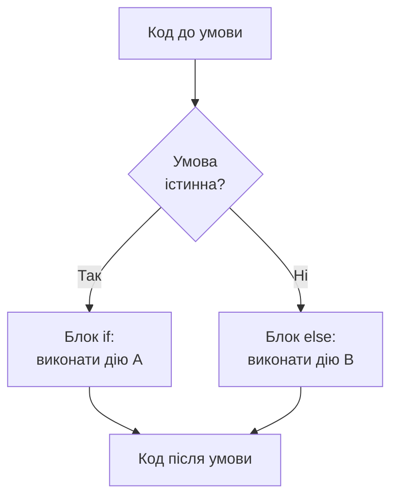

# Розділ 6. Умовні оператори: прийняття рішень

## Анотація

Наш БПЛА-агент із Розділу 5 має змінні для батареї, координат, висоти — але не вміє приймати рішення. Він виводить "все добре" при 5% заряду. Він "летить" на висоті 10 000 метрів, яка фізично неможлива. Він ігнорує будь-яку небезпеку, бо в його коді немає жодного "якщо". Цей розділ змінює ситуацію. Ви навчитесь писати умовні оператори `if`, `else if`, `else`, які дозволяють програмі обирати між різними діями залежно від стану. Окремо розглядається булева алгебра: логічні оператори `&&`, `||`, `!`, таблиці істинності, складні умови з кількома факторами. Детально пояснюється область видимості змінних — що відбувається зі змінною, створеною всередині блоку `{}`, і чому вона зникає після закриваючої дужки. Нарешті, ви побачите особливість Rust, якої немає в більшості мов: `if` як вираз, що повертає значення.

---

## Цілі навчання

Після опрацювання цього розділу студент зможе:

1. Написати умовний оператор `if` / `else if` / `else` та пояснити порядок перевірки умов.
2. Побудувати складну логічну умову з операторами `&&`, `||`, `!` та пояснити її значення через таблицю істинності.
3. Використовувати `if` як вираз, що повертає значення, і пояснити, чому типи обох гілок мають збігатися.
4. Пояснити, що таке область видимості змінної, та передбачити, які змінні доступні в якому місці коду.
5. Написати програму, де БПЛА-агент приймає рішення на основі кількох параметрів стану.

---

## Ключові терміни

**Conditional (умовний оператор)** — конструкція, що виконує різний код залежно від умови.

**Boolean expression (логічний вираз)** — вираз, що обчислюється в `true` або `false`.

**Comparison operator (оператор порівняння)** — оператор, що порівнює два значення: `==`, `!=`, `<`, `>`, `<=`, `>=`.

**Logical operator (логічний оператор)** — оператор над логічними значеннями: `&&` (і), `||` (або), `!` (не).

**Short-circuit evaluation (скорочене обчислення)** — зупинка обчислення логічного виразу, коли результат вже визначений.

**Scope (область видимості)** — частина коду, де змінна існує та доступна.

**Block (блок)** — код між фігурними дужками `{}`. Визначає область видимості.

**Expression (вираз)** — конструкція, що обчислюється у значення. У Rust `if` — це вираз.

---

## Мотиваційний кейс

У 2015 році безпілотник Почтової служби Швейцарії врізався в озеро Цюрих. Розслідування показало: бортовий комп'ютер зафіксував втрату GPS-сигналу, але програма не мала правильної логіки для цієї ситуації. Замість "втрата GPS → зупинити місію → повернутися по компасу" логіка була "втрата GPS → ігнорувати → продовжити за старими координатами". Старі координати за кілька хвилин стали нерелевантними, і дрон полетів у бік озера.

Кожне "якщо" у коді БПЛА — це потенційно врятоване обладнання або навіть людське життя. Умовні оператори — це не абстрактна концепція, а механізм прийняття рішень, без якого автономна система — просто некерований снаряд.

---

## 6.1. Розгалуження: як процесор обирає шлях

До цього розділу весь наш код виконувався лінійно: рядок за рядком, зверху вниз, без варіантів. Кожна інструкція виконувалась безумовно. Але реальні програми постійно стоять перед вибором: зробити одне чи інше, залежно від обставин.

На рівні процесора (згадайте Розділ 1) розгалуження реалізується через умовний перехід. Процесор обчислює умову, і якщо вона істинна — "стрибає" до однієї послідовності інструкцій, якщо хибна — до іншої. Це єдиний механізм, і всі конструкції мови програмування — `if`, `else`, `match`, тернарний оператор — зводяться до нього.



Ключове спостереження: завжди виконується рівно один шлях. Не обидва, не жоден — рівно один. Це гарантія, яку дає і процесор, і мова Rust.

---

## 6.2. if: найпростіше рішення

Умовний оператор `if` — це спосіб сказати компілятору: "виконай цей блок коду тільки тоді, коли умова істинна". Якщо умова хибна — блок пропускається, і виконання продовжується далі.

Синтаксис Rust має особливість, яка відрізняє його від C, Java та JavaScript: навколо умови не потрібні круглі дужки. У C ви пишете `if (battery < 30)`, у Rust — просто `if battery < 30`. Якщо ви поставите круглі дужки — код скомпілюється, але `cargo clippy` видасть попередження: зайві дужки. Це не косметична різниця — це філософія Rust: менше синтаксичного "шуму", більше сигналу.

Після умови обов'язково йде блок у фігурних дужках `{}`. На відміну від C, де фігурні дужки можна пропустити для одного рядка, Rust вимагає їх завжди. Це запобігає класичній помилці, коли програміст додає другий рядок в тіло `if` без дужок, і цей рядок виконується безумовно (Apple SSL bug 2014 — "goto fail" — саме через цю помилку мільйони iPhone були вразливі до перехоплення трафіку).

Продемонструємо на найпростішому прикладі: перевірка заряду батареї БПЛА. Якщо заряд нижче 30%, програма виводить попередження. Якщо 30% і вище — блок пропускається.

```rust
fn main() {
    let battery: u8 = 22;

    println!("Батарея: {}%", battery);

    if battery < 30 {
        println!("УВАГА: низький заряд! Повертайтесь на базу.");
    }

    println!("Програма завершена.");
}
```

Вивід:

```
Батарея: 22%
УВАГА: низький заряд! Повертайтесь на базу.
Програма завершена.
```

Процесор дійшов до `if`, обчислив `22 < 30` — отримав `true` — виконав блок усередині дужок. Якщо змінити `battery` на 75, то `75 < 30` дасть `false`, блок буде пропущений, і вивід міститиме лише "Батарея: 75%" та "Програма завершена." — без попередження.

Важливий момент: умова після `if` повинна бути виразом типу `bool` — тобто обчислюватись у `true` або `false`. У Rust, на відміну від C, число не є логічним значенням. Ви не можете написати `if battery` (де `battery` — число) — компілятор скаже "expected bool, found u8". Потрібно явне порівняння: `if battery > 0`, `if battery != 0`. Це знову захист від помилок: у C `if (x = 5)` (присвоєння замість порівняння) компілюється і завжди виконує тіло, бо `5` інтерпретується як `true`. У Rust такий код не скомпілюється.

---

## 6.3. if / else: два взаємовиключні шляхи

Часто потрібно не просто "зробити щось при умові", а обрати між двома альтернативами. Для цього існує `else` — блок, що виконується тоді і тільки тоді, коли умова `if` хибна.

Ментальна модель: `if`/`else` — це розвилка на дорозі. Ви обов'язково повертаєте або ліворуч, або праворуч. Не обидва, не жоден.

```rust
fn main() {
    let battery: u8 = 65;

    if battery < 30 {
        println!("Статус: КРИТИЧНИЙ. Повернення на базу.");
    } else {
        println!("Статус: нормальний. Продовжуємо місію.");
    }
}
```

Вивід:

```
Статус: нормальний. Продовжуємо місію.
```

Тут `65 < 30` дає `false`, тому виконується блок `else`. Якби `battery` було 22, виконався б блок `if`. Важливо: ці два блоки взаємовиключні — виконується завжди рівно один.

---

## 6.4. else if: ланцюжок рішень

Реальні рішення рідко бувають бінарними "так/ні". Батарея БПЛА може бути у одному з кількох станів: критичний (нижче 15%), низький (15–29%), нормальний (30–79%), повний (80% і вище). Для моделювання таких ситуацій існує ланцюжок `else if`.

Ланцюжок працює за принципом "першого збігу": Rust перевіряє умови зверху вниз і виконує перший блок, де умова істинна. Після цього всі наступні `else if` та `else` пропускаються, навіть якщо їхні умови теж істинні. Це означає, що порядок перевірок має значення, і має бути від найбільш специфічного до найбільш загального.

```rust
fn main() {
    let battery: u8 = 42;

    if battery < 15 {
        println!("КРИТИЧНИЙ. Аварійна посадка.");
    } else if battery < 30 {
        println!("НИЗЬКИЙ. Повернення на базу.");
    } else if battery < 80 {
        println!("Нормальний. Місія продовжується.");
    } else {
        println!("Повний заряд.");
    }

    println!("Батарея: {}%", battery);
}
```

Вивід:

```
Нормальний. Місія продовжується.
Батарея: 42%
```

Rust перевірив `42 < 15` — хибно, перейшов далі. `42 < 30` — хибно, далі. `42 < 80` — істинно, виконав цей блок і пропустив `else`.

Тепер зверніть увагу на критичний нюанс порядку. Що станеться, якщо переставити перевірки — поставити `battery < 80` першою?

При `battery = 10`: умова `10 < 80` — істинна. Rust виконає "Нормальний", хоча батарея насправді критична. Чому? Бо `10 < 80` — правда, і Rust виконує першу істинну гілку. Умова `battery < 15` ніколи не буде перевірена, тому що `battery < 80` "поглинає" всі менші значення.

Правило: у ланцюжку `else if` ставте вужчі (специфічніші) умови першими, ширші (загальніші) — останніми. Від найменшого порогу до найбільшого, від найкритичнішого до найменш критичного.

---

## 6.5. Оператори порівняння

Умова в `if` — це логічний вираз (boolean expression), що обчислюється в `true` або `false`. Найпростіші логічні вирази будуються за допомогою операторів порівняння — операцій, що порівнюють два значення.

Rust має шість операторів порівняння. Кожен приймає два операнди одного типу і повертає `bool`:

| Оператор | Значення | Приклад | Результат |
|----------|----------|---------|-----------|
| `==` | дорівнює | `5 == 5` | `true` |
| `!=` | не дорівнює | `5 != 3` | `true` |
| `<` | менше | `3 < 5` | `true` |
| `>` | більше | `3 > 5` | `false` |
| `<=` | менше або дорівнює | `5 <= 5` | `true` |
| `>=` | більше або дорівнює | `3 >= 5` | `false` |

Окремо зупинимось на відмінності `=` від `==`. У Rust (як і в C, Java, Python) одинарне `=` — це присвоєння: `let x = 5` записує значення 5 у змінну x. Подвійне `==` — це порівняння: `x == 5` перевіряє, чи значення x дорівнює 5, і повертає `true` або `false`. Плутання між ними — одна з найпоширеніших помилок у C, де `if (x = 5)` (присвоєння!) компілюється без попереджень і завжди виконує тіло. У Rust `if x = 5` не скомпілюється — компілятор скаже "expected bool, found ()". Ще один приклад того, як Rust захищає від помилок, що коштують годин відлагодження.

Демонстрація операторів порівняння на прикладі перевірки висоти БПЛА:

```rust
fn main() {
    let altitude: f64 = 120.5;
    let max_altitude: f64 = 400.0;

    if altitude > max_altitude {
        println!("НЕБЕЗПЕКА: перевищення максимальної висоти!");
    } else if altitude == 0.0 {
        println!("Дрон на землі.");
    } else {
        println!("Висота {:.1} м — у допустимих межах.", altitude);
    }
}
```

Вивід:

```
Висота 120.5 м — у допустимих межах.
```

Застереження щодо порівняння дробових чисел. Через обмежену точність binary floating point, пряме порівняння `==` для `f64` може давати несподівані результати. Наприклад, `0.1 + 0.2 == 0.3` у Rust дає `false`, тому що `0.1 + 0.2` обчислюється як `0.30000000000000004`. Для порівняння дробових чисел використовують порівняння з допуском: замість `a == b` пишуть `(a - b).abs() < 0.0001`. Ми повернемось до цього нюансу в наступних розділах.

---

## 6.6. Булева алгебра та логічні вирази

### Навіщо потрібна булева алгебра

Прості порівняння вирішують нескладні ситуації: "батарея нижче порогу", "висота більше максимуму". Але реальні рішення БПЛА залежать від кількох факторів одночасно. Дрон може летіти, тільки якщо батарея достатня, І GPS працює, І вітер допустимий, І мотори справні. Аварійна посадка потрібна, якщо батарея критична АБО мотори несправні. Місія дозволена, якщо є GPS АБО (немає GPS, АЛЕ висота низька і є компас).

Для формулювання таких умов потрібна булева алгебра — розділ математики, що працює з логічними значеннями `true` та `false` і операціями над ними. Булева алгебра названа на честь Джорджа Буля, англійського математика XIX століття, який формалізував закони логіки задовго до появи комп'ютерів. Сьогодні його алгебра — фундамент цифрової електроніки та програмування.

### Три логічних оператори Rust

Rust має три логічних оператори, які відповідають трьом фундаментальним операціям булевої алгебри.

**Оператор `&&` (AND, логічне І)** — повертає `true` тільки тоді, коли *обидва* операнди `true`. Якщо хоча б один з них `false` — результат `false`.

Інтуїтивне розуміння: `&&` — це вимогливий суддя, який ставить "зараховано" тільки коли ВСЕ ідеально. Як перевірка безпеки в аеропорту: і паспорт має бути, і квиток, і заборонених предметів не має бути. Якщо хоча б одна умова не виконана — не пропускають.

Таблиця істинності для `&&`:

| A | B | A && B |
|---|---|--------|
| false | false | false |
| false | true | false |
| true | false | false |
| true | true | **true** |

Тільки один рядок дає `true` — коли обидва операнди `true`.

```rust
fn main() {
    let battery: u8 = 25;
    let has_gps: bool = true;

    let can_fly = battery > 10 && has_gps;
    println!("Батарея > 10%: {}", battery > 10);  // true
    println!("GPS є: {}", has_gps);                // true
    println!("Може летіти: {}", can_fly);          // true — обидва true
}
```

Якщо змінити `has_gps` на `false`, то `can_fly` стане `false` — бо `true && false` дає `false`. Одна невиконана умова — і весь вираз хибний.

**Оператор `||` (OR, логічне АБО)** — повертає `true`, коли *хоча б один* операнд `true`. Результат `false` — тільки коли обидва `false`.

Інтуїтивне розуміння: `||` — це поблажливий суддя. Достатньо однієї причини. Як виклик пожежної: потрібен дим АБО вогонь АБО спрацювання датчика — хоча б одне, і вони їдуть.

Таблиця істинності для `||`:

| A | B | A \|\| B |
|---|---|----------|
| false | false | **false** |
| false | true | true |
| true | false | true |
| true | true | true |

Тільки один рядок дає `false` — коли обидва операнди `false`.

```rust
fn main() {
    let battery: u8 = 5;
    let motor_error: bool = false;

    // Аварія, якщо критичний заряд АБО несправний мотор
    let emergency = battery < 10 || motor_error;
    println!("Батарея < 10%: {}", battery < 10);  // true
    println!("Помилка мотора: {}", motor_error);   // false
    println!("Аварія: {}", emergency);              // true — достатньо одного true
}
```

Батарея критична (`true`), мотор у порядку (`false`), але для аварії достатньо однієї причини — тому `emergency` є `true`.

**Оператор `!` (NOT, логічне НЕ)** — інвертує значення. `true` стає `false`, `false` стає `true`. Це єдиний унарний логічний оператор (працює з одним операндом, а не з двома).

Таблиця істинності для `!`:

| A | !A |
|---|----|
| false | true |
| true | false |

```rust
fn main() {
    let is_landed: bool = true;
    let is_flying = !is_landed; // НЕ на землі = у повітрі
    println!("На землі: {}, у повітрі: {}", is_landed, is_flying);
}
```

`!` часто використовується для інверсії умови: `if !has_gps` означає "якщо немає GPS".

### Складні логічні вирази

Оператори можна комбінувати, будуючи складні умови з кількох факторів. Це основа прийняття рішень у будь-якій автономній системі.

Розглянемо реалістичний приклад. Дрон може продовжувати місію тільки коли виконуються всі умови безпеки: достатня батарея, наявність GPS, допустимий вітер, справні мотори.

```rust
fn main() {
    let battery: u8 = 45;
    let has_gps: bool = true;
    let wind_speed: f64 = 8.5;
    let max_wind: f64 = 15.0;
    let is_motor_ok: bool = true;

    let mission_ok = battery > 30
        && has_gps
        && wind_speed < max_wind
        && is_motor_ok;

    println!("Місія дозволена: {}", mission_ok);
}
```

Вираз `mission_ok` об'єднує чотири умови через `&&`. Якщо будь-яка з них стане `false` — весь вираз стане `false`. Це логічно: якщо немає GPS — не має значення, що батарея повна і вітер слабкий.

Тепер складніший випадок — комбінація `&&` та `||`. Аварійна посадка потрібна, якщо батарея критична, АБО якщо немає GPS на великій висоті:

```rust
fn main() {
    let battery: u8 = 8;
    let has_gps: bool = false;
    let altitude: f64 = 150.0;

    let emergency = battery < 10 || (!has_gps && altitude > 100.0);

    println!("Батарея < 10%: {}", battery < 10);              // true
    println!("Немає GPS і висота > 100: {}", !has_gps && altitude > 100.0); // true
    println!("Аварійна посадка: {}", emergency);                // true
}
```

У цьому виразі дужки визначають, що `!has_gps && altitude > 100.0` — це одна складова умова, яка об'єднується з `battery < 10` через `||`. Без дужок пріоритет операторів дав би той самий результат (бо `&&` має вищий пріоритет за `||`), але з дужками намір програміста очевидний.

### Пріоритет логічних операторів

Коли у виразі змішані `&&`, `||` та `!`, Rust застосовує пріоритет — порядок обчислення, аналогічний тому, як у математиці множення виконується до додавання:

1. `!` — найвищий пріоритет (виконується першим)
2. `&&` — середній (як множення)
3. `||` — найнижчий (як додавання)

Тому `a || b && c` обчислюється як `a || (b && c)`, а не як `(a || b) && c`. Аналогія з математикою точна: `a + b * c` = `a + (b * c)`.

Покажемо різницю конкретно:

```rust
fn main() {
    let x = false;
    let y = true;
    let z = false;

    // && має вищий пріоритет за ||
    let r1 = x || y && z;         // = false || (true && false) = false || false = false
    let r2 = (x || y) && z;       // = (false || true) && false = true && false = false

    println!("x || y && z     = {} (бо && першим: false || (true && false))", r1);
    println!("(x || y) && z   = {} (бо дужки: (false || true) && false)", r2);
}
```

У цьому конкретному прикладі обидва дали `false`, але з іншими значеннями різниця проявиться. Порада, яка врятує вам години відлагодження: якщо вираз містить і `&&`, і `||` — завжди ставте дужки явно. Навіть якщо вони технічно зайві. Код `(battery < 10) || (!has_gps && altitude > 100.0)` читається як "критична батарея АБО (немає GPS І висота велика)". Без дужок потрібно згадувати правила пріоритету — а пам'ять програміста краще витрачати на логіку задачі, а не на синтаксис мови.

### Скорочене обчислення (short-circuit evaluation)

Rust обчислює логічні вирази "ліниво": якщо результат уже визначений після лівого операнда, правий не обчислюється зовсім.

Для `&&`: якщо лівий операнд `false` — результат гарантовано `false` (бо `false && що_завгодно = false`), тому правий операнд не обчислюється.

Для `||`: якщо лівий операнд `true` — результат гарантовано `true` (бо `true || що_завгодно = true`), тому правий операнд не обчислюється.

Зараз це здається незначною деталлю — якщо обидва операнди це просто змінні, різниці немає. Але коли правий операнд — це виклик функції, яка може бути повільною, мати побічні ефекти або навіть спричиняти помилку, скорочене обчислення стає важливим. Ми повернемось до цього у Частині III, коли вивчимо функції та обробку помилок.

### Закони де Моргана

При роботі зі складними логічними виразами корисні два правила, відомі як закони де Моргана. Вони дозволяють перетворювати заперечення складних виразів:

```
!(A && B)  еквівалентно  !A || !B
!(A || B)  еквівалентно  !A && !B
```

Словами: "НЕ (A І B)" — те саме, що "(НЕ A) АБО (НЕ B)". І навпаки: "НЕ (A АБО B)" — те саме, що "(НЕ A) І (НЕ B)".

Практичний приклад: "місія НЕ дозволена" означає "НЕ (батарея_ОК І GPS_ОК)". За де Морганом це рівносильно "батарея_НЕ_ОК АБО GPS_НЕ_ОК". Тобто для заборони місії достатньо, щоб хоча б одна система була не ОК.

Ці перетворення корисні, коли потрібно спростити або інвертувати складну умову.

---

## 6.7. Область видимості: де живе змінна

### Концепція

Область видимості (scope) — одна з найважливіших концепцій у програмуванні, і Rust реалізує її строго і передбачувано. Ідея проста: кожна змінна має "час життя" — від моменту створення до моменту знищення. У Rust цей час визначається фігурними дужками `{}`: змінна створюється всередині блоку і знищується при виході з нього.

Чому це важливо? Тому що область видимості пов'язана з пам'яттю. Коли змінна створюється — для неї виділяється місце в RAM (згадайте Розділ 5). Коли область видимості закінчується — це місце звільняється. Rust гарантує, що ви не зможете звернутися до звільненої пам'яті — це перевіряється на етапі компіляції.

У більш практичному сенсі: область видимості визначає, які змінні "бачить" кожен рядок коду. Змінна, створена всередині `if`-блоку, не існує за його межами. Змінна, створена у функції `main`, не існує в іншій функції (коли ви їх вивчите у Розділі 11). Це не обмеження, а захист: якщо змінна не доступна за межами блоку, то ніхто не може випадково її змінити або прочитати.

### Приклад 1: Змінна всередині if-блоку

Найтиповіший випадок: змінна створюється всередині умовного блоку і потрібна лише там.

```rust
fn main() {
    let battery: u8 = 22;

    if battery < 30 {
        let warning = "УВАГА: низький заряд!";
        println!("{}", warning);
    } // warning знищується тут

    // println!("{}", warning); // ПОМИЛКА: warning вже не існує
    println!("Програма завершена.");
}
```

Змінна `warning` народилась між `{` та `}` блоку `if` і вмерла на `}`. За межами цього блоку її не існує. Якщо розкоментувати останній `println!` з `warning`, компілятор скаже: `error[E0425]: cannot find value 'warning' in this scope` — "не можу знайти значення warning у цій області видимості."

### Приклад 2: Вкладені блоки та видимість

Фігурні дужки створюють область видимості навіть без `if`. Це дозволяє обмежити "час життя" змінної рівно тим фрагментом коду, де вона потрібна.

Внутрішній блок бачить змінні зовнішнього (бо він "всередині"), але зовнішній не бачить змінних внутрішнього (бо вони ще не існують або вже знищені).

```rust
fn main() {
    let a = 10;
    println!("Зовнішній блок: a = {}", a);

    {
        let b = 20;
        println!("Внутрішній блок: a = {}, b = {}", a, b);
        // a доступне — воно з зовнішнього блоку
        // b доступне — воно з цього блоку
    } // b знищується тут

    println!("Знову зовнішній: a = {}", a);
    // println!("b = {}", b); // ПОМИЛКА: b не існує
}
```

Аналогія: уявіть матрьошку. Маленька лялька (внутрішній блок) знаходиться всередині великої (зовнішній блок) і "бачить" все, що є у великій. Але коли ви дістаєте маленьку — все, що було всередині неї, зникає разом з нею. Велика лялька ніколи не знала, що було всередині маленької.

### Приклад 3: Shadowing та scope — принципова відмінність

Цей приклад демонструє тонку, але критичну різницю між затіненням (shadowing) та областю видимості. Якщо ви створюєте нову змінну з тим самим ім'ям у внутрішньому блоці — вона "затіняє" зовнішню, але лише всередині цього блоку. Після виходу з блоку знову стає видимою зовнішня:

```rust
fn main() {
    let x = 5;
    println!("Зовні (до блоку): x = {}", x);   // 5

    {
        let x = 99; // нова змінна x, затіняє зовнішню
        println!("Всередині: x = {}", x);        // 99
    } // внутрішня x (99) знищується

    println!("Зовні (після блоку): x = {}", x);  // 5 — зовнішня ніколи не змінювалась
}
```

Зовнішня `x` зі значенням 5 не була змінена і не зникла. Внутрішній блок створив *нову* змінну з тим самим ім'ям, яка існувала лише всередині блоку. Після `}` нова зникла, і стара знову "видна".

### Приклад 4: mut всередині блоку — зберігає зміни

Тепер порівняйте з мутабельною змінною. Якщо змінну створено зовні з `mut`, а всередині блоку її значення *змінюється* (без `let` — тобто без створення нової), зміна зберігається після виходу з блоку:

```rust
fn main() {
    let mut battery: u8 = 100;
    println!("До блоку: {}%", battery);

    {
        battery = 75; // змінюємо ІСНУЮЧУ змінну, а не створюємо нову
        println!("Всередині: {}%", battery);
    }

    println!("Після блоку: {}%", battery); // 75 — зміна збереглася!
}
```

Відмінність від попереднього прикладу: тут немає `let` перед `battery = 75`. Це не створення нової змінної, а зміна значення існуючої. Існуюча змінна живе у зовнішньому блоці, тому зміна зберігається.

Ця різниця — джерело частих помилок. `let battery = 75` (з `let`) створює нову змінну і затіняє стару. `battery = 75` (без `let`) змінює існуючу. Після блоку у першому випадку зовнішня змінна не торкнута, у другому — її значення змінилось.

### Приклад 5: Область видимості в if/else

Кожна гілка `if`/`else` — це окремий блок зі своєю областю видимості. Змінні з однієї гілки не видимі в іншій:

```rust
fn main() {
    let battery: u8 = 22;
    let status;

    if battery < 30 {
        let threshold = 30;
        status = "Критичний";
        println!("Поріг: {}", threshold);
    } else {
        let margin = battery.saturating_sub(30);
        status = "Нормальний";
        // println!("{}", threshold); // ПОМИЛКА: threshold тут не існує
    }

    println!("Статус: {}", status);
    // println!("{}", threshold); // ПОМИЛКА
    // println!("{}", margin);    // ПОМИЛКА
}
```

`threshold` існує лише в if-блоці, `margin` — лише в else-блоці. За межами `if`/`else` жодна з них не доступна. Але `status`, оголошена до `if`, живе у зовнішньому блоці — тому вона доступна після.

Зверніть увагу на `let status;` без значення. Rust дозволяє оголосити змінну і присвоїти значення пізніше, але тільки якщо компілятор може гарантувати: значення буде присвоєне у кожному можливому шляху виконання. Тут є і `if`, і `else`, і в кожному присвоюється `status` — тому компілятор задоволений. Якщо прибрати `else` — компілятор скаже: при `battery >= 30` змінна `status` залишиться без значення, і це помилка.

---

## 6.8. if як вираз: Rust повертає значення

Ось особливість Rust, якої немає в C, Java чи Python: `if` — це не тільки оператор (statement), а й вираз (expression). Різниця фундаментальна. Оператор *робить щось* — виконує дію. Вираз *обчислюється у значення*. У Rust `if` може обчислюватись у значення — так само, як `2 + 3` обчислюється у `5`.

Чому це корисно? Тому що дозволяє ініціалізувати змінну результатом умови в одному рядку, замість створення мутабельної змінної та присвоєння в різних гілках. Порівняйте два підходи.

Підхід через оператор (як у C) — потребує мутабельну змінну або попереднє оголошення:

```rust
fn main() {
    let battery: u8 = 22;
    let status;

    if battery < 30 {
        status = "Критичний";
    } else {
        status = "Нормальний";
    }

    println!("Статус: {}", status);
}
```

Підхід через вираз (ідіоматичний Rust) — змінна ініціалізується одразу:

```rust
fn main() {
    let battery: u8 = 22;

    let status = if battery < 30 {
        "Критичний"
    } else {
        "Нормальний"
    };

    println!("Статус: {}", status);
}
```

Другий варіант коротший і, головне, `status` — іммутабельна. Її значення визначене один раз і не може бути випадково змінене далі. Менше `mut` у коді — менше місць для помилки.

Три правила `if`-виразу, які потрібно запам'ятати.

Перше: останній рядок у кожному блоці — без крапки з комою. `"Критичний"` без `;` — це значення, яке повертається з блоку. Якщо додати `;` — це стане інструкцією, що повертає `()` (порожній тип), і компілятор повідомить про невідповідність типів.

Друге: обидві гілки повинні повертати значення одного типу. Не можна повернути рядок з `if` і число з `else`. Компілятор перевіряє це: `if true { "текст" } else { 42 }` — помилка "expected &str, found integer".

Третє: `else` обов'язковий. Якщо `if` повертає значення, а умова хибна — що повертати без `else`? Відповіді немає, тому Rust вимагає `else`.

`if`-вираз часто використовується для компактного вибору значення:

```rust
fn main() {
    let altitude: f64 = 350.0;
    let max_altitude: f64 = 400.0;

    let target_speed = if altitude > max_altitude * 0.8 {
        5.0    // на великій висоті — повільно
    } else {
        12.0   // на нормальній висоті — стандартна швидкість
    };

    println!("Висота: {:.0} м, швидкість: {:.1} м/с", altitude, target_speed);
}
```

---

## 6.9. Вкладені if та антипатерн "arrow code"

Коли рішення залежить від кількох незалежних факторів, виникає спокуса вкладати `if` один в одний. Кожне нове вкладення додає рівень відступу, і код починає рости вправо, набуваючи форми стрілки — тому цей антипатерн називають "arrow code":

```rust
fn main() {
    let battery: u8 = 45;
    let has_gps: bool = true;
    let wind_speed: f64 = 8.0;

    if battery > 30 {
        if has_gps {
            if wind_speed < 15.0 {
                println!("Все ОК. Місія дозволена.");
            } else {
                println!("Сильний вітер.");
            }
        } else {
            println!("Немає GPS.");
        }
    } else {
        println!("Низький заряд.");
    }
}
```

Код працює, але вже при трьох рівнях вкладення стає важким для читання. При п'яти-шести — практично нечитабельним. Кращий підхід — використати складні логічні вирази з `&&` та ланцюжок `else if`:

```rust
fn main() {
    let battery: u8 = 45;
    let has_gps: bool = true;
    let wind_speed: f64 = 8.0;

    if battery > 30 && has_gps && wind_speed < 15.0 {
        println!("Все ОК. Місія дозволена.");
    } else if battery <= 30 {
        println!("Низький заряд.");
    } else if !has_gps {
        println!("Немає GPS.");
    } else {
        println!("Сильний вітер.");
    }
}
```

Код плоский, читається зверху вниз, кожна умова на одному рівні відступу. Значно легше зрозуміти, підтримувати та модифікувати.

---

## 6.10. Практика: дерево рішень БПЛА

Об'єднаємо все вивчене в програмі, що моделює прийняття рішення БПЛА на основі стану всіх систем. Це перша програма курсу, де агент по-справжньому "думає" — аналізує стан і обирає дію.

```rust
const MIN_BATTERY: u8 = 30;
const CRITICAL_BATTERY: u8 = 10;
const MAX_WIND: f64 = 15.0;
const MAX_ALTITUDE: f64 = 400.0;

fn main() {
    let battery: u8 = 28;
    let has_gps: bool = true;
    let wind_speed: f64 = 12.5;
    let altitude: f64 = 180.0;
    let is_motor_ok: bool = true;

    println!("=== СТАН БПЛА ===");
    println!("Батарея: {}%", battery);
    println!("GPS: {}", if has_gps { "так" } else { "ні" });
    println!("Вітер: {:.1} м/с", wind_speed);
    println!("Висота: {:.0} м", altitude);
    println!("Мотори: {}", if is_motor_ok { "справні" } else { "несправні" });

    println!("\n=== РІШЕННЯ ===");

    if battery < CRITICAL_BATTERY || !is_motor_ok {
        let reason = if battery < CRITICAL_BATTERY {
            "критичний заряд"
        } else {
            "несправність мотора"
        };
        println!("АВАРІЙНА ПОСАДКА! Причина: {}", reason);
    } else if battery < MIN_BATTERY {
        let can_return = has_gps && wind_speed < MAX_WIND;
        if can_return {
            println!("ПОВЕРНЕННЯ НА БАЗУ. Заряд низький, умови дозволяють.");
        } else {
            println!("АВАРІЙНА ПОСАДКА! Безпечне повернення неможливе.");
        }
    } else if !has_gps && altitude > 100.0 {
        println!("ЗНИЖЕННЯ до 100 м. Причина: втрата GPS.");
    } else if wind_speed >= MAX_WIND {
        println!("ЗАВИСАННЯ. Очікування покращення вітру.");
    } else {
        println!("ПРОДОВЖЕННЯ МІСІЇ. Всі системи в нормі.");
    }
}
```

У цій програмі зверніть увагу: перевірки від найкритичнішого до найменш критичного. Складні логічні умови (`battery < CRITICAL_BATTERY || !is_motor_ok`). Використання `if`-виразу всередині `println!` для вибору тексту ("так"/"ні", "справні"/"несправні"). Локальна змінна `can_return` всередині блоку — вона існує тільки там, де потрібна.

---

## Prompt Engineering: дебаг умовної логіки

Помилки в умовних операторах — одні з найпідступніших: код компілюється і запускається, але приймає неправильні рішення. Приклад ефективного промпту:

```
Я вивчаю Rust (розділ 6: умовні оператори). 
Ось мій код прийняття рішення БПЛА:
[ваш код]

Тестую з battery=5, has_gps=false, is_motor_ok=true.
Очікую: "АВАРІЙНА ПОСАДКА" через критичний заряд.
Отримую: "ПОВЕРНЕННЯ НА БАЗУ".

Знайди помилку в логіці перевірок.
Покажи, в якому порядку перевіряються умови і де збій.
```

---

## Лабораторна робота №6

### Мета

Написати програму, де БПЛА-агент приймає рішення на основі кількох параметрів.

### Завдання базового рівня

Напишіть програму "Передпольотна перевірка БПЛА". Дрон перевіряє 5 параметрів перед стартом. Для кожного — умови допуску. Програма виводить: результат кожної перевірки, загальне рішення, список причин заборони (якщо є).

### Варіанти для самостійного виконання

**Варіант A.** Класифікатор рівня тривоги (5 рівнів), кожен визначається комбінацією 3–4 параметрів. Тестування з 5 наборами даних.

**Варіант B.** Вибір маршруту з трьох варіантів залежно від заряду, вітру та висоти.

**Варіант C.** Калькулятор дальності польоту з коефіцієнтами вітру через `if`-вирази.

**Варіант D.** AI генерує дерево рішень за вашою специфікацією. Знайдіть дві логічні помилки. Промпт-журнал.

### Критерії оцінювання

| Критерій | Максимальний бал |
|----------|-----------------|
| Програма компілюється та працює | 15 |
| Правильна логіка умов | 25 |
| Складні логічні вирази (&&, \|\|, !) | 20 |
| Тестування з різними даними | 20 |
| Читабельність та коментарі | 20 |

---

## Troubleshooting

**`error[E0308]: mismatched types — expected bool, found integer`**

Ви написали `if x`, де `x` — число. У Rust числа не конвертуються в bool. Напишіть `if x != 0` або `if x > 0`.

**`error: mismatched types` у гілках if-виразу.**

Гілки `if` та `else` повертають різні типи. Обидві повинні повертати один тип.

**`error[E0382]: use of possibly uninitialized variable`**

Змінна оголошена без значення, і присвоєння є тільки в `if`, але не в `else`. Додайте `else`.

**Код компілюється, але рішення неправильне.**

Перевірте порядок `else if`. Ставте вужчі умови першими.

**Дробові числа порівнюються некоректно.**

Не використовуйте `==` для `f64`. Порівнюйте з допуском: `(a - b).abs() < 0.0001`.

---

## Додатково

### Таблиця істинності для складного виразу

Для відлагодження складної умови корисно побудувати повну таблицю. Наприклад, для `(A && B) || (!A && C)`:

| A | B | C | A && B | !A | !A && C | Результат |
|---|---|---|--------|----|---------|-----------|
| F | F | F | F | T | F | F |
| F | F | T | F | T | T | T |
| F | T | F | F | T | F | F |
| F | T | T | F | T | T | T |
| T | F | F | F | F | F | F |
| T | F | T | F | F | F | F |
| T | T | F | T | F | F | T |
| T | T | T | T | F | F | T |

Така таблиця допомагає знайти випадки, де умова поводиться не так, як очікувалось.

---

## Контрольні запитання

### Рівень 1 (знання)

1. Чим відрізняється `=` від `==` у Rust?
2. Перерахуйте три логічних оператори та їх значення.
3. Що таке область видимості змінної?
4. Чи потрібні круглі дужки навколо умови в `if`?

### Рівень 2 (розуміння)

5. Чому порядок перевірок в `else if` має значення? Наведіть приклад хибного результату.
6. Чому обидві гілки `if`-виразу повинні повертати один тип?
7. Що виведе цей код і чому?
```rust
fn main() {
    let x = 10;
    { let x = 20; println!("{}", x); }
    println!("{}", x);
}
```

### Рівень 3 (застосування)

8. Напишіть вираз: "БПЛА може продовжувати місію, якщо (батарея > 30% І є GPS) АБО (батарея > 60% І немає GPS, але висота < 50 м)".
9. Знайдіть та виправте помилки:
```rust
fn main() {
    let temp = 45;
    if temp < 30 {
        let status = "нормально";
    } else {
        let status = "перегрів";
    }
    println!("Стан: {}", status);
}
```

### Рівень 4 (аналіз)

10. Спростіть вираз `!(!has_gps || !is_motor_ok)` за законами де Моргана. Перевірте таблицею істинності.
11. Система має 4 сенсори (батарея, GPS, мотори, висота), кожен "ОК" або "збій". Скільки комбінацій можливо? Для кожної визначте рішення.

---

## Резюме

`if`/`else if`/`else` — механізм розгалуження: програма обирає один шлях із кількох. Порядок перевірок від специфічного до загального.

Оператори порівняння (`==`, `!=`, `<`, `>`, `<=`, `>=`) створюють логічні вирази. `=` — присвоєння, `==` — порівняння; Rust не дозволить переплутати.

Булева алгебра: `&&` (І — обидва true), `||` (АБО — хоча б один true), `!` (НЕ — інверсія). Пріоритет: `!` > `&&` > `||`. Закони де Моргана для спрощення заперечень. Скорочене обчислення — правий операнд може не обчислюватися.

Область видимості визначається `{}`. Змінна, створена в блоці, не існує за його межами. Внутрішній блок бачить змінні зовнішнього, зовнішній — не бачить внутрішнього. Shadowing у внутрішньому блоці не змінює зовнішню змінну; `mut` без `let` — змінює.

`if` — це вираз, що повертає значення. Обидві гілки мають повертати один тип. `else` обов'язковий для виразу.

---

## Що далі

Агент тепер приймає рішення. Але він робить це один раз і завершує роботу. Справжній БПЛА перевіряє стан безперервно: кожну секунду, тисячі разів за політ. Для цього потрібні цикли — конструкції, що повторюють блок коду. У Розділі 7 ви вивчите `loop`, `while`, `for`, навчитесь переписувати один вид циклу через інший, і створите перший "живий" цикл агента.
