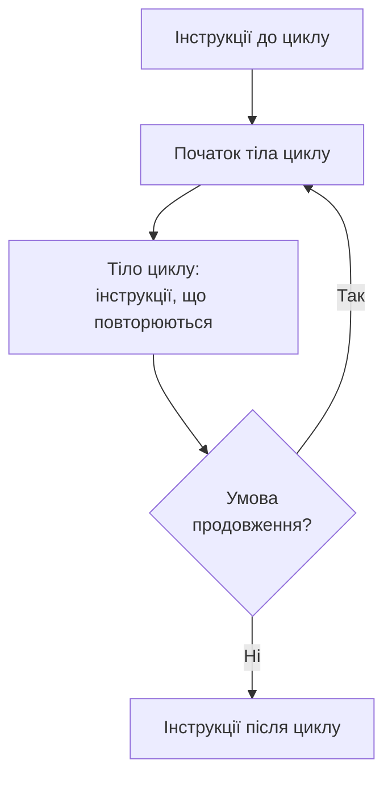
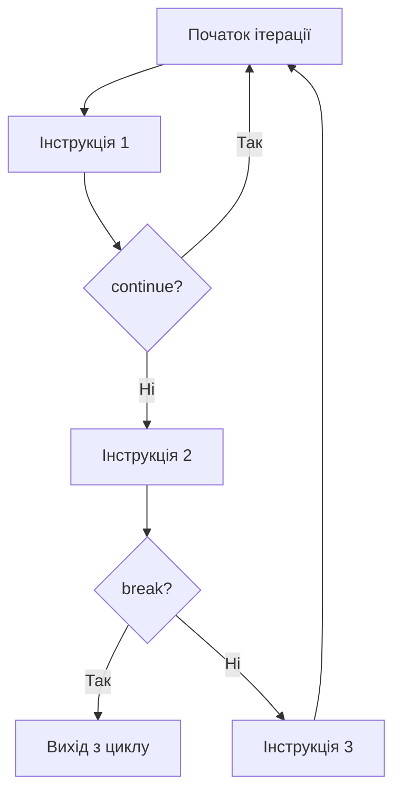

# Розділ 7. Цикли: повторення дій

## Анотація

Агент із Розділу 6 вміє приймати рішення, але робить це один раз і зупиняється. Справжній БПЛА працює в безперервному циклі: прочитати сенсори, прийняти рішення, виконати дію, повторити. Тисячі разів за хвилину, без зупинки, доки не сяде батарея або не завершиться місія. Цей розділ пояснює природу циклу як фундаментальної конструкції програмування: чому повторення — це не просто "виконати те саме ще раз", а окрема модель мислення зі своїми правилами, пастками та елегантними рішеннями. Ви вивчите три способи організації повторення в Rust — `loop`, `while`, `for` — і, що найважливіше, зрозумієте, чому всі три є різними обличчями одного й того самого механізму.

---

## Цілі навчання

Після опрацювання цього розділу студент зможе:

1. Пояснити, як процесор виконує цикл на рівні інструкцій (умовний перехід назад).
2. Написати цикл `loop`, `while` та `for` і обґрунтувати вибір типу циклу для конкретної задачі.
3. Використовувати `break` та `continue` і пояснити їхній вплив на потік виконання.
4. Переписати один вид циклу через інший і пояснити, чому трансформація коректна.
5. Пояснити поняття умови завершення циклу та розпізнавати типові помилки (нескінченний цикл, off-by-one).
6. Використовувати вкладені цикли з мітками.

---

## Ключові терміни

**Loop (цикл)** — конструкція, що повторює блок коду.

**Iteration (ітерація)** — один прохід тіла циклу.

**Infinite loop (нескінченний цикл)** — цикл без умови зупинки. У Rust — `loop {}`.

**Termination condition (умова завершення)** — умова, при виконанні якої цикл зупиняється.

**break** — оператор негайного виходу з циклу.

**continue** — оператор пропуску решти поточної ітерації та переходу до наступної.

**Range (діапазон)** — послідовність чисел: `0..5` (від 0 до 4), `1..=10` (від 1 до 10 включно).

**Label (мітка)** — ім'я циклу для використання з `break`/`continue` у вкладених циклах.

**Off-by-one error (помилка на одиницю)** — помилка, коли цикл виконується на одну ітерацію більше або менше, ніж потрібно.

---

## Мотиваційний кейс

Бортовий комп'ютер типового БПЛА виконує головний цикл (main loop) з частотою 50–400 разів на секунду. Кожен прохід циклу: зчитати акселерометр, гіроскоп, барометр, GPS; розрахувати поточну орієнтацію; порівняти з цільовою; обчислити корекцію; надіслати команди моторам. 400 Гц означає 400 ітерацій за секунду. За хвилину — 24 000. За годинний політ — 1 440 000. Якщо хоча б в одній ітерації є логічна помилка, що накопичується (наприклад, похибка округлення) — через тисячу ітерацій дрон може бути далеко від правильної позиції. Цикли — основа будь-якої системи реального часу, і розуміння їхньої механіки — не опціональне знання.

---

## 7.1. Що таке цикл з точки зору процесора

Перш ніж вивчати синтаксис, варто зрозуміти, що відбувається "під капотом". У Розділі 1 ми говорили, що процесор виконує інструкції послідовно: бере наступну інструкцію з пам'яті, виконує, переходить до наступної. Цей порядок лінійний — зверху вниз, без повернення.

Цикл ламає цю лінійність. На рівні machine code цикл — це дві речі: умовна перевірка та стрибок назад. Процесор доходить до кінця тіла циклу, перевіряє умову, і якщо вона виконана — стрибає назад до початку тіла. Якщо не виконана — продовжує далі, як зазвичай.



Ця схема однакова для всіх трьох видів циклів Rust. Різниця лише в тому, де і як перевіряється умова, і хто відповідає за її формулювання — програміст явно чи компілятор неявно.

Ось чому розуміння еквівалентності циклів таке важливе: на рівні процесора `for`, `while` та `loop` перетворюються компілятором у практично однаковий machine code — умовний перехід назад. Три різних синтаксиси — один механізм. Вивчаючи трансформації між ними, ви бачите цей механізм безпосередньо.

---

## 7.2. loop: нескінченний цикл з ручним контролем

Найпростіший і водночас найпотужніший цикл у Rust — `loop`. Він не має вбудованої умови зупинки. Він просто повторює тіло знову і знову, безкінечно. Відповідальність за зупинку повністю лежить на програмісті, який має написати `break` у правильному місці.

Чому це корисно? Тому що не кожна задача має просту умову "поки X — роби Y". Іноді умова зупинки складна, залежить від кількох факторів, або перевіряється в середині тіла циклу, а не на початку. `loop` дає повний контроль: ви вирішуєте, де перевіряти, що перевіряти, і коли виходити.

Наступна програма імітує зворотний відлік перед стартом БПЛА. Зверніть увагу: перевірка умови виходу стоїть на початку тіла циклу, до основної дії. Це гарантує, що при `countdown == 0` жодного зайвого виводу не буде.

```rust
fn main() {
    let mut countdown = 5;

    println!("Підготовка до старту...");

    loop {
        if countdown == 0 {
            break;
        }
        println!("{}...", countdown);
        countdown = countdown - 1;
    }

    println!("СТАРТ!");
}
```

Вивід:

```
Підготовка до старту...
5...
4...
3...
2...
1...
СТАРТ!
```

Прослідкуємо виконання покроково. На першій ітерації `countdown` дорівнює 5, умова `5 == 0` хибна, `break` не виконується, виводиться "5...", `countdown` стає 4. Так продовжується до моменту, коли `countdown` стає 0: умова `0 == 0` істинна, `break` виконується, процесор "стрибає" за межі циклу до рядка з "СТАРТ!".

Тепер ключове питання: що станеться, якщо забрати рядок `countdown = countdown - 1`? Змінна завжди залишатиметься 5, умова `5 == 0` ніколи не стане істинною, `break` ніколи не виконається — програма "зависне" у нескінченному циклі. Це найчастіша помилка при роботі з `loop`, і єдиний спосіб зупинити таку програму — натиснути Ctrl+C у терміналі.

Принцип безпеки: кожен `loop` має мати гарантований шлях до `break`. Перед написанням тіла циклу запитайте себе: "що саме змінюється на кожній ітерації, щоб колись умова виходу стала істинною?" Якщо ви не можете відповісти — у вас потенційний нескінченний цикл.

### break та continue: два способи змінити потік

Всередині циклу є два оператори, що змінюють нормальний порядок виконання.

**`break`** — негайний вихід із циклу. Процесор "стрибає" до першої інструкції після закриваючої дужки циклу. Решта тіла циклу не виконується, наступні ітерації не відбуваються.

**`continue`** — пропуск залишку поточної ітерації. Процесор "стрибає" назад до початку тіла циклу. Решта поточної ітерації не виконується, але цикл продовжується з наступної ітерації.

Різницю легко зрозуміти через аналогію. Уявіть, що ви перебираєте яблука з кошика. `break` — це "кошик впав, зупиняємось". `continue` — це "це яблуко гниле, пропускаю, беру наступне".



Продемонструємо обидва на одному прикладі. Програма імітує відлік, де число 3 пропускається (через `continue`), а при 0 — зупинка (через `break`):

```rust
fn main() {
    let mut countdown = 5;

    loop {
        if countdown == 0 {
            break; // зупинити відлік
        }
        if countdown == 3 {
            countdown = countdown - 1;
            continue; // пропустити число 3
        }
        println!("{}...", countdown);
        countdown = countdown - 1;
    }

    println!("СТАРТ!");
}
```

Вивід:

```
5...
4...
2...
1...
СТАРТ!
```

При `countdown == 3` виконується `continue`, яке перестрибує `println!` і повертається до початку. Зверніть увагу на важливий нюанс: перед `continue` ми зменшуємо `countdown`. Якщо забути цей рядок — при наступній ітерації `countdown` знову буде 3, знову `continue`, і так вічно. Це ще один рецепт нескінченного циклу: `continue`, що не змінює стан, який перевіряється.

### loop як вираз: повернення значення через break

Ось особливість, унікальна для Rust: `loop` може повертати значення. Подібно до `if`-виразу з Розділу 6, `loop` може бути правою частиною `let`. Значення повертається через `break значення`.

Навіщо це потрібно? Розглянемо типову задачу: потрібно знайти перше число, що задовольняє умову, і зберегти його. Без `break` зі значенням довелося б створювати змінну до циклу і присвоювати їй значення всередині. З `break` зі значенням — код стає прямолінійнішим і не потребує зайвих мутабельних змінних.

У наступній програмі ми шукаємо: на якому кроці польоту батарея впаде нижче критичного рівня. Результат пошуку — номер кроку — повертається як значення всього `loop`-виразу.

```rust
fn main() {
    let mut energy = 100;
    let mut step = 0;

    let critical_step = loop {
        if energy < 30 {
            break step; // повертаємо номер кроку як результат
        }
        energy = energy - 13;
        step = step + 1;
    };

    println!("Батарея впала нижче 30 на кроці {}", critical_step);
    println!("Залишок: {}", energy);
}
```

Вивід:

```
Батарея впала нижче 30 на кроці 6
Залишок: 22
```

Тільки `loop` може повертати значення. `while` та `for` — не можуть. Це логічно: `while` може не виконатися жодного разу (якщо умова одразу хибна), і тоді незрозуміло, яке значення повертати. `loop` гарантовано виконується хоча б раз, і `break` зі значенням завжди буде досягнутий (за умови коректної логіки).

---

## 7.3. while: цикл із передумовою

`while` відрізняється від `loop` тим, що умова продовження вбудована у синтаксис. Це не "нескінченний цикл із ручним break", а "цикл, що працює, поки умова істинна". Ментальна модель інша: ви декларуєте умову зверху, і тіло виконується лише коли ця умова задоволена.

Принципова різниця: `while` перевіряє умову *перед* кожною ітерацією, включаючи першу. Тому якщо умова хибна з самого початку — тіло не виконається жодного разу. Це відрізняє `while` від `loop`, де тіло гарантовано виконується принаймні один раз (бо перевірка — всередині тіла).

Розглянемо модель патрулювання БПЛА: дрон виконує кроки, поки батарея вище порогу. Кожен крок витрачає заряд, і рано чи пізно умова стає хибною — цикл завершується.

```rust
fn main() {
    let mut battery: u8 = 100;
    let mut step: u32 = 0;

    println!("Початок патрулювання. Батарея: {}%", battery);

    while battery > 30 {
        step = step + 1;
        battery = battery.saturating_sub(12);
        println!("Крок {}: батарея {}%", step, battery);
    }

    println!("Батарея нижче порогу. Повернення.");
    println!("Кроків: {}", step);
}
```

Вивід:

```
Початок патрулювання. Батарея: 100%
Крок 1: батарея 88%
Крок 2: батарея 76%
Крок 3: батарея 64%
Крок 4: батарея 52%
Крок 5: батарея 40%
Крок 6: батарея 28%
Батарея нижче порогу. Повернення.
Кроків: 6
```

Після шостого кроку батарея стала 28%, і перед сьомою ітерацією перевірка `28 > 30` дала `false` — цикл завершився. Тіло сьомого кроку не виконувалось.

Тепер важливе спостереження. Що станеться, якщо батарея з самого початку менша за поріг?

```rust
fn main() {
    let battery: u8 = 25;
    let mut step: u32 = 0;

    while battery > 30 {
        step = step + 1;
        println!("Крок {}", step);
    }

    println!("Кроків: {}", step);
}
```

Вивід:

```
Кроків: 0
```

Тіло циклу не виконалося жодного разу, бо умова `25 > 30` була хибна вже при першій перевірці. Це важлива властивість `while`, яку треба враховувати: цикл while не гарантує жодного виконання тіла. Якщо ваша логіка вимагає, щоб тіло виконалося хоча б раз — використовуйте `loop` з `break` в кінці тіла.

### Коли while, а коли loop?

Вибір між `while` та `loop` — це вибір ментальної моделі. `while` каже: "є чітка умова продовження, і вона перевіряється перед кожним повторенням". `loop` каже: "я працюю безперервно, а вихід визначається складною логікою всередині".

Для нашого БПЛА це виглядає так: `while battery > 30` — це "патрулюй, поки є заряд". Ясно, просто, декларативно. А `loop` з кількома `break` у різних місцях — це "працюй, але зупинись при критичній батареї, АБО при втраті GPS, АБО при завершенні маршруту, АБО при команді оператора". Коли причин зупинки кілька і вони перевіряються у різних місцях тіла — `loop` природніший.

---

## 7.4. for та Range: ітерація по діапазону

`for` — найвживаніший цикл у Rust, і його філософія принципово відрізняється від `loop` та `while`. Замість "повторюй, поки щось" він каже "пройди по кожному елементу послідовності". Це декларативний підхід: ви не керуєте лічильником вручну, не перевіряєте умову, не збільшуєте крок — ви просто вказуєте, по чому ітерувати, а Rust робить решту.

Найпростіша послідовність — діапазон чисел (Range). У Rust діапазон записується через `..` або `..=`:

- `0..5` — від 0 до 4 включно (верхня межа НЕ включена)
- `1..=10` — від 1 до 10 включно (верхня межа включена)

Чому верхня межа не включається за замовчуванням? Це конвенція, що прийшла з теорії масивів: якщо масив має 5 елементів з індексами 0, 1, 2, 3, 4, то `for i in 0..5` проходить рівно по всіх індексах. Якби верхня межа включалась — треба було б писати `0..4`, і помилка на одиницю ставала б ще ймовірнішою. Ця конвенція однакова у Python (`range(5)`), Java, JavaScript та більшості сучасних мов.

```rust
fn main() {
    for i in 1..=5 {
        println!("Крок {}", i);
    }
}
```

Вивід:

```
Крок 1
Крок 2
Крок 3
Крок 4
Крок 5
```

На кожній ітерації змінна `i` отримує наступне значення з діапазону. Ця змінна створюється заново на кожній ітерації — вона іммутабельна і не може бути змінена всередині тіла. Це дизайнерське рішення Rust: якщо `for` дає вам лічильник, ви не можете його "зіпсувати". У C можна написати `for(int i=0; i<10; i++) { i = 100; }` — і цикл виконається один раз із зіпсованим лічильником. У Rust `for i in 0..10 { i = 100; }` — помилка компіляції.

`break` та `continue` працюють із `for` так само, як із `loop` та `while`. `break` зупиняє цикл, `continue` пропускає решту поточної ітерації:

```rust
fn main() {
    // Знайти перше число, квадрат якого більше 50
    for i in 1..100 {
        if i * i > 50 {
            println!("Відповідь: {} (квадрат: {})", i, i * i);
            break; // далі шукати немає сенсу
        }
    }
}
```

Вивід:

```
Відповідь: 8 (квадрат: 64)
```

---

## 7.5. Еквівалентність циклів

Це центральна тема розділу, і вона виходить за межі синтаксису. Ідея така: `for`, `while` та `loop` — це три різних способи записати одну й ту саму ідею "повторюй". Компілятор перетворює їх усіх у практично однаковий machine code: послідовність інструкцій, перевірка умови, умовний стрибок назад. Різниця — лише у зручності для програміста та у рівні захисту від помилок.

Розуміння еквівалентності дає два практичних результати. По-перше, ви глибше розумієте механіку кожного циклу: знаючи, що `for i in 0..5` — це "обгортка" над `while` з лічильником, ви бачите, чому `for` безпечніший (бо приховує лічильник від вас) і чому `while` гнучкіший (бо дає повний контроль над лічильником). По-друге, ви можете обрати правильний цикл для задачі: якщо задача природно описується як "пройди від A до B" — це `for`; якщо "роби, поки X" — це `while`; якщо "працюй і зупинись за складних умов" — це `loop`.

### Трансформація 1: for → while

`for i in 0..5 { тіло }` робить три речі неявно: ініціалізує лічильник (i = 0), перевіряє умову (i < 5), збільшує лічильник (i = i + 1). `while` вимагає, щоб ви зробили ці три речі явно. Порівняємо:

```rust
fn main() {
    // ОРИГІНАЛ: for
    println!("for:");
    for i in 0..5 {
        println!("  i = {}", i);
    }

    // ЕКВІВАЛЕНТ: while (ті самі три речі — вручну)
    println!("while:");
    let mut i = 0;        // 1. Ініціалізація
    while i < 5 {         // 2. Умова
        println!("  i = {}", i);
        i = i + 1;        // 3. Збільшення
    }
}
```

Обидва виводять однаковий результат. Але у `while`-версії з'явились три потенційних помилки, яких у `for`-версії немає. Перша: забути ініціалізувати `i` (компілятор спіймає — змінна не оголошена). Друга: написати `<=` замість `<` (off-by-one — компілятор не спіймає, це логічна помилка). Третя: забути `i = i + 1` (нескінченний цикл — компілятор не спіймає). Три місця для помилок замість нуля — ось чому `for` ідіоматичний для ітерації по діапазону.

### Трансформація 2: while → loop + if break

`while condition { тіло }` можна розгорнути у `loop` з явною перевіркою та `break`. Трансформація механічна: умова while інвертується і стає умовою break.

```rust
fn main() {
    let mut battery: u8 = 100;

    // ОРИГІНАЛ: while
    println!("while:");
    while battery > 30 {
        battery = battery.saturating_sub(15);
        println!("  батарея: {}%", battery);
    }

    // Скидаємо для другого прикладу
    battery = 100;

    // ЕКВІВАЛЕНТ: loop + if break
    println!("loop:");
    loop {
        if battery <= 30 {  // інвертована умова: !(battery > 30) = battery <= 30
            break;
        }
        battery = battery.saturating_sub(15);
        println!("  батарея: {}%", battery);
    }
}
```

Зверніть увагу на інверсію: `while battery > 30` стає `if battery <= 30 { break }`. Це дві сторони однієї медалі: `while` каже "продовжуй, поки вірно", `loop + if break` каже "зупинись, коли невірно". Логічно — те саме, записано по-різному.

### Трансформація 3: for → loop (повна розгортка)

Тепер переписуємо `for` напряму через `loop` — найнижчий рівень, де всі три елементи (ініціалізація, перевірка, інкремент) написані вручну:

```rust
fn main() {
    // ОРИГІНАЛ: один рядок
    println!("for:");
    for i in 0..5 {
        println!("  i = {}", i);
    }

    // ЕКВІВАЛЕНТ: все вручну
    println!("loop:");
    let mut i = 0;        // ініціалізація
    loop {
        if i >= 5 {       // перевірка (інвертована: !(i < 5) = i >= 5)
            break;
        }
        println!("  i = {}", i);
        i = i + 1;        // інкремент
    }
}
```

Ця розгортка робить очевидним, скільки роботи `for` робить за вас. Один рядок `for i in 0..5` замінює три рядки ручного управління. І, що найважливіше, `for` робить цю роботу без помилок — ви не можете забути ініціалізувати, забути перевірити, забути збільшити.

### Зведення: три обличчя одного механізму

Ось одна й та сама задача — "виведи числа від 1 до 5" — трьома способами поруч:

```rust
fn main() {
    // Спосіб 1: for — декларативний, безпечний
    println!("for:");
    for i in 1..=5 {
        println!("  {}", i);
    }

    // Спосіб 2: while — з ручним лічильником
    println!("while:");
    let mut i = 1;
    while i <= 5 {
        println!("  {}", i);
        i = i + 1;
    }

    // Спосіб 3: loop — повністю ручний контроль
    println!("loop:");
    let mut i = 1;
    loop {
        if i > 5 { break; }
        println!("  {}", i);
        i = i + 1;
    }
}
```

Всі три дають однаковий результат і компілюються у подібний machine code. Різниця — у рівні абстракції та ризику помилки.

Тепер узагальнимо: коли який цикл ідіоматичний?

`for` — коли є відомий діапазон або колекція (масив, вектор — Розділ 8 і далі). Це найкоротший запис, без `mut`, без ризику забути інкремент. Ідіоматичний вибір для 90% ситуацій з відомою кількістю ітерацій.

`while` — коли умова зупинки не пов'язана з лічильником. "Поки є заряд", "поки користувач не ввів 'вихід'", "поки помилка не виправлена". Читається природно: while condition — "поки умова".

`loop` — коли потрібен повний контроль. Нескінченний цикл сервера чи агента. Цикл із кількома різними `break` у різних місцях. Цикл, що повертає значення через `break value`. Цикл, де тіло має виконатися хоча б раз.

---

## 7.6. Вкладені цикли та мітки

Коли цикл знаходиться всередині іншого циклу, виникає питання: до якого циклу належить `break`? За замовчуванням — до найближчого (внутрішнього). Але іноді потрібно зупинити зовнішній цикл зсередини внутрішнього.

Типовий приклад: БПЛА патрулює прямокутну зону, рядок за рядком. На кожній клітинці витрачається батарея. Якщо батарея критична — потрібно зупинити не тільки поточний рядок, а й весь патруль. Без спеціального механізму `break` зупинить лише внутрішній цикл (поточний рядок), і зовнішній цикл почне наступний рядок — з порожньою батареєю.

Для цього Rust має мітки (labels). Мітка — це ім'я, що починається з апострофа (`'patrol:`, `'outer:`, `'main_loop:`), і ставиться перед циклом. `break 'назва_мітки` виходить саме з того циклу, який позначений цією міткою, незалежно від глибини вкладення.

```rust
fn main() {
    let mut battery: u8 = 100;

    'patrol: for row in 0..5 {
        for col in 0..5 {
            battery = battery.saturating_sub(5);
            println!("({}, {}) — батарея {}%", row, col, battery);

            if battery < 30 {
                println!("Батарея критична! Перериваємо.");
                break 'patrol; // вихід із ЗОВНІШНЬОГО циклу
            }
        }
    }

    println!("Повернення. Батарея: {}%", battery);
}
```

Без мітки `break` вийшов би лише з `for col` — і `for row` почав би наступний рядок. З міткою `'patrol` — вихід з обох циклів одразу.

`continue` теж працює з мітками: `continue 'patrol` пропустив би залишок внутрішнього циклу і перейшов до наступної ітерації зовнішнього — тобто до наступного рядка патрулювання.

---

## 7.7. Практика: цикл життя агента

Об'єднаємо цикли з умовними операторами. Ця програма моделює головний цикл БПЛА: сприйняття → рішення → дія → повторення. Саме так працюють реальні автономні системи.

```rust
const MIN_BATTERY: u8 = 20;
const MAX_STEPS: u32 = 20;
const BATTERY_PER_STEP: u8 = 7;

fn main() {
    let mut battery: u8 = 100;
    let mut x: i32 = 0;
    let mut y: i32 = 0;
    let mut heading: u16 = 0;
    let mut step: u32 = 0;

    println!("=== БПЛА: початок місії ===\n");

    loop {
        step = step + 1;

        // --- Сприйняття ---
        println!("--- Крок {} ---", step);
        println!("  Позиція: ({}, {}), курс: {}°, батарея: {}%",
            x, y, heading, battery);

        // --- Рішення ---
        if battery < MIN_BATTERY {
            println!("  ПОВЕРНЕННЯ (батарея < {}%)", MIN_BATTERY);
            break;
        }
        if step >= MAX_STEPS {
            println!("  ЗАВЕРШЕННЯ (ліміт кроків)");
            break;
        }

        // --- Дія ---
        let phase = step % 4;
        if phase == 1 {
            heading = 0; y = y + 1;
        } else if phase == 2 {
            heading = 90; x = x + 1;
        } else if phase == 3 {
            heading = 180; y = y - 1;
        } else {
            heading = 270; x = x - 1;
        }

        battery = battery.saturating_sub(BATTERY_PER_STEP);
        println!("  Рух на {}°, нова позиція: ({}, {})", heading, x, y);
    }

    println!("\n=== Місія завершена ===");
    println!("Кроків: {}, позиція: ({}, {}), батарея: {}%", step, x, y, battery);
}
```

Зверніть увагу на структуру. `loop` — головний цикл, що працює "вічно". Два `break` — дві причини зупинки (батарея або ліміт). Оператор `%` (залишок від ділення) створює циклічний патерн руху: крок 1 → фаза 1 (північ), крок 2 → фаза 2 (схід), крок 3 → фаза 3 (південь), крок 4 → фаза 0 (захід), крок 5 → знову фаза 1. Агент рухається "квадратом".

Саме `loop` тут ідіоматичний, а не `while`: є дві незалежних умови зупинки, кожна перевіряється в своєму місці, і обидві вимагають різних повідомлень. `while battery > MIN_BATTERY && step < MAX_STEPS` було б коротшим, але не дозволило б вивести *причину* зупинки.

---

## Prompt Engineering: дебаг циклів

Помилки в циклах — одні з найскладніших для самостійного пошуку, бо цикл може виконатися тисячу разів правильно і помилитися на тисячу першій. AI добре знаходить такі помилки, якщо ви надаєте конкретику:

```
Я вивчаю Rust (розділ 7: цикли). Ось мій код:

[ваш код]

Очікую: цикл має виконатися 5 разів (кроки 1–5).
Фактично: виконується 4 рази (кроки 1–4).

Знайди помилку. Чи це off-by-one?
Покажи виправлення та поясни різницю між .. та ..=
```

---

## Лабораторна робота №7

### Мета

Навчитися використовувати цикли для моделювання повторюваних процесів та розуміти еквівалентність циклів.

### Завдання базового рівня

Напишіть програму "Патрулювання периметра". БПЛА обходить прямокутну зону 4x3, рухаючись по периметру за годинниковою стрілкою. На кожному кроці: виводить позицію, зменшує батарею, перевіряє поріг. Якщо батарея нижче 25% — зупиняється. Реалізуйте двома способами: (1) через `loop` з `break`, (2) через `while`. Поясніть у коментарях, чим відрізняються реалізації.

### Варіанти для самостійного виконання

**Варіант A.** Реалізуйте одну задачу (наприклад, "таблиця множення 5x5") трьома способами: `for`, `while`, `loop`. Прокоментуйте кожну трансформацію: що додалось, що зникло.

**Варіант B.** БПЛА "сканує" сітку 5x5, шукаючи ціль у клітинці (3, 2). Використайте вкладені цикли з міткою. Коли ціль знайдена — вихід з обох циклів через `break 'label`.

**Варіант C.** Змоделюйте "спіральний" патруль: БПЛА рухається по спіралі від центру. Довжина сторони збільшується кожні два повороти.

**Варіант D.** Попросіть AI написати цикл за вашою специфікацією. Перепишіть його іншим типом циклу. Порівняйте в промпт-журналі.

### Критерії оцінювання

| Критерій | Максимальний бал |
|----------|-----------------|
| Програма компілюється та працює | 15 |
| Правильна логіка та break | 20 |
| Дві реалізації (loop та while) | 25 |
| Коректна робота з батареєю | 20 |
| Читабельність, коментарі | 20 |

---

## Troubleshooting

**Програма "зависла" і не реагує.**

Нескінченний цикл. Натисніть Ctrl+C. Перевірте: чи є `break` у `loop`? Чи змінюється умова `while`? Чи збільшується лічильник? Чи не пропускає `continue` рядок із зміною лічильника?

**`error[E0384]: cannot assign twice to immutable variable 'i'` всередині for.**

Лічильник `for` — іммутабельний. Ви не можете написати `i = i + 2` всередині `for i in 0..10`. Якщо потрібен нестандартний крок — використовуйте `while` з мутабельним лічильником або `(0..10).step_by(2)`.

**Цикл виконується на 1 раз більше або менше.**

Off-by-one. Перевірте межі: `0..5` дає 0,1,2,3,4 (п'ять значень). `1..5` дає 1,2,3,4 (чотири). `1..=5` дає 1,2,3,4,5 (п'ять). При `while` перевірте `<` vs `<=`.

**`error[E0308]: mismatched types` при `break value` у while або for.**

Тільки `loop` може повертати значення через `break`. `while` та `for` — не можуть.

**Мітка не розпізнається.**

Перевірте: мітка починається з апострофа (`'outer:`), стоїть безпосередньо перед циклом, і `break 'outer` має те саме ім'я.

---

## Додатково

### Зворотний for та крок

Rust не має синтаксису `for i in 10..0` для зворотного відліку — це пустий діапазон. Використовуйте `.rev()` для обертання порядку та `.step_by()` для кроку:

```rust
fn main() {
    // Зворотний відлік
    for i in (1..=5).rev() {
        println!("{}...", i);
    }
    println!("СТАРТ!");

    // Крок 3
    for i in (0..20).step_by(3) {
        print!("{} ", i); // 0 3 6 9 12 15 18
    }
    println!();
}
```

### Цикл та ownership

У наступних розділах, коли ви вивчите ownership (Частина II), з'явиться нюанс: `for item in collection` *переміщує* (move) колекцію, і після циклу вона більше не доступна. Для ітерації без переміщення використовується `for item in &collection`. Поки що це не актуально — ми працюємо з числовими діапазонами, які не мають ownership-семантики.

---

## Контрольні запитання

### Рівень 1 (знання)

1. Назвіть три види циклів у Rust.
2. Чим відрізняється `0..5` від `0..=5`?
3. Для чого потрібен `break`? А `continue`?
4. Який цикл може повертати значення через `break`?

### Рівень 2 (розуміння)

5. Чому `while` може не виконатися жодного разу, а `loop` завжди виконається хоча б раз? Поясніть через позицію перевірки умови.
6. Перепишіть `for i in 0..5 { println!("{}", i); }` через `while`. Які три елементи потрібно додати?
7. Навіщо потрібні мітки циклів? У якій ситуації `break` без мітки недостатній?

### Рівень 3 (застосування)

8. Що виведе цей код? Відповідайте без запуску.
```rust
fn main() {
    let mut sum = 0;
    for i in 1..=10 {
        if i % 3 == 0 { continue; }
        sum = sum + i;
    }
    println!("{}", sum);
}
```

9. Перепишіть наступний `loop` як `while`:
```rust
let mut n = 1;
loop {
    if n > 100 { break; }
    if n % 7 == 0 { println!("{}", n); }
    n = n + 1;
}
```

### Рівень 4 (аналіз)

10. БПЛА патрулює сітку NxN. Кожен крок витрачає E одиниць батареї. Початковий заряд — B. Скільки клітинок дрон встигне перевірити? За якої умови він перевірить усю сітку? Реалізуйте обчислення у коді.
11. Порівняйте три реалізації одного циклу (for, while, loop) за критеріями: кількість рядків, кількість mut-змінних, ризик нескінченного циклу, ризик off-by-one. Яка найбезпечніша? Яка найгнучкіша?

---

## Резюме

Цикл на рівні процесора — це умовний перехід назад. `for`, `while`, `loop` компілюються у подібний machine code: виконати тіло, перевірити умову, стрибнути назад або продовжити далі.

`loop` — нескінченний цикл із ручним `break`. Гарантовано виконується хоча б раз. Може повертати значення через `break value`. Ідіоматичний для складних умов зупинки та нескінченних циклів.

`while condition {}` — цикл із передумовою. Може не виконатися жодного разу. Ідіоматичний для "роби, поки умова".

`for i in range {}` — ітерація по діапазону. Лічильник іммутабельний, інкремент автоматичний. Найбезпечніший від помилок.

Еквівалентність: `for` = `while` + ручний лічильник = `loop` + ручний лічильник + `if break`. Всі три — різні рівні абстракції над одним механізмом.

Мітки (`'label:`) дозволяють `break` та `continue` працювати із зовнішнім циклом у вкладених конструкціях.

Типові помилки: забутий `break` чи інкремент (нескінченний цикл), `..` замість `..=` (off-by-one), `continue` що пропускає зміну лічильника.

---

## Що далі

Агент рухається, приймає рішення і працює в циклі. Але всі дані — окремі змінні: `x`, `y`, `battery`, `heading`. Щоб зберігати 10 останніх показань сенсора, довелося б створити 10 окремих змінних. У Розділі 8 ви вивчите масиви та кортежі — структури, що зберігають кілька значень в одній змінній, і зможете обробляти їх через цикл `for`.
