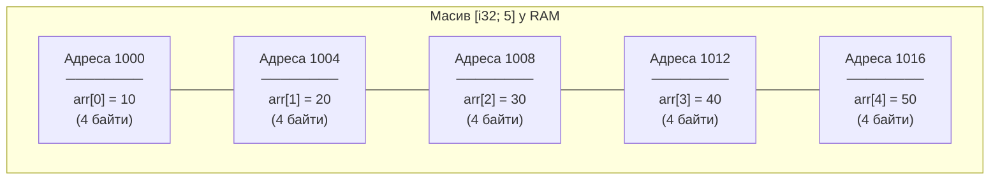
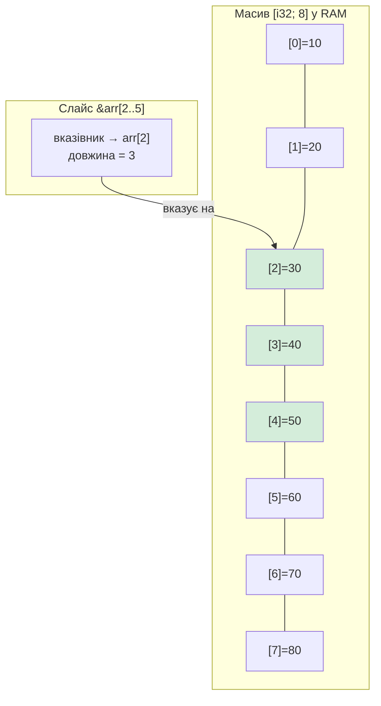

# Розділ 8. Прості структури даних (Stack-only)

## Анотація

До цього розділу кожне значення у нашій програмі зберігалось в окремій змінній. Координата x — одна змінна, координата y — інша, висота — третя, і так далі. Але що робити, якщо потрібно зберігати десять останніх показань сенсора висоти? Двадцять точок маршруту? П'ятдесят ідентифікаторів дронів у рої? Створювати п'ятдесят окремих змінних — це не рішення, а капітуляція. Цей розділ знайомить із двома фундаментальними структурами даних: масивом та кортежем. Масив зберігає кілька значень одного типу в суцільному блоці пам'яті. Кортеж зберігає кілька значень різних типів як єдине ціле. Обидві структури живуть на стеку (stack) — частині пам'яті з передбачуваним часом життя та мінімальними накладними витратами. Окремо розглядаються слайси — "вікна" в масив, що дозволяють працювати з його частиною без копіювання.

---

## Цілі навчання

Після опрацювання цього розділу студент зможе:

1. Пояснити, чому масив зберігається як суцільний блок пам'яті, і намалювати схему розташування елементів у RAM.
2. Створити масив, звернутися до елементів за індексом, та пояснити, чому індексація починається з нуля.
3. Пояснити, чому Rust викликає panic при виході за межі масиву, і чим це краще за поведінку C.
4. Створити кортеж, використати деструктуризацію, та пояснити, коли обирати кортеж замість масиву.
5. Створити слайс масиву та пояснити, що слайс — це посилання, а не копія.
6. Ітерувати по масиву та слайсу через `for`.

---

## Ключові терміни

**Array (масив)** — колекція фіксованої кількості значень одного типу, що зберігається в суцільному блоці пам'яті. Тип: `[T; N]`.

**Tuple (кортеж)** — колекція фіксованої кількості значень, можливо різних типів. Тип: `(T1, T2, ...)`.

**Index (індекс)** — позиція елемента в масиві. Починається з 0.

**Slice (слайс)** — посилання на неперервну частину масиву. Тип: `&[T]`.

**Stack (стек)** — область пам'яті з автоматичним управлінням: змінні додаються при вході в блок і видаляються при виході.

**Panic** — аварійне завершення програми при виявленні невиправної помилки (наприклад, вихід за межі масиву).

**Destructuring (деструктуризація)** — розбирання складного значення (кортежу, масиву) на окремі змінні.

**Copy semantics** — поведінка, при якій присвоєння створює повну копію значення, а не переміщує його.

---

## Мотиваційний кейс

Бортовий комп'ютер БПЛА зберігає буфер останніх 100 показань акселерометра для фільтрації шуму. Кожне показання — три числа (x, y, z). Якщо зберігати їх в окремих змінних — це 300 змінних: `accel_x_0`, `accel_x_1`, ..., `accel_z_99`. Неможливо написати цикл, що обробляє всі 300. Неможливо передати їх в функцію без 300 параметрів. Неможливо змінити розмір буфера без переписування сотень рядків коду. Масив вирішує цю проблему одним рядком: `let readings: [[f32; 3]; 100]` — сто тривимірних показань, доступних через індекс, оброблюваних циклом, переданих одним параметром.

---

## 8.1. Масив: кілька значень в одному блоці пам'яті

### Що таке масив

Масив — це найпростіша складна структура даних. "Складна" — бо містить кілька значень, а не одне. "Найпростіша" — бо всі значення мають один тип і їх кількість фіксована при компіляції.

У Rust масив записується як `[T; N]`, де `T` — тип елементів, а `N` — кількість. `[i32; 5]` — п'ять цілих чисел. `[f64; 10]` — десять дробових. `[bool; 3]` — три логічних значення. Кількість елементів `N` — це частина типу: `[i32; 5]` та `[i32; 6]` — це різні типи, несумісні між собою. Ви не можете присвоїти масив із 5 елементів змінній типу масив із 6.

### Як масив зберігається в пам'яті

Це ключове для розуміння. Масив — це суцільний, неперервний блок пам'яті, де елементи розташовані послідовно, один за одним, без проміжків. Якщо масив `[i32; 5]` починається за адресою 1000, то перший елемент — за адресою 1000, другий — за адресою 1004 (бо `i32` займає 4 байти), третій — за адресою 1008, і так далі.



Чому це важливо? Тому що суцільне розташування має два наслідки. Перший — швидкість: процесор може обчислити адресу будь-якого елемента за одну арифметичну операцію: `адреса_початку + індекс * розмір_елемента`. Не потрібно "шукати" елемент — його позиція обчислюється миттєво. Другий — кешування: сучасні процесори завантажують дані з RAM блоками (cache lines). Коли елементи розташовані поруч — один блок містить кілька елементів, і звернення до сусіднього елемента майже безкоштовне. Це робить ітерацію по масиву одною з найшвидших операцій у програмуванні.

### Створення масивів

Масив створюється через квадратні дужки зі списком значень:

```rust
fn main() {
    // Масив із явно перерахованих значень
    let altitudes = [120.5, 118.3, 122.7, 119.0, 121.1];

    // Масив із повторюваного значення: [значення; кількість]
    let zeros = [0.0; 10]; // десять нулів

    // Масив із явною анотацією типу
    let sensor_ids: [u8; 4] = [1, 4, 7, 12];

    println!("Перша висота: {:.1}", altitudes[0]);
    println!("Кількість нулів: {}", zeros.len());
    println!("Перший сенсор: {}", sensor_ids[0]);
}
```

Вивід:

```
Перша висота: 120.5
Кількість нулів: 10
Перший сенсор: 1
```

Синтаксис `[0.0; 10]` створює масив із 10 елементів, кожен з яких дорівнює 0.0. Це зручно для ініціалізації великих масивів значенням за замовчуванням. Метод `.len()` повертає кількість елементів.

### Індексація: чому з нуля

Доступ до елементів масиву здійснюється через індекс у квадратних дужках: `arr[0]`, `arr[1]`, `arr[4]`. Індексація починається з нуля, а не з одиниці.

Чому з нуля? Це не довільна конвенція, а пряме відображення того, як масив зберігається в пам'яті. Індекс — це зміщення (offset) від початку масиву. Перший елемент знаходиться на зміщенні 0 від початку. Другий — на зміщенні 1 (помножений на розмір елемента). Третій — на зміщенні 2. Адреса елемента = адреса початку + індекс * розмір. При індексації з нуля формула працює ідеально: `arr[0]` = початок + 0 * розмір = початок. Якби індексація була з одиниці, потрібно було б віднімати одиницю при кожному зверненні: `адреса = початок + (індекс - 1) * розмір` — зайва операція на кожному доступі.

Ця конвенція однакова у C, Java, Python, JavaScript, Go і практично всіх сучасних мовах. Запам'ятайте: масив із 5 елементів має індекси 0, 1, 2, 3, 4. Не 1–5, а 0–4. Останній елемент — `arr[4]`, не `arr[5]`.

### Panic при виході за межі

Що відбувається, коли ви звертаєтесь до елемента, якого не існує? У C — нічого хорошого: програма прочитає випадкові байти з пам'яті за межами масиву і поверне "сміттєве" значення. Це один з найнебезпечніших типів помилок — buffer overread — і саме через нього виникають уразливості безпеки на кшталт Heartbleed (2014), що скомпрометувала шифрування на мільйонах серверів.

Rust обирає безпечний шлях: програма аварійно завершується (panic) з чітким повідомленням про помилку. Наступний код демонструє цю поведінку — він компілюється, але падає при запуску:

```rust
fn main() {
    let sensors = [10, 20, 30, 40, 50];
    let index = 7; // за межами масиву!

    // Ця операція спричинить panic
    println!("Значення: {}", sensors[index]);
}
```

Помилка при запуску:

```
thread 'main' panicked at 'index out of bounds: the len is 5 but the index is 7',
src/main.rs:5:35
```

Rust каже: "масив має довжину 5, а ви просите елемент з індексом 7 — це за межами." Програма зупиняється негайно, замість того, щоб продовжити з хибними даними. Це краще, ніж Heartbleed: аварійна зупинка — неприємність, а робота з випадковими даними — катастрофа.

Чому Rust не перевіряє це при компіляції? Тому що індекс може бути змінною, значення якої визначається під час виконання (наприклад, введене користувачем). Компілятор не може знати заздалегідь, яке значення матиме `index`. Тому перевірка відбувається при кожному зверненні — під час виконання. Це має невеликий overhead (зайву перевірку), але Rust вважає безпеку пам'яті важливішою за мікрооптимізацію.

### Зміна елементів та ітерація

Щоб змінити елемент масиву — сам масив має бути `mut`:

```rust
fn main() {
    let mut readings = [0.0; 5]; // п'ять нулів

    // Заповнюємо масив показаннями
    readings[0] = 120.5;
    readings[1] = 118.3;
    readings[2] = 122.7;
    readings[3] = 119.0;
    readings[4] = 121.1;

    // Ітерація по масиву через for
    println!("Показання висотоміра:");
    for i in 0..readings.len() {
        println!("  [{}] = {:.1} м", i, readings[i]);
    }

    // Ітерація по значеннях (ідіоматичний спосіб)
    let mut sum = 0.0;
    for value in readings {
        sum = sum + value;
    }
    let average = sum / readings.len() as f64;
    println!("Середня висота: {:.1} м", average);
}
```

Вивід:

```
Показання висотоміра:
  [0] = 120.5 м
  [1] = 118.3 м
  [2] = 122.7 м
  [3] = 119.0 м
  [4] = 121.1 м
Середня висота: 120.3 м
```

Зверніть увагу на два способи ітерації. Перший — `for i in 0..readings.len()` — ітерація по індексах, де `i` — це число від 0 до 4. Другий — `for value in readings` — ітерація по значеннях, де `value` — це кожен елемент масиву по черзі. Другий спосіб ідіоматичніший у Rust, але перший потрібен, коли вам потрібен сам індекс (наприклад, для виводу номера елемента).

Конструкція `readings.len() as f64` конвертує `usize` (тип, що повертає `.len()`) у `f64` для ділення. Без цього Rust не дозволить поділити `f64` на `usize` — типи мають збігатися.

---

## 8.2. Кортеж: кілька значень різних типів

### Що таке кортеж

Масив зберігає кілька значень одного типу. Але що робити, якщо потрібно зберігати пов'язані значення різних типів як єдине ціле? Наприклад, позиція БПЛА — це три дробових числа (широта, довгота, висота). Ідентифікація — це номер (u8) та рядок (ім'я). Стан мотора — це обороти (u16) та температура (f64).

Для цього існує кортеж (tuple) — фіксована колекція значень, де кожен елемент може мати свій тип. Тип кортежу визначається типами всіх його елементів: `(f64, f64, f64)` — три дробових, `(u8, bool, f64)` — число, логічне, дробове.

На відміну від масиву, елементи кортежу можуть бути різних типів. На відміну від масиву, до елементів кортежу звертаються не через індекс у квадратних дужках, а через крапку і номер позиції: `.0`, `.1`, `.2`.

### Створення та доступ

```rust
fn main() {
    // Кортеж із трьох дробових — координати
    let position: (f64, f64, f64) = (50.450001, 30.523410, 120.5);

    println!("Широта:  {:.6}", position.0);
    println!("Довгота: {:.6}", position.1);
    println!("Висота:  {:.1} м", position.2);

    // Кортеж із різних типів
    let drone_info: (u8, bool, f64) = (7, true, 73.8);

    println!("ID: {}, активний: {}, батарея: {:.1}%",
        drone_info.0, drone_info.1, drone_info.2);
}
```

Вивід:

```
Широта:  50.450001
Довгота: 30.523410
Висота:  120.5 м
ID: 7, активний: true, батарея: 73.8%
```

Номери `.0`, `.1`, `.2` — це не індекси в масивному сенсі. Вони фіксовані при компіляції — ви не можете написати `position.i`, де `i` — змінна. Це тому, що кожна позиція кортежу може мати різний тип, і компілятор повинен знати заздалегідь, який саме тип ви отримуєте.

### Деструктуризація: розбирання кортежу на змінні

Замість звернення через `.0`, `.1`, `.2` (що нечитабельне — що таке `position.1`?), можна "розібрати" кортеж на окремі іменовані змінні. Це називається деструктуризація (destructuring):

```rust
fn main() {
    let position = (50.450001, 30.523410, 120.5);

    // Деструктуризація: розбираємо кортеж на три змінні
    let (latitude, longitude, altitude) = position;

    println!("Широта:  {:.6}", latitude);
    println!("Довгота: {:.6}", longitude);
    println!("Висота:  {:.1} м", altitude);
}
```

Тепер замість незрозумілого `position.1` ми маємо `longitude` — код став самодокументованим. Деструктуризація — це не копіювання з накладними витратами; компілятор просто присвоює кожній змінній відповідне значення з кортежу.

Якщо деякі елементи не потрібні, їх можна ігнорувати через підкреслення `_`:

```rust
fn main() {
    let telemetry = (50.45, 30.52, 120.5, 73.8, true);

    // Потрібні лише висота (третій) та батарея (четвертий)
    let (_, _, altitude, battery, _) = telemetry;

    println!("Висота: {:.1} м, батарея: {:.1}%", altitude, battery);
}
```

### Коли масив, коли кортеж

Вибір між масивом та кортежем визначається природою даних.

Масив — коли всі значення одного типу і мають однакову "природу": п'ять показань сенсора, десять координатних точок, двадцять ідентифікаторів. Масив можна обходити циклом, бо кожен елемент обробляється однаково.

Кортеж — коли значення різних типів або мають різну "природу": (широта, довгота, висота) — три f64, але кожне має різний сенс. Або (id, is_active, battery) — три різних типи. Кортеж не можна обходити циклом (бо елементи мають різні типи), але можна деструктуризувати.

Для наскрізного проєкту БПЛА: масив — для буфера показань одного сенсора. Кортеж — для позиції `(lat, lon, alt)` або для результату обчислення `(відстань, напрямок)`.

---

## 8.3. Слайси: вікно в масив

### Концепція

Уявіть, що у вас є масив із 100 показань сенсора, і вам потрібно обробити лише останні 10. Копіювати ці 10 елементів в новий масив — марнування пам'яті та часу. Натомість Rust пропонує слайс (slice) — посилання на неперервну частину існуючого масиву. Слайс не копіює дані — він "дивиться" на частину масиву, як вікно на стіну.

Тип слайса — `&[T]`. Знак `&` означає, що це посилання (reference) — слайс не володіє даними, а лише вказує на них. Це preview концепції borrowing, яку ми детально вивчимо у Частині II.

### Як слайс зберігається в пам'яті

Слайс — це не просто вказівник на початок. Це два значення: вказівник на перший елемент та довжина (кількість елементів). Це називається "fat pointer" (товстий вказівник) — він "товщий" за звичайний вказівник, бо містить додаткову інформацію.



Слайс `&arr[2..5]` не копіює елементи 30, 40, 50 у нове місце. Він зберігає два значення: адресу елемента `arr[2]` та число 3 (кількість елементів). Коли ви звертаєтесь до `slice[0]` — Rust бере адресу з вказівника і читає значення за нею. Коли до `slice[1]` — додає розмір елемента до адреси. Все це без копіювання.

### Створення слайсів

Слайс створюється через синтаксис діапазону, застосований до масиву з `&`:

```rust
fn main() {
    let readings = [10, 20, 30, 40, 50, 60, 70, 80];

    // Слайс елементів з індексу 2 до 5 (не включаючи 5)
    let middle = &readings[2..5]; // елементи [2], [3], [4] → 30, 40, 50
    println!("Середня частина: {:?}", middle);
    println!("Довжина слайсу: {}", middle.len());

    // Слайс від початку
    let first_three = &readings[..3]; // елементи [0], [1], [2]
    println!("Перші три: {:?}", first_three);

    // Слайс до кінця
    let last_four = &readings[4..]; // елементи [4], [5], [6], [7]
    println!("Останні чотири: {:?}", last_four);

    // Слайс усього масиву
    let all = &readings[..];
    println!("Усі: {:?}", all);
}
```

Вивід:

```
Середня частина: [30, 40, 50]
Довжина слайсу: 3
Перші три: [10, 20, 30]
Останні чотири: [50, 60, 70, 80]
Усі: [10, 20, 30, 40, 50, 60, 70, 80]
```

Зверніть увагу: для виводу слайсу використовується `{:?}` (debug-формат), а не `{}`. Масиви та слайси не реалізують Display-формат (ми дізнаємось чому у Розділі 27, коли вивчимо traits), але реалізують Debug — тому `{:?}` працює.

Діапазони слайсів використовують ту саму нотацію, що й `for`: `2..5` — від 2 до 4 включно (верхня межа не включається), `..3` — від початку до 2, `4..` — від 4 до кінця.

### Ітерація по слайсу

Слайси ітеруються так само, як масиви:

```rust
fn main() {
    let altitudes = [120.5, 118.3, 122.7, 119.0, 121.1, 115.8, 123.2];

    // Останні три показання
    let recent = &altitudes[4..];

    println!("Останні показання висоти:");
    for value in recent {
        println!("  {:.1} м", value);
    }
}
```

Вивід:

```
Останні показання висоти:
  121.1 м
  115.8 м
  123.2 м
```

Для БПЛА це типовий патерн: зберігаємо буфер із N показань і обробляємо лише останні кілька для фільтрації шуму або виявлення тренду.

---

## 8.4. Copy semantics: що відбувається при присвоєнні

Коли ви присвоюєте масив примітивних типів (`i32`, `f64`, `bool`) іншій змінній, Rust створює повну копію. Це відрізняється від поведінки з більшими типами (наприклад, `String`), де присвоєння *переміщує* дані замість копіювання — але це тема Частини II.

```rust
fn main() {
    let original = [1, 2, 3, 4, 5];
    let copy = original; // повна копія всіх 5 елементів

    println!("Оригінал: {:?}", original); // оригінал все ще доступний
    println!("Копія:    {:?}", copy);
}
```

Вивід:

```
Оригінал: [1, 2, 3, 4, 5]
Копія:    [1, 2, 3, 4, 5]
```

Обидві змінні містять однакові значення, але це незалежні копії: зміна `copy` не вплине на `original`. Це працює, тому що `i32` реалізує trait `Copy` — про traits ви дізнаєтесь у Частині III. Поки достатньо знати: масиви примітивних типів копіюються при присвоєнні, і обидві копії існують незалежно.

---

## 8.5. Практика: масив показань сенсорів БПЛА

Об'єднаємо масиви, кортежі та слайси у програмі, що обробляє дані сенсорів БПЛА.

```rust
fn main() {
    // Буфер висотоміра: останні 8 показань
    let altitudes: [f64; 8] = [120.5, 118.3, 122.7, 119.0, 121.1, 115.8, 123.2, 120.0];

    // Координатні точки маршруту (кортежі)
    let waypoint_1 = (50.450, 30.523, 120.0);
    let waypoint_2 = (50.452, 30.525, 130.0);
    let waypoint_3 = (50.455, 30.520, 110.0);

    // === Обробка буфера висоти ===
    println!("=== Буфер висоти ({} показань) ===", altitudes.len());

    // Знаходимо мінімум та максимум
    let mut min = altitudes[0];
    let mut max = altitudes[0];
    let mut sum = 0.0;

    for value in altitudes {
        if value < min { min = value; }
        if value > max { max = value; }
        sum = sum + value;
    }

    let avg = sum / altitudes.len() as f64;
    let spread = max - min;

    println!("Мін: {:.1} м, Макс: {:.1} м", min, max);
    println!("Середня: {:.1} м, Розкид: {:.1} м", avg, spread);

    // Аналіз останніх 3 показань (слайс)
    let recent = &altitudes[5..];
    println!("\nОстанні {} показання:", recent.len());
    for val in recent {
        println!("  {:.1} м", val);
    }

    // === Робота з координатними точками ===
    println!("\n=== Маршрут ===");
    let (lat1, lon1, alt1) = waypoint_1;
    let (lat2, lon2, alt2) = waypoint_2;

    println!("Точка 1: ({:.3}, {:.3}), висота {:.0} м", lat1, lon1, alt1);
    println!("Точка 2: ({:.3}, {:.3}), висота {:.0} м", lat2, lon2, alt2);

    // Різниця висот між точками
    let alt_diff = alt2 - alt1;
    let direction = if alt_diff > 0.0 { "набір" } else { "зниження" };
    println!("Зміна висоти: {:.0} м ({})", alt_diff.abs(), direction);
}
```

У цій програмі масив `altitudes` зберігає буфер показань, слайс `recent` дає "вікно" на останні три, кортежі `waypoint` зберігають координати з різною семантикою (широта, довгота, висота). Деструктуризація `let (lat, lon, alt) = waypoint` робить код читабельним.

---

## Prompt Engineering: дебаг роботи з масивами

Помилки з масивами часто пов'язані з індексацією та межами:

```
Я вивчаю Rust (розділ 8: масиви та кортежі).
Мій код:

let data = [10, 20, 30, 40, 50];
let last = data[data.len()];

Падає з "index out of bounds: the len is 5 but the index is 5".
Я думав, що data.len() дає 5, і data[5] — це останній елемент.
Поясни, чому це неправильно і як отримати останній елемент.
```

AI повинен пояснити: `data.len()` = 5, але індекси 0–4. `data[5]` — за межами. Останній елемент: `data[data.len() - 1]` або `data[4]`.

---

## Лабораторна робота №8

### Мета

Навчитися працювати з масивами, кортежами та слайсами для зберігання та обробки даних БПЛА.

### Завдання базового рівня

Напишіть програму "Аналіз польоту". Масив із 10 висот (заповніть вручну). Обчисліть: середню висоту, мінімум, максимум, кількість показань вище середнього. Слайс останніх 3 показань — обчисліть для нього окремо. Маршрут із 3 точок (кортежі) — виведіть відстань між сусідніми (спрощено: різницю координат).

### Варіанти для самостійного виконання

**Варіант A.** Масив із 20 "показань температури" мотора. Знайдіть найдовшу послідовність показань, де температура зростає. Виведіть індекси початку та кінця цієї послідовності.

**Варіант B.** Два масиви: координати x та y (по 10 значень кожен). Обчисліть "довжину маршруту" — суму відстаней між сусідніми точками. Відстань між (x1,y1) та (x2,y2) спрощено: |x2-x1| + |y2-y1|.

**Варіант C.** Масив батареї за 12 кроків. Знайдіть крок, на якому батарея вперше опускається нижче 30%. Виведіть слайс від цього кроку до кінця — "фаза повернення".

**Варіант D.** AI генерує програму обробки масиву за вашою специфікацією. Перевірте на помилки індексації та off-by-one.

### Критерії оцінювання

| Критерій | Максимальний бал |
|----------|-----------------|
| Програма компілюється та працює | 15 |
| Коректна робота з масивами та індексами | 25 |
| Використання слайсів | 20 |
| Використання кортежів з деструктуризацією | 20 |
| Читабельність та коментарі | 20 |

---

## Troubleshooting

**`thread panicked at 'index out of bounds'`**

Ви звернулись до елемента за межами масиву. Перевірте: індекси від 0 до `len() - 1`. `arr[arr.len()]` — завжди помилка (off-by-one).

**`error[E0308]: mismatched types — expected [i32; 5], found [i32; 3]`**

Масиви різної довжини — різні типи. `[i32; 5]` та `[i32; 3]` несумісні. Якщо потрібна змінна довжина — використовуйте слайс `&[i32]`.

**`error: cannot use the '}' operator with '{:?}'`**

Масиви та слайси виводяться через `{:?}` (debug), а не `{}` (display). Використовуйте `println!("{:?}", arr)`.

**`error[E0277]: the trait bound [f64; 100]: std::fmt::Debug is not satisfied`**

Масиви довжиною більше 32 не реалізують Debug автоматично. Використовуйте слайс: `println!("{:?}", &arr[..])`.

**`error[E0508]: cannot move out of type [T; N], a non-copy array element`**

Ви намагаєтесь "витягнути" елемент з масиву не-Copy типу. Для String та інших типів heap — це тема Частини II. Для примітивних типів ця помилка не виникне.

**Кортеж не можна ітерувати через for.**

Кортеж містить елементи різних типів, тому `for x in tuple` не працює. Використовуйте деструктуризацію або доступ через `.0`, `.1`.

---

## Додатково

### Масиви масивів (двовимірні)

Масив може містити масиви — це створює двовимірну структуру:

```rust
fn main() {
    // Сітка 3x3 для патрулювання (0 — не відвідано, 1 — відвідано)
    let grid: [[u8; 3]; 3] = [
        [1, 1, 0],
        [1, 0, 0],
        [0, 0, 0],
    ];

    for row in 0..3 {
        for col in 0..3 {
            let symbol = if grid[row][col] == 1 { "X" } else { "." };
            print!("{} ", symbol);
        }
        println!();
    }
}
```

Вивід:

```
X X . 
X . . 
. . . 
```

Тип `[[u8; 3]; 3]` — масив із 3 масивів по 3 елементи. У пам'яті це суцільний блок із 9 байтів. `grid[row][col]` — спочатку обираємо рядок, потім стовпець.

### Unit-тип та порожній кортеж

Порожній кортеж `()` — це спеціальний тип у Rust, який називається unit. Він не містить жодних даних і має рівно одне можливе значення: `()`. Функції, що "нічого не повертають" (як наш `fn main()`), насправді повертають `()`. Це аналог `void` у C, але в Rust це повноцінний тип зі своїм значенням.

---

## Контрольні запитання

### Рівень 1 (знання)

1. Чим масив відрізняється від кортежу?
2. З якого числа починається індексація масиву в Rust?
3. Що таке слайс і чим він відрізняється від масиву?
4. Як отримати довжину масиву?

### Рівень 2 (розуміння)

5. Чому розмір масиву є частиною його типу (`[i32; 5]` та `[i32; 6]` — різні типи)?
6. Чому Rust обирає panic при виході за межі замість повернення "сміттєвого" значення, як C?
7. Чому слайс зберігає і вказівник, і довжину, а не лише вказівник?

### Рівень 3 (застосування)

8. Напишіть код, що знаходить індекс максимального елемента в масиві `[f64; 6]`.
9. Що виведе цей код? Відповідайте без запуску:
```rust
fn main() {
    let a = [10, 20, 30, 40, 50];
    let s = &a[1..4];
    println!("{} {} {}", s[0], s.len(), a[3]);
}
```

### Рівень 4 (аналіз)

10. БПЛА має буфер на 1000 показань висоти (`f64`). Скільки пам'яті займає цей буфер? Якщо бортовий комп'ютер має 64 КБ RAM, яку частину пам'яті це становить?
11. Порівняйте два підходи до зберігання координат маршруту: масив кортежів `[(f64, f64); N]` та два окремих масиви `[f64; N]` (один для широти, один для довготи). Які переваги кожного підходу з точки зору зручності та продуктивності?

---

## Резюме

Масив `[T; N]` — фіксована кількість значень одного типу у суцільному блоці пам'яті. Розмір — частина типу. Індексація з 0. Вихід за межі — panic.

Кортеж `(T1, T2, ...)` — фіксована кількість значень, можливо різних типів. Доступ через `.0`, `.1`. Деструктуризація дає іменовані змінні.

Слайс `&[T]` — посилання на неперервну частину масиву. Не копіює дані. Зберігає вказівник і довжину ("fat pointer"). Створюється через `&arr[start..end]`.

Масиви примітивних типів копіюються при присвоєнні (Copy semantics). Обидві копії незалежні.

Вибір: масив — для однотипних даних, оброблюваних циклом. Кортеж — для пов'язаних різнотипних значень. Слайс — для роботи з частиною масиву без копіювання.

---

## Що далі

Масиви та кортежі зберігають числа, логічні значення, символи. Але наш БПЛА-агент потребує текстових даних: ідентифікатор "БПЛА-07", команди "зліт", "посадка", назви місій. Текст у Rust — це окрема і непроста тема: `String` та `&str`, UTF-8, чому рядок не можна індексувати як масив. У Розділі 9 ми розберемось з рядками і навчимо агента працювати з текстом.
