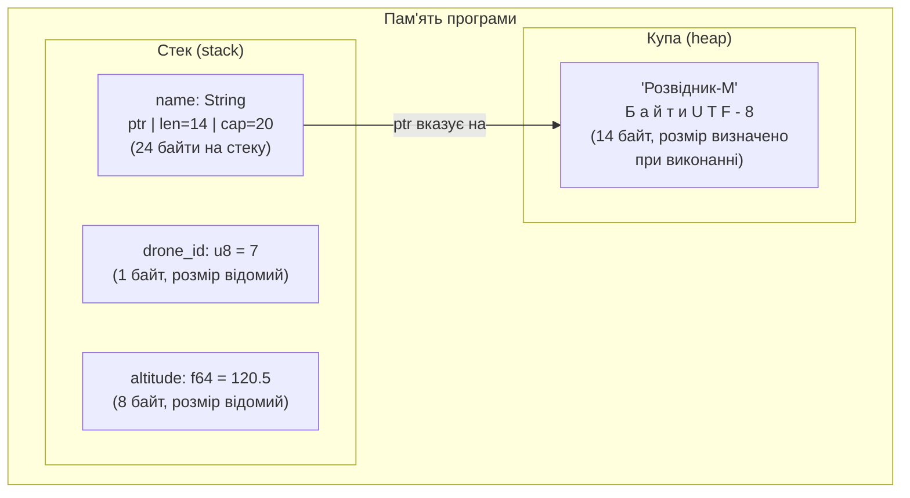
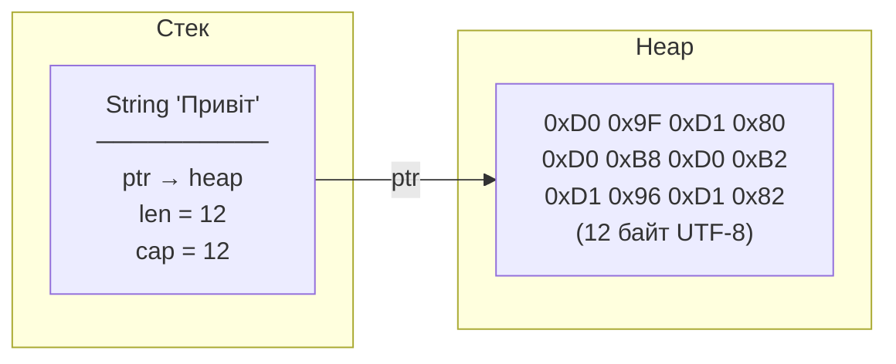
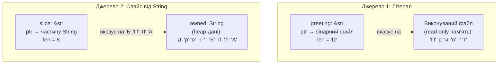

# Розділ 9. Рядки: String та &str

## Анотація

Числа, логічні значення, масиви — всі ці типи мають спільну рису: їхній розмір відомий при компіляції. `i32` завжди 4 байти. `[f64; 10]` завжди 80 байт. Компілятор розміщує їх на стеку — швидко, автоматично, передбачувано. Текст зламує цю модель. Рядок "Привіт" і рядок "Автономний безпілотний літальний апарат із системою уникнення перешкод" — один тип, але перший займає 12 байтів, другий — 97. Розмір невідомий до моменту створення. Більше того, рядок може змінювати довжину: до нього додають текст, з нього видаляють. Для таких даних стеку недостатньо — потрібна купа (heap). Цей розділ — перша зустріч із heap-пам'яттю, і вона відбувається через рядки: два типи `String` та `&str`, їхнє розташування в пам'яті, кодування UTF-8, і численні наслідки, які з цього випливають для повсякденного програмування.

---

## Цілі навчання

Після опрацювання цього розділу студент зможе:

1. Пояснити різницю між стеком та купою (heap) і обґрунтувати, чому текст зберігається на heap.
2. Пояснити різницю між `String` та `&str` з точки зору пам'яті (owned vs borrowed, heap vs read-only).
3. Створити рядок кількома способами і обрати правильний для ситуації.
4. Пояснити кодування UTF-8 і чому `s[0]` не працює для Rust-рядків.
5. Використовувати `chars()`, `bytes()` та основні методи рядків.
6. Конкатенувати рядки через `format!` і пояснити, чому це ідіоматичний спосіб.

---

## Ключові терміни

**String** — тип рядка, що володіє своїми даними. Зберігає текст на heap. Може змінювати розмір.

**&str (string slice)** — посилання на послідовність UTF-8 байтів. Не володіє даними.

**Heap (купа)** — область пам'яті для даних змінного розміру. Виділення та звільнення — в довільному порядку.

**Stack (стек)** — область пам'яті з автоматичним управлінням за принципом LIFO.

**UTF-8** — стандарт кодування тексту зі змінною довжиною символу (1–4 байти).

**Owned (власний)** — дані, якими змінна володіє і відповідає за звільнення.

**Borrowed (позичений)** — дані, на які змінна лише посилається.

**Capacity (ємність)** — загальна кількість байтів, виділених на heap для String.

**Code point** — унікальний числовий ідентифікатор символу в стандарті Unicode.

---

## Мотиваційний кейс

У 2010 році Twitter збільшив ліміт повідомлень зі 140 символів до 280. Здавалося — просто змінити константу. Але виникло фундаментальне питання: що таке "символ"? Латинська 'A' — один байт. Японський ієрогліф — три. Емодзі прапора — два Unicode code points по 4 байти кожен, разом 8 байтів на один "символ" з точки зору людини. Один рядок тексту — це три різних довжини: в байтах, у code points, у "видимих символах" (графемних кластерах). Rust не приховує цю складність. Він робить її явною, змушуючи програміста зробити свідомий вибір: "я працюю з байтами", "я працюю з Unicode-символами", або "я працюю з графемними кластерами". Це складніше на початку, але рятує від класу помилок, які Python, JavaScript та Java ховають за зручним, але неточним фасадом.

---

## 9.1. Стек та купа: два види пам'яті

Перш ніж говорити про рядки, потрібно зрозуміти нову концепцію: heap (купа). До цього розділу всі наші дані жили на стеку. Тепер з'являється другий "поверх" — і рядки будуть першим типом даних, який його використовує.

У Розділі 5 ми говорили, що змінні зберігаються в оперативній пам'яті. Але не вся RAM однакова. Операційна система розділяє пам'ять програми на кілька областей, і дві найважливіших — стек (stack) та купа (heap).

**Стек** — це область пам'яті, що працює за принципом "останній прийшов — перший вийшов" (LIFO). Коли програма входить у функцію чи блок `{}` — на вершину стеку додаються змінні цього блоку. Коли блок завершується — ці змінні знімаються з вершини. Процес повністю автоматичний, швидкий (одна операція зміщення вказівника) і передбачуваний. Але є обмеження: розмір кожної змінної на стеку повинен бути відомий при компіляції. `i32` — 4 байти, завжди. `[f64; 10]` — 80 байт, завжди. Компілятор знає розмір і резервує місце наперед.

**Купа (heap)** — це область пам'яті для даних, розмір яких невідомий при компіляції або може змінюватися під час виконання. Виділення пам'яті на heap — це запит до операційної системи: "дай мені блок N байтів". ОС знаходить вільне місце, позначає його як зайняте, і повертає адресу початку блоку. Звільнення — зворотний процес. На відміну від стеку, виділення та звільнення на heap може відбуватися в довільному порядку, що робить управління складнішим і повільнішим.



Зверніть увагу: `String` живе *одночасно* на стеку і на heap. На стеку — маленька структура з трьох полів (вказівник, довжина, ємність). На heap — самі дані (байти тексту). Стекова частина має фіксований розмір (24 байти на 64-бітній системі: три поля по 8 байт). Heap-частина має змінний розмір — стільки байтів, скільки потрібно для тексту.

Ця двоповерхова архітектура вирішує проблему: стек вимагає фіксованого розміру — і він отримує його (24 байти). Текст вимагає змінного розміру — і отримує його на heap. Вказівник на стеку зв'язує дві частини.

Чому не зберігати все на heap? Тому що стек значно швидший. Виділення на стеку — одна інструкція (зміщити вказівник). Виділення на heap — системний виклик, пошук вільного блоку, оновлення таблиць — десятки чи сотні інструкцій. Для `i32` чи `bool` використовувати heap — як наймати вантажівку для перевезення олівця.

---

## 9.2. String: текст, яким ви володієте

### Внутрішня структура

`String` — це owned (власний) рядок. "Owned" означає: змінна типу `String` відповідає за пам'ять, де зберігається текст. Коли `String` виходить з області видимості — пам'ять на heap автоматично звільняється. Не через збирач сміття (як у Java, Python, Go), а через механізм Drop, прив'язаний до фігурних дужок `{}`. Ви вже знаєте цей принцип з Розділу 6 (область видимості) — тепер він застосовується і до heap-пам'яті.

На стеку `String` зберігає три поля:

- pointer — адреса початку тексту на heap
- length — поточна довжина тексту в байтах (скільки байтів фактично використовується)
- capacity — загальна кількість байтів, виділених на heap (може бути більше за length)



Навіщо capacity окремо від length? Уявіть, що ви створили рядок "Привіт" (12 байт), а потім хочете додати " світ" (ще 10 байт). Якщо capacity = 12, Rust мусить: виділити новий блок на heap (22+ байт), скопіювати старий текст, додати новий, звільнити старий блок. Це повільно. Тому Rust часто виділяє більше, ніж потрібно: capacity може бути 24, коли length лише 12. Тоді додавання " світ" відбудеться без переалокації — є запас.

Аналогія: `String` — це зошит. Сторінки зошита — це heap-пам'ять. Кількість написаних сторінок — length. Загальна кількість сторінок — capacity. Ви можете писати нові сторінки, поки є порожні. Коли порожні закінчуються — доведеться купити зошит більшого розміру та переписати все.

### Створення String

```rust
fn main() {
    // Найчастіший спосіб: зі строкового літералу
    let drone_id = String::from("БПЛА-07");

    // Альтернативний спосіб: метод .to_string()
    let status = "активний".to_string();

    // format! — для складного форматування
    let lat = 50.45;
    let lon = 30.52;
    let report = format!("Позиція: ({:.2}, {:.2})", lat, lon);

    // Порожній рядок для поступового заповнення
    let empty = String::new();

    // З відомою ємністю (оптимізація, коли знаєте приблизний розмір)
    let with_capacity = String::with_capacity(100);

    println!("ID: {} (len={}, cap={})", drone_id, drone_id.len(), drone_id.capacity());
    println!("Статус: {}", status);
    println!("Звіт: {}", report);
    println!("Порожній: '{}' (len={}, cap={})", empty, empty.len(), empty.capacity());
    println!("З ємністю: '{}' (len={}, cap={})", with_capacity, with_capacity.len(), with_capacity.capacity());
}
```

Вивід:

```
ID: БПЛА-07 (len=11, cap=11)
Статус: активний
Звіт: Позиція: (50.45, 30.52)
Порожній: '' (len=0, cap=0)
З ємністю: '' (len=0, cap=100)
```

Зверніть увагу на останній рядок: `with_capacity` порожній (len=0), але вже має 100 байт на heap (cap=100). Додавання перших 100 байтів тексту відбуватиметься без переалокації. Це корисно, коли ви знаєте, що рядок буде рости — наприклад, при побудові логу місії.

`String::from()` та `.to_string()` роблять те саме: копіюють байти літералу на heap і створюють `String`. Різниця суто стилістична.

### Зміна String

`String` може змінюватись — це одна з головних причин його існування. Методи для зміни вимагають `mut`:

```rust
fn main() {
    let mut log = String::from("[10:00] Зліт");
    println!("Початковий: '{}'", log);
    println!("  len={}, cap={}", log.len(), log.capacity());

    // push_str — додати &str до кінця
    log.push_str(". Висота 120 м");
    println!("Після push_str: '{}'", log);
    println!("  len={}, cap={}", log.len(), log.capacity());

    // push — додати один символ
    log.push('!');
    println!("Після push: '{}'", log);

    // Зверніть увагу: capacity може зрости при додаванні,
    // якщо вільного місця не вистачило
}
```

Вивід (capacity може відрізнятись залежно від системи):

```
Початковий: '[10:00] Зліт'
  len=18, cap=18
Після push_str: '[10:00] Зліт. Висота 120 м'
  len=42, cap=42
Після push: '[10:00] Зліт. Висота 120 м!'
  len=43, cap=84
```

Після `push('!')` capacity різко зросла з 42 до 84. Це тому, що при додаванні одного байта (символ `!`) старого capacity (42) виявилось недостатньо (бо len було 42 = cap), і Rust подвоїв capacity. Стратегія подвоєння гарантує, що серія `push_str` у циклі не потребуватиме переалокації на кожній ітерації — що робить цю операцію ефективною в середньому.

---

## 9.3. &str: посилання на текст

### Що таке &str

`&str` (вимовляється "string slice" або "стринг-слайс") — це посилання на послідовність UTF-8 байтів, що зберігаються десь в іншому місці. Ключове слово — "посилання": `&str` не володіє даними, не виділяє пам'ять, не звільняє її. Воно лише вказує на текст, який уже існує.

Це прямий аналог слайсу масиву `&[T]` з Розділу 8. Як `&arr[2..5]` — це "вікно" в масив без копіювання, так `&str` — це "вікно" в рядкові дані без копіювання.

`&str` зберігає два значення: вказівник на перший байт тексту та довжину в байтах. Це "fat pointer", як і слайс масиву.

### Звідки беруться дані &str

Є два основних джерела.

**Перше — рядкові літерали.** Коли ви пишете `"Привіт"` у вихідному коді, компілятор вбудовує ці байти безпосередньо у виконуваний файл програми. При запуску текст потрапляє в read-only область пам'яті — він існує протягом усього часу роботи програми і не може бути змінений. Рядковий літерал `"Привіт"` має тип `&str` зі спеціальним часом життя `'static` — це означає "живе стільки, скільки працює програма".

**Друге — слайс від String.** Коли ви пишете `&my_string` або `&my_string[2..8]`, ви отримуєте `&str`, що посилається на частину (або весь) вміст `String`. Ці дані живуть на heap — у тій пам'яті, яку виділив `String`.



Аналогія: `&str` — це табличка-вказівник у бібліотеці. На ній написано: "книга стоїть на полиці 3, починаючи зі сторінки 50, прочитайте 10 сторінок." Табличка не містить тексту книги — вона лише вказує, де його знайти. Якщо хтось забере книгу з полиці (String буде звільнений), а ви спробуєте прочитати за табличкою — це помилка. Rust гарантує на етапі компіляції, що така ситуація неможлива.

### Конвертація між String та &str

Перехід в обох напрямках простий, але асиметричний за вартістю.

`String` → `&str` — безкоштовно. Просто створюємо вказівник на вже існуючі дані. `&my_string` або `my_string.as_str()`.

`&str` → `String` — потребує виділення пам'яті та копіювання байтів. `my_str.to_string()` або `String::from(my_str)`.

```rust
fn main() {
    // &str → String (копіювання на heap)
    let literal: &str = "Привіт";
    let owned: String = literal.to_string(); // або String::from(literal)

    // String → &str (просто посилання, без копіювання)
    let borrowed: &str = &owned; // або owned.as_str()

    println!("Літерал (&str): {}", literal);
    println!("Owned (String): {}", owned);
    println!("Borrowed (&str): {}", borrowed);
}
```

Усі три виведуть "Привіт", але `literal` вказує на бінарний файл, `owned` володіє копією на heap, а `borrowed` вказує на heap-дані, що належать `owned`.

### Коли String, коли &str

Правило, що працює у 90% випадків: якщо потрібно лише **прочитати** текст — використовуйте `&str`. Якщо потрібно **володіти** текстом (зберігати у структурі, змінювати, передавати кудись де він має жити довше за поточний блок) — використовуйте `String`.

На практиці: рядкові літерали автоматично `&str`. Параметри функцій, що лише читають текст, мають бути `&str` (ви побачите це у Розділі 11). Поля структур зазвичай `String` (Розділ 16). Повернення з функції — зазвичай `String` (бо &str має бути прив'язаний до існуючих даних).

---

## 9.4. UTF-8: один символ — це не один байт

### Проблема кодування

Комп'ютер зберігає тільки числа — байти. Текст — це інтерпретація чисел як символів. Питання: яке число відповідає якому символу?

Перша відповідь — ASCII (1963). 128 символів: англійський алфавіт, цифри, пунктуація, керуючі символи. Кожен символ — один байт. Просто, елегантно, і абсолютно недостатньо для решти світу. Кирилиці немає. Китайських ієрогліфів немає. Арабської в'язі немає.

Друга відповідь — Unicode (1991). Стандарт, що присвоює унікальний номер (code point) кожному символу з кожної писемності: від латинської 'A' (U+0041) до кирилічної 'Б' (U+0411), ієрогліфа (U+6F22), емодзі (U+1F680). На сьогодні визначено понад 150 000 символів. Unicode вирішує питання "який номер у якого символу", але не вирішує "як записати цей номер у байти".

Третя відповідь — UTF-8 (1993). Спосіб запису Unicode code points у байти зі змінною довжиною. Це означає: різні символи займають різну кількість байтів. Латинські літери та цифри (ASCII-діапазон, code points U+0000–U+007F) — 1 байт. Кирилиця, грецька, арабська, більшість європейських діакритичних знаків (U+0080–U+07FF) — 2 байти. Китайські, японські, корейські ієрогліфи, деванагарі (U+0800–U+FFFF) — 3 байти. Емодзі, рідкісні символи, історичні писемності (U+10000–U+10FFFF) — 4 байти.

### Наслідки для Rust

Ця змінна довжина має прямі наслідки для програмування. Rust зберігає рядки виключно в UTF-8. Це означає, що довжина рядка в байтах і кількість символів — це різні числа.

```rust
fn main() {
    let english = "Hello";
    let ukrainian = "Привіт";
    let mixed = "БПЛА-07";
    let japanese = "東京";

    println!("{:12} | {:>6} байт | {:>3} символів | {:>4.1} б/с",
        "Рядок", "—", "—", "—");
    println!("{:─>12}─┼─{:─>6}──────┼─{:─>3}───────────┼─{:─>4}───", "", "", "", "");

    for (name, s) in [
        ("Hello", english),
        ("Привіт", ukrainian),
        ("БПЛА-07", mixed),
        ("東京", japanese),
    ] {
        let bytes = s.len();
        let chars = s.chars().count();
        let ratio = bytes as f64 / chars as f64;
        println!("{:12} | {:6} байт | {:3} символів | {:4.1} б/с",
            name, bytes, chars, ratio);
    }
}
```

Вивід:

```
Рядок        |      — байт |   — символів |    — б/с
─────────────┼─────────────┼──────────────┼────────
Hello        |      5 байт |   5 символів |  1.0 б/с
Привіт       |     12 байт |   6 символів |  2.0 б/с
БПЛА-07      |     11 байт |   7 символів |  1.6 б/с
東京          |      6 байт |   2 символів |  3.0 б/с
```

"Hello" — 5 байт, 5 символів: кожна літера 1 байт (ASCII). "Привіт" — 12 байт, 6 символів: кожна кирилічна літера 2 байти. "БПЛА-07" — 11 байт: 4 кирилічних (8 байт) + дефіс (1 байт) + дві цифри (2 байти). "東京" — 6 байт, 2 символи: кожен ієрогліф 3 байти.

Метод `.len()` повертає кількість байтів. `.chars().count()` — кількість Unicode code points (що зазвичай збігається з інтуїтивним "кількість символів", хоча для деяких емодзі це не так).

### Чому s[0] не працює

У масиві `arr[2]` працює миттєво: компілятор знає розмір елемента, обчислює адресу за формулою `початок + індекс * розмір`. Це операція O(1) — константний час, незалежно від розміру масиву.

Для рядка UTF-8 `s[2]` неоднозначне. Воно може означати дві речі. Перша інтерпретація: "другий байт". Але другий байт може бути серединою кирилічної літери — ви отримаєте не символ, а половину символу, що є невалідним Unicode. Друга інтерпретація: "другий символ". Але щоб знайти другий символ, потрібно прочитати перший (щоб дізнатись, скільки байтів він займає), потім перейти до другого. Для n-го символу потрібно прочитати n-1 попередніх. Це O(n) — час залежить від позиції. Оператор `[]` зазвичай асоціюється з O(1) доступом, і O(n) під цим синтаксисом був би оманливим.

Rust вирішив: замість неоднозначної операції — заборонити її і надати два явних підходи.

```rust
fn main() {
    let text = "Привіт";

    // Підхід 1: ітерація по Unicode-символах
    println!("Символи (chars):");
    for (i, ch) in text.chars().enumerate() {
        println!("  [{}] '{}' (U+{:04X}, {} байт у UTF-8)",
            i, ch, ch as u32, ch.len_utf8());
    }

    // Підхід 2: ітерація по байтах
    println!("\nБайти (bytes):");
    for (i, byte) in text.bytes().enumerate() {
        println!("  [{:2}] 0x{:02X} ({})", i, byte, byte);
    }

    // Підхід 3: отримати конкретний символ (не за O(1)!)
    let third_char = text.chars().nth(2); // Option<char>
    println!("\nТретій символ: {:?}", third_char);
}
```

Вивід (скорочено):

```
Символи (chars):
  [0] 'П' (U+041F, 2 байт у UTF-8)
  [1] 'р' (U+0440, 2 байт у UTF-8)
  [2] 'и' (U+0438, 2 байт у UTF-8)
  [3] 'в' (U+0432, 2 байт у UTF-8)
  [4] 'і' (U+0456, 2 байт у UTF-8)
  [5] 'т' (U+0442, 2 байт у UTF-8)

Байти (bytes):
  [ 0] 0xD0 (208)
  [ 1] 0x9F (159)
  [ 2] 0xD1 (209)
  ...

Третій символ: Some('и')
```

`.chars()` дає ітератор по Unicode-символах — те, що людина вважає "літерами". `.bytes()` дає ітератор по байтах — те, що процесор бачить у пам'яті. `.chars().nth(2)` повертає `Option<char>` — або `Some('и')`, або `None`, якщо індекс за межами. `Option` — це тип, який ми вивчимо у Розділі 15, а поки зверніть увагу: Rust не дає вам "просто символ" — він дає "символ, якщо він існує".

### Слайси рядків та межі символів

Хоча `s[0]` заборонений, слайс рядка `&s[0..4]` — дозволений. Але з важливим обмеженням: межі слайсу мають потрапляти на межі UTF-8 символів. Якщо ви спробуєте розрізати рядок посередині символу — panic.

```rust
fn main() {
    let text = "Привіт"; // кожна літера 2 байти

    // Коректно: байти 0..4 = два повних символи 'П' та 'р'
    let slice = &text[0..4];
    println!("Слайс [0..4]: '{}'", slice);

    // PANIC: байт 3 — середина символу 'р' (байти 2..3)
    // let bad_slice = &text[0..3]; // thread panicked: byte index 3 is not a char boundary
}
```

Вивід:

```
Слайс [0..4]: 'Пр'
```

Рядок "Привіт" у байтах: [0..2) = 'П', [2..4) = 'р', [4..6) = 'и', [6..8) = 'в', [8..10) = 'і', [10..12) = 'т'. Слайс `[0..4]` бере рівно два символи — коректно. Слайс `[0..3]` розрізав би 'р' навпіл — panic.

Для БПЛА з кирилічними ідентифікаторами це має практичне значення: якщо ви отримуєте команду мережею і обрізаєте до фіксованої довжини в байтах — можете потрапити на межу символу. Безпечніше обрізати за кількістю символів через `.chars().take(n)`.

---

## 9.5. Основні методи рядків

Rust надає багатий набір методів. Розглянемо найуживаніші, згрупувавши за призначенням.

### Інформація про рядок

`len()` — кількість байтів (не символів). `is_empty()` — чи порожній рядок (еквівалент `len() == 0`). `chars().count()` — кількість Unicode-символів.

### Пошук

`contains(&str)` — чи містить підрядок. `starts_with(&str)` — чи починається з підрядка. `ends_with(&str)` — чи закінчується підрядком. Усі повертають `bool`.

### Трансформації

`trim()` — видаляє пробіли, табуляції та символи нового рядка з обох кінців. Повертає `&str` (не створює нового рядка — просто зсуває вказівники). `trim_start()` та `trim_end()` — те саме, але тільки з одного боку.

`to_uppercase()` та `to_lowercase()` — змінюють регістр. Повертають нову `String`, тому що результат може мати іншу довжину (наприклад, німецька 'ß' у верхньому регістрі стає "SS" — один символ стає двома).

`replace(old, new)` — замінює всі входження підрядка. Повертає нову `String`.

```rust
fn main() {
    let raw_command = "  ЗЛІТ 120  \n";

    // Крок 1: очистити від пробілів та \n
    let cleaned = raw_command.trim();
    println!("Після trim: '{}'", cleaned);

    // Крок 2: перевірити вміст
    println!("Містить 'ЗЛІТ': {}", cleaned.contains("ЗЛІТ"));
    println!("Починається з 'ЗЛ': {}", cleaned.starts_with("ЗЛ"));
    println!("Закінчується на '120': {}", cleaned.ends_with("120"));
    println!("Порожній: {}", cleaned.is_empty());

    // Крок 3: трансформувати
    let lower = cleaned.to_lowercase();
    println!("Нижній регістр: '{}'", lower);

    let replaced = cleaned.replace("120", "200");
    println!("Заміна: '{}'", replaced);

    // Тип повернення кожного методу:
    // trim() → &str (без копіювання)
    // to_lowercase() → String (нова пам'ять)
    // replace() → String (нова пам'ять)
    // contains() → bool
}
```

Вивід:

```
Після trim: 'ЗЛІТ 120'
Містить 'ЗЛІТ': true
Починається з 'ЗЛ': true
Закінчується на '120': true
Порожній: false
Нижній регістр: 'зліт 120'
Заміна: 'ЗЛІТ 200'
```

Зверніть увагу на тип повернення кожного методу — це важливо для розуміння ownership. `trim()` повертає `&str` — воно не створює новий рядок, а лише зсуває початок і кінець "вікна" на ту ж пам'ять. `to_lowercase()` і `replace()` повертають нову `String` — вони створюють новий рядок на heap, бо результат може мати іншу довжину.

---

## 9.6. Конкатенація: з'єднання рядків

### format! — ідіоматичний спосіб

`format!` працює як `println!`, але замість виводу на екран повертає `String`. Це найбезпечніший і найзручніший спосіб з'єднання рядків, бо він не забирає ownership жодного з аргументів.

```rust
fn main() {
    let drone_id = "БПЛА-07";
    let mission = "Патрулювання";
    let battery: u8 = 73;
    let lat = 50.45;
    let lon = 30.52;

    // format! — як println!, але повертає String
    let report = format!(
        "{} | Місія: {} | Батарея: {}% | Позиція: ({:.2}, {:.2})",
        drone_id, mission, battery, lat, lon
    );
    println!("{}", report);

    // drone_id та mission все ще доступні — format! не забирає ownership
    println!("ID: {}", drone_id);
}
```

### push_str — для поступового накопичення

Коли рядок будується покроково (наприклад, лог місії в циклі), `push_str` додає текст до кінця існуючого `String`:

```rust
fn main() {
    let mut log = String::with_capacity(200); // оптимізація: відразу виділяємо місце

    let events = [
        ("[10:00] Старт системи",
         "[10:01] Ініціалізація сенсорів",
         "[10:02] GPS-сигнал отримано",
         "[10:03] Калібрування завершено",
         "[10:05] Зліт"),
    ];

    // Але events — це масив кортежів з 5 елементів, а не масив рядків.
    // Виправимо:
    let events = [
        "[10:00] Старт системи",
        "[10:01] Ініціалізація сенсорів",
        "[10:02] GPS-сигнал отримано",
        "[10:03] Калібрування завершено",
        "[10:05] Зліт",
    ];

    for event in events {
        log.push_str(event);
        log.push('\n'); // push — для одного символу
    }

    println!("=== Лог місії ===\n{}", log);
    println!("Розмір логу: {} байт (capacity: {})", log.len(), log.capacity());
}
```

### Оператор + (з обмеженнями)

Оператор `+` працює, але з важливою особливістю: лівий операнд має бути `String` (owned), правий — `&str` (borrowed). При цьому лівий операнд переміщується — стає недоступним після операції.

```rust
fn main() {
    let greeting = String::from("Привіт, ");
    let name = "світе!"; // &str

    let message = greeting + name; // greeting ПЕРЕМІЩЕНИЙ у message
    println!("{}", message);

    // println!("{}", greeting); // ПОМИЛКА: greeting вже не існує!
}
```

Це пов'язано з ownership, яку ми детально вивчимо у Частині II. Через цю особливість `+` використовується рідко. `format!` зручніший і не має цієї пастки.

---

## 9.7. Практика: текстові команди та ідентифікатори БПЛА

```rust
fn main() {
    // Ідентифікація дрона
    let model = String::from("Розвідник-М");
    let drone_num: u8 = 7;
    let full_id = format!("{}-{:02}", model, drone_num);

    // Масив команд місії
    let commands = ["ЗЛІТ", "ПАТРУЛЬ_ПІВНІЧ", "ПАТРУЛЬ_СХІД", "ПОВЕРНЕННЯ", "ПОСАДКА"];

    // Побудова логу місії
    let mut mission_log = format!("=== Місія дрона {} ===\n", full_id);

    for i in 0..commands.len() {
        let cmd = commands[i];
        let time = format!("10:{:02}", i * 15);
        mission_log.push_str(&format!("[{}] {}", time, cmd));

        // Аналіз типу команди
        if cmd.contains("ПАТРУЛЬ") {
            let direction = cmd.replace("ПАТРУЛЬ_", "").to_lowercase();
            mission_log.push_str(&format!(" (напрямок: {})", direction));
        }
        mission_log.push('\n');
    }

    println!("{}", mission_log);

    // Статистика
    println!("--- Статистика ---");
    println!("ID: {} ({} байт, {} символів)",
        full_id, full_id.len(), full_id.chars().count());
    println!("Команд: {}", commands.len());
    println!("Лог: {} байт", mission_log.len());
}
```

У цій програмі: `format!` будує ідентифікатор та лог. Масив `&str` зберігає незмінні команди. `push_str` додає записи в лог. `contains` аналізує вміст команди. `replace` + `to_lowercase` витягують напрямок.

---

## Prompt Engineering: дебаг рядків

```
Я вивчаю Rust (розділ 9: рядки). Мій код:

let name = "БПЛА";
let id = String::from("-07");
let full = name + id;

Помилка: "expected `&str`, found `String`"

Я хочу з'єднати name та id. Покажи 2 способи:
1. Через +
2. Через format!
Поясни, чому + вимагає &str справа, а String зліва.
```

---

## Лабораторна робота №9

### Мета

Навчитися працювати з рядками для обробки текстових даних БПЛА.

### Завдання базового рівня

Напишіть програму "Парсер команд оператора". Масив із 5 текстових команд. Для кожної: виведіть команду, довжину в байтах та символах, чи містить число, чи починається з великої літери. Побудуйте `String` з повним звітом через `push_str`.

### Варіанти для самостійного виконання

**Варіант A.** "Генератор позивних" для рою БПЛА: назва моделі + масив номерів → масив позивних. Виведіть кожен та його розмір у байтах.

**Варіант B.** Порівняйте `len()` та `chars().count()` для 5 рядків різними мовами. Побудуйте таблицю: рядок, байти, символи, середній розмір символу.

**Варіант C.** "Лог-аналізатор": String з 10 рядками логу. Знайдіть рядки з "ERROR", порахуйте, виведіть окремо.

**Варіант D.** AI генерує програму обробки рядків. Перевірте: правильність String vs &str, відсутність помилок ownership.

### Критерії оцінювання

| Критерій | Максимальний бал |
|----------|-----------------|
| Програма компілюється та працює | 15 |
| Правильне використання String та &str | 25 |
| Робота з методами рядків | 20 |
| Розуміння UTF-8 (len vs chars) | 20 |
| Читабельність, коментарі | 20 |

---

## Troubleshooting

**`error[E0308]: mismatched types — expected String, found &str` (або навпаки).**

`&str` → `String`: `.to_string()` або `String::from()`. `String` → `&str`: `&my_string` або `.as_str()`.

**`error: cannot index into a value of type String`**

`s[0]` заборонений для рядків. Використовуйте `s.chars().nth(0)` для символу або `s.as_bytes()[0]` для байта (тільки ASCII).

**`error[E0382]: borrow of moved value` після +.**

`+` забирає ownership лівого String. Використовуйте `format!` замість `+`.

**`thread panicked: byte index N is not a char boundary`**

Слайс `&s[0..N]` розрізав UTF-8 символ. Перевірте, що межі потрапляють на межі символів. Для кирилиці кожен символ 2 байти: межі 0, 2, 4, 6...

**Неочікувана довжина рядка.**

`len()` повертає байти, не символи. "Привіт".len() = 12, не 6. Для символів — `.chars().count()`.

**`error: the trait bound String: Copy is not satisfied`.**

`String` не Copy (живе на heap). `let s2 = s1` переміщує. Для копії — `s1.clone()`.

---

## Додатково

### String та пам'ять: grow та reallocate

При `push_str`, якщо capacity вичерпано, Rust виділяє новий, більший блок на heap (зазвичай подвоює capacity), копіює дані, звільняє старий. Для програм із частим push_str у циклі — використовуйте `String::with_capacity(n)`.

### Інші кодування

UTF-8 — не єдине кодування. Є UTF-16 (Windows, Java, JavaScript) та UTF-32 (фіксований 4 байти на символ). Rust обрав UTF-8: зворотно сумісний з ASCII, компактний для латиниці, стандарт у Linux, macOS, вебі.

### Графемні кластери

Деякі "символи" складаються з кількох Unicode code points. Наприклад, літера "й" може бути одним code point (U+0439) або двома (U+0438 + U+0306: "и" + combining breve). Для людини це один символ, для `.chars()` — може бути два. Бібліотека `unicode-segmentation` (крейт) вирішує цю проблему, але вона за межами стандартної бібліотеки Rust.

---

## Контрольні запитання

### Рівень 1 (знання)

1. Чим `String` відрізняється від `&str` з точки зору володіння?
2. Де зберігаються дані `String` — на стеку чи на heap?
3. Скільки байтів "Hello" у UTF-8? А "Привіт"?
4. Який метод повертає довжину в байтах?

### Рівень 2 (розуміння)

5. Чому `s[0]` заборонений? Яка фундаментальна причина?
6. Чому `trim()` повертає `&str`, а `to_lowercase()` — `String`?
7. Чому `format!` ідіоматичніший за `+`? Дві причини.
8. Поясніть, чому capacity може бути більшим за length.

### Рівень 3 (застосування)

9. Рядок "  БПЛА-07: ЗЛІТ  ". Напишіть код: trim, to_lowercase, contains("зліт"), replace("07", "12").
10. Скільки байтів та символів у "Дрон-07"? Поясніть розрахунок побайтово.

### Рівень 4 (аналіз)

11. Бортовий комп'ютер з 64 КБ RAM зберігає лог. Запис до 50 кирилічних символів. Скільки записів вміститься? Як зміниться для англомовних?
12. Порівняйте Python (str, UTF-32, s[0] працює) та Rust (String/&str, UTF-8, s[0] заборонений). Переваги та недоліки кожного.

---

## Резюме

Стек — для даних фіксованого розміру (швидко, автоматично). Heap — для даних змінного розміру (повільніше, але гнучко). `String` живе на обох: стек (pointer, length, capacity) та heap (дані).

`String` — owned рядок на heap. Може змінюватись. Створюється через `String::from()`, `.to_string()`, `format!()`, `String::new()`.

`&str` — посилання на UTF-8 байти. Не володіє даними. Літерали `"текст"` мають тип `&str`. Слайс від String — теж `&str`.

UTF-8: символ 1–4 байти. `.len()` — байти, `.chars().count()` — символи. `s[0]` заборонений (неоднозначний). `.chars()` — ітерація по символах, `.bytes()` — по байтах. Слайси рядків мають потрапляти на межі символів.

`format!` — ідіоматична конкатенація (не забирає ownership). `push_str` — поступове додавання. `+` — має обмеження.

Основні методи: `len()`, `is_empty()`, `contains()`, `starts_with()`, `trim()`, `to_uppercase()`, `to_lowercase()`, `replace()`.

---

## Що далі

Агент працює з числами, масивами та текстом. Але все захардкоджено — оператор не може ввести команду. У Розділі 10 ми навчимо програму читати ввід користувача: стандартний ввід, парсинг тексту в числа, цикл читання команд. Агент отримає інтерактивне управління.
